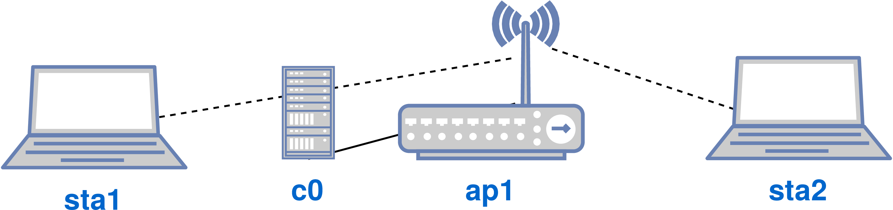
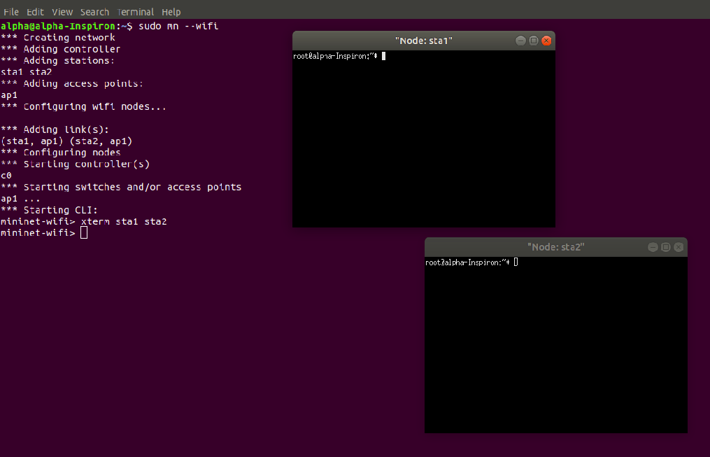
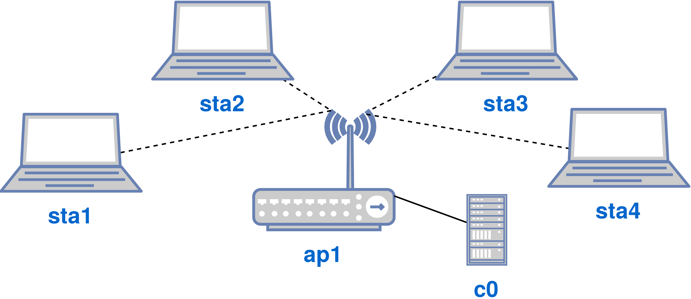
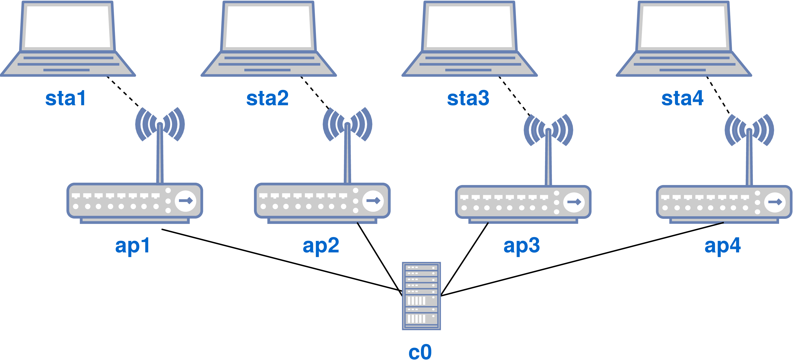
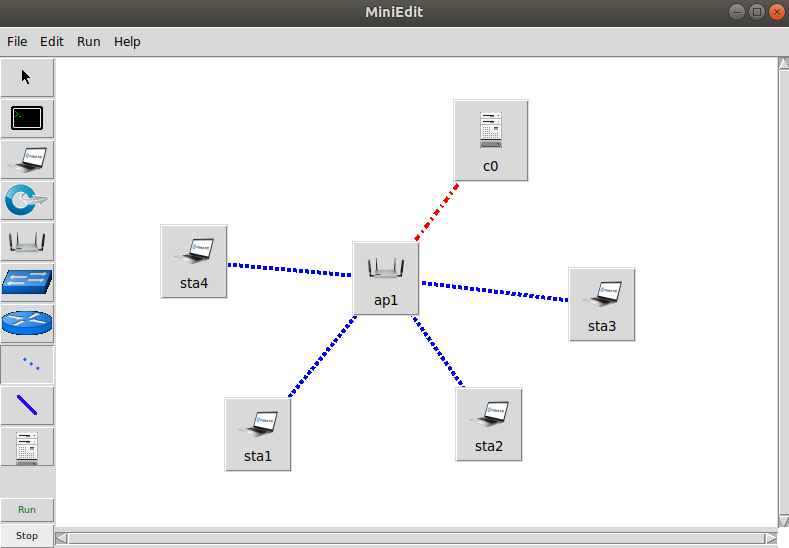
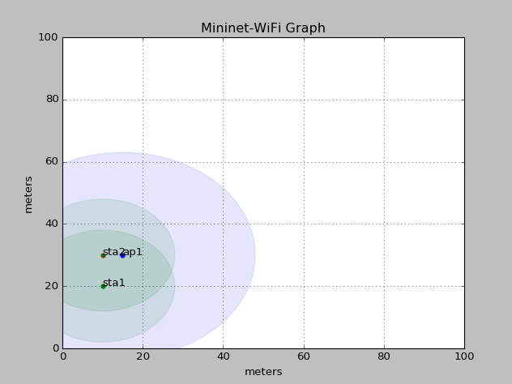
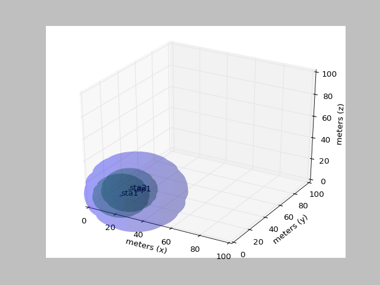
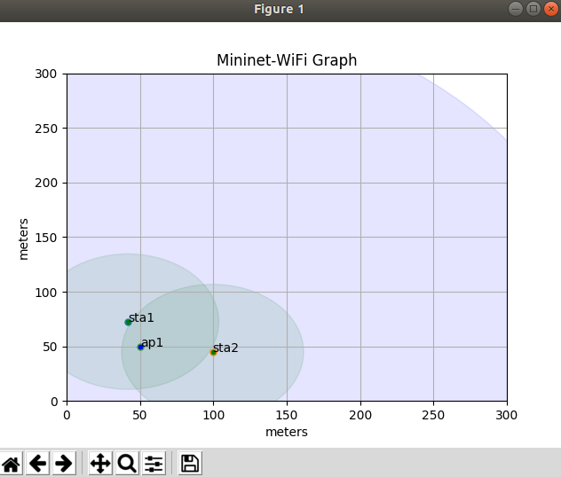

# Beginner

In this chapter we introduce Mininet-WiFi and all features supported by this emulator, highlighting critical information necessary to understand the tutorials explored throughout this book. We begin by discussing all steps needed to get Mininet-WiFi up and running on your computer.


## Downloading and installing Mininet-WiFi

The Mininet-WiFi source code is a _Git repository_ publicly available on _Github_. Git is an amazing open source system, capable of handling the distributed version control of any given project, in this case the Mininet-WiFi project. It was devised by [Linus Torvalds](github.com/torvalds) himself as a means of helping the development, at the time, of a tiny project called Linux.


To ease the searching and following-up of projects managed by Git, developers usually share their Git repository on Github, a platform for creating, managing, further distributing and interacting with open-source projects. This means that the life cycle of a project can be easily analyzed by contributors through Github, which keeps any file's modification history since its origin. In this book we only use the basic concepts of the Git system. For more information about Git and Github, please refer to <_git-scm.com_> and <_github.com_>.


To obtain Mininet-WiFi's source code and install it, you will need to perform a process called cloning, in which all the information pertaining to a project is downloaded to your computer. Since Mininet-WiFi is a Git repository on Github, its cloning is carried out using the Git system.


After this brief introduction to Git and Github, you can clone the Mininet-WiFi source code by using the following command line, which consists of the instruction git clone  followed by a link to Mininet-Wifi's Github repository.

```
    ~$ git clone https://github.com/intrig-unicamp/mininet-wifi
```

 Mininet-WiFi relies on Linux Kernel components to function properly. Of the different Linux distributions that can be used to this end, we recommend Ubuntu, since Mininet-WiFi was extensively tested on it.


In the link to Mininet-WiFi's repository, _intrig-unicamp_ refers to the profile or organization where the repository is located on Github. _mininet-wifi_, in turn, is the name of the repository where the source code is deposited.

 If you do not have _git_, you can install it using the `sudo apt install git` command.

Once the clone is complete, a directory named <_mininet-wifi_> should be created. Since the cloning was done from the user's directory, the Mininet-WiFi source code should be located at </_home/your\_username/mininet-wifi_>, or simply <_~/mininet-wifi_>. 


Now you need to install Mininet-WiFi. To do so, you will need to access the created directory and execute the `sudo util/install.sh` command, as follows. 

```
    ~$ cd mininet-wifi
    ~/mininet-wifi$ sudo util/install.sh -Wlnfv6
```

 Further information on the _Wlnfv6_ parameters can be found on the Mininet-WiFi source code page on Github.

Alternatively, you can also use the virtual machine available on the source page. To ensure that the virtual machine has the latest version of Mininet-WiFi, you must use the commands below.

```
    ~/mininet-wifi$ git pull
    ~/mininet-wifi$ sudo make install
```

 Capturing the code through the `git clone` command ensures that the source code will always contain the latest updates implemented for Mininet-WiFi.

Even if you already have Mininet-WiFi and/or the virtual machine installed, the `git pull` command can be issued from the Mininet-WiFi directory at any time. This command will synchronize the code that is on your computer with the source code available in the Mininet-WiFi source code repository. By doing this, you will always have the latest version of Mininet-WiFi installed.

## First steps to use Mininet-WiFi

In the following paragraphs, we will begin to understand how to use Mininet-WiFi.


First, we need to be aware of three commands: `sudo mn --version`, which prints the Mininet-WiFi version in use; `sudo mn --help`, which prints a help menu; and `sudo mn -c`, which is responsible for cleaning up poorly-made Mininet-WiFi executions. Remember this last command, because it will be very useful later on.


Mininet-WiFi can be started by running a very simple command, `sudo mn --wifi`. In addition to opening the Command Line Interface (CLI), this command will create a topology consisted of two stations connected to an access point via a wireless medium, as well as an SDN controller that is connected to the access point, as shown in the figure below.



```
    ~/mininet-wifi$ sudo mn --wifi
    *** Creating network
    *** Adding controller
    *** Adding stations:
    sta1 sta2 
    *** Adding access points:
    ap1 
    *** Configuring wifi nodes...
    *** Adding link(s):
    (sta1, ap1) (sta2, ap1) 
    *** Configuring nodes
    *** Starting controller(s)
    c0 
    *** Starting switches and/or access points
    ap1 ...
    *** Starting CLI:
    mininet-wifi>
```

If you already know Mininet, you have probably already used the `sudo mn` command, which creates a simple topology with two hosts, one switch and one OpenFlow controller, connected by a wired medium.

 If you notice an error similar to the one below, it means that there is a controller or process already running on port 6653, the default port used by the most recent OpenFlow controllers. This problem can be solved using the `sudo fuser -k 6653/tcp` command, which will kill the process that is using port 6653. If the controller is running on port 6633, the same must be done with this port number.

```
    Exception: Please shut down the controller which is running on port 6653:
    Active Internet connections (servers and established)
    tcp  0  0 0.0.0.0:6653   0.0.0.0:*  LISTEN   2449/ovs-testcontro 
    tcp  0  0 127.0.0.1:55118   127.0.0.1:6653 TIME_WAIT   - 
```

To identify the Mininet-WiFi CLI, just search for the text below:

```
    mininet-wifi>
```

Within the CLI you can essentially use any network commands or programs. Additionally, it is also possible to list and execute a number of commands that have been implemented exclusively for Mininet-WiFi. The `help` command allows you to list available commands, as follows.

```
    mininet-wifi> help
  Documented commands (type help <topic>):
  ========================================
  EOF      exit  iperf    nodes       pingpair     py     start  x    
  distance gterm iperfudp noecho      pingpairfull quit   stop   xterm
  dpctl    help  links    pingall     ports        sh     switch
  dump     intfs net      pingallfull px           source time
```

Most of these commands already existed in Mininet and were kept for Mininet-WiFi. Only three new commands have been added to Mininet-WiFi: `distance`, `start` and `stop`. `distance` allows you to check the distance between two nodes, while `start` and `stop` allow you to pause and continue experiments that implement node mobility. 

 This book will demonstrate the commands implemented for Mininet-WiFi, in addition to some others already implemented on Mininet.

Try using the `nodes` command to identify nodes that are part of the topology. Note that the nodes described by the `nodes` command are the same as those shown previously in https://github.com/ramonfontes/mn-wifi-ebook/raw/main/figures/topo-wifi.png. 
**Note**: Node **c0** will be discussed later.

```
    mininet-wifi> nodes
    available nodes are: 
    ap1 c0 sta1 sta2
```

As previously mentioned, the `sudo mn --wifi` command creates a topology with stations that are connected through a wireless medium to an access point. This can be easily verified using wireless networking tools. 


Although the `sudo mn --wifi` command creates an AP with an SSID called `my-ssid` operating on channel 1 (2412MHz), these values can also be customized. For instance, we will exit the Mininet-WiFi CLI with the `exit` command and then set up a new SSID and a new channel, as follows:

```
    mininet-wifi> exit
    ~/mininet-wifi$ sudo mn --wifi --ssid=new-ssid --channel=10
```

Then try the following command.

```
    mininet-wifi> sta1 iw dev sta1-wlan0 info
    Interface sta1-wlan0
    	ifindex 33
    	wdev 0x1000000001
    	addr 02:00:00:00:00:00
	    ssid new-ssid
	    type managed
	    wiphy 16
	    channel 10 (2457 MHz), width: 20 MHz (no HT), center1: 2457 MHz
    	txpower 14.00 dBm
```

If you are new to wireless networking, especially on Linux operating systems, you might not have noticed, but you have just used a very common program in wireless networking environments, the _iw_ tool. _iw_ is a utility for wireless networks that is gradually replacing _iwconfig_. We will use it extensively throughout this book.

 _iwconfig_ is certainly already installed on your system and you can also use it. For example, _sta1 iwconfig_ will produce a similar result to the one shown previously by _iw_. Try running `iwconfig --help` for more information on how to use it.

With respect to the command that we have just used, the _info_ parameter brings up information about the association (or no association) between nodes. It is noticeable that **sta1** is associated with an access point with a SSID _new-ssid_ that also operates on channel 10, exactly as defined by the command.


Additionally, using the _link_ parameter instead of _info_ allows the user to obtain the signal level perceived by the node and the _bitrate_, in addition to transmitted and received packets, among other data.

```
    mininet-wifi> sta1 iw dev sta1-wlan0 link
    Connected to 02:00:00:00:02:00 (on sta1-wlan0)
        SSID: new-ssid
        freq: 2457
        RX: 1241 bytes (22 packets)
        TX: 93 bytes (2 packets)
        signal: -36 dBm
        tx bitrate: 1.0 MBit/s

        bss flags:	short-slot-time
        dtim period:	2rendering this PDF.

        beacon int:	100
```


Now, let us use the _ping_ command to verify the connectivity between **sta1** and **sta2**.

```
    mininet-wifi> sta1 ping -c1 sta2
    PING 10.0.0.2 (10.0.0.2) 56(84) bytes of data.
    64 bytes from 10.0.0.2: icmp_seq=1 ttl=64 time=0.380 ms

    --- 10.0.0.2 ping statistics ---
    1 packets transmitted, 1 received, 0% packet loss, time 0ms
    rtt min/avg/max/mdev = 0.380/0.380/0.380/0.000 ms
```

The command shows that there is communication between the two nodes in question, since it also displays a response time in milliseconds belonging to **sta2**(_ms_). It is important to note that because Mininet-WiFi is an emulation platform capable of emulating several nodes, it is necessary to define in the CLI the source node that will be responsible, in practice, for issuing a given command.

The `-c1` parameter used with the _ping_ command means that only one ICMP packet will be sent. Otherwise, **sta1** will send endless ICMP packets.

Thus, as the _ping_ command needs a target node - which can be either a name or an IP address -, **sta2**'s destination can also be replaced by its IP address. As can be seen below, the IP address that identifies **sta2** is 10.0.0.2/8.


```
    mininet-wifi> sta2 ip addr
    1: lo: <LOOPBACK,UP,LOWER_UP> mtu 65536 qdisc noqueue state UNKNOWN group default qlen 1000
        link/loopback 00:00:00:00:00:00 brd 00:00:00:00:00:00
        inet 127.0.0.1/8 scope host lo
           valid_lft forever preferred_lft forever
        inet6 ::1/128 scope host 
           valid_lft forever preferred_lft forever
    34: sta2-wlan0: <BROADCAST,MULTICAST,UP,LOWER_UP> mtu 1500 qdisc htb state UP group default qlen 1000
        link/ether 02:00:00:00:01:00 brd ff:ff:ff:ff:ff:ff
        inet 10.0.0.2/8 scope global sta2-wlan0
           valid_lft forever preferred_lft forever
        inet6 fe80::ff:fe00:100/64 scope link 
           valid_lft forever preferred_lft forever
```


Alternatively, you can also open different terminals for each node and issue commands as if they were being sent directly to a computer, exactly as it happens in the real world. For example, the following command will open two terminals, one for **sta1** and another for **sta2**. Once there is a terminal for each node, it will no longer be necessary to indicate which one is the origin, as explained in the previous paragraph.



```
    mininet-wifi> xterm sta1 sta2
```

 _Xterm_ may not work as expected if there is no GUI enabled on your operating system.

Now, we will perform a few routines and exclusive actions of the wireless environment. To begin, we will disconnect **sta1** from **ap1** and confirm the disassociation by issuing the following command:\\

```
    mininet-wifi> sta1 iw dev sta1-wlan0 disconnect
    mininet-wifi> sta1 iw dev sta1-wlan0 link
        Not connected.
```

So let us try a new _ping_ between **sta1** and **sta2**.

```
    mininet-wifi> sta1 ping -c1 sta2
    PING 10.0.0.2 (10.0.0.2) 56(84) bytes of data.
    From 10.0.0.1 icmp_seq=1 Destination Host Unreachable

    --- 10.0.0.2 ping statistics ---
    1 packets transmitted, 0 received, +1 errors, 100% packet loss, time 0ms
```

As you can see, station **sta1** is no longer associated with access point **ap1**, so it would be logically impossible to perform any kind of communication with **sta2**.


Now, we will connect **sta1** again to the **ap1** access point and confirm the association.

```
    mininet-wifi> sta1 iw dev sta1-wlan0 connect new-ssid
    mininet-wifi> sta1 iw dev sta1-wlan0 link
    Connected to 02:00:00:00:02:00 (on sta1-wlan0)
    	SSID: new-ssid
	    freq: 2457
    	RX: 370 bytes (9 packets)
    	TX: 202 bytes (3 packets)
    	signal: -36 dBm
    	tx bitrate: 6.0 MBit/s

    	bss flags:	short-slot-time
    	dtim period:	2
    	beacon int:	100
```

And then we will try a new _ping_ between **sta1** and **sta2**. The _ping_ command should run successfully, as follows.

```
    mininet-wifi> sta1 ping -c1 sta2
    PING 10.0.0.2 (10.0.0.2) 56(84) bytes of data.
    64 bytes from 10.0.0.2: icmp_seq=1 ttl=64 time=1011 ms

    --- 10.0.0.2 ping statistics ---
    1 packets transmitted, 1 received, 0% packet loss, time 0ms
    rtt min/avg/max/mdev = 1011.206/1011.206/1011.206/0.000 ms
```

Another very useful operation for WiFi networks is scanning, which allows you to check which access points a certain station can see. For example, let us assume that the SSID of access point **ap1** is unknown. In this case, the following command can be used to display **ap1**'s SSID.

```
    mininet-wifi> sta1 iw dev sta1-wlan0 scan
    BSS 02:00:00:00:02:00(on sta1-wlan0) -- associated
	TSF: 1534710096681871 usec (17762d, 20:21:36)
	freq: 2457
	beacon interval: 100 TUs
	capability: ESS ShortSlotTime (0x0401)
	signal: -36.00 dBm
	last seen: 0 ms ago
	Information elements from Probe Response frame:
	SSID: new-ssid
	Supported rates: 1.0* 2.0* 5.5* 11.0* 6.0 9.0 12.0 18.0 
	DS Parameter set: channel 1
	ERP: Barker_Preamble_Mode
	Extended supported rates: 24.0 36.0 48.0 54.0 
	Extended capabilities:
		 * Extended Channel Switching
		 * Operating Mode Notification
```


## Customizing topologies

Different topologies can be created in Mininet-WiFi, through simple commands or even by using scripts written in _Python_.


The topologies that can be created through commands are _single_ and _linear_. To generate these two kinds of topologies, we will need to close Mininet-WiFi.

```
    mininet-wifi> exit
```

So let us start with the _single_ topology, which consists of one access point, **ap1**, and n stations associated with it. For example, the following command creates four stations, one access point and one SDN controller, as shown in the figure below.

```
    ~/mininet-wifi$ sudo mn --wifi --topo single,4
```



At this point, we can test the connectivity between all the nodes by issuing the `pingall` command, as follows.

```
    mininet-wifi> pingall
    *** Ping: testing ping reachability
    sta1 -> *** sta1 : ('ping -c1  10.0.0.2',)
    PING 10.0.0.2 (10.0.0.2) 56(84) bytes of data.
    64 bytes from 10.0.0.2: icmp_seq=1 ttl=64 time=0.170 ms

    --- 10.0.0.2 ping statistics ---
    1 packets transmitted, 1 received, 0% packet loss, time 0ms
    rtt min/avg/max/mdev = 0.170/0.170/0.170/0.000 ms
    sta2 *** sta1 : ('ping -c1  10.0.0.3',)
    PING 10.0.0.3 (10.0.0.3) 56(84) bytes of data.
    64 bytes from 10.0.0.3: icmp_seq=1 ttl=64 time=0.121 ms

    --- 10.0.0.3 ping statistics ---
    1 packets transmitted, 1 received, 0% packet loss, time 0ms
    rtt min/avg/max/mdev = 0.121/0.121/0.121/0.000 ms
    sta3 *** sta1 : ('ping -c1  10.0.0.4',)
    PING 10.0.0.4 (10.0.0.4) 56(84) bytes of data.
    64 bytes from 10.0.0.4: icmp_seq=1 ttl=64 time=0.129 ms

    --- 10.0.0.4 ping statistics ---
    1 packets transmitted, 1 received, 0% packet loss, time 0ms
    rtt min/avg/max/mdev = 0.129/0.129/0.129/0.000 ms
```

The other topology that can be created using commands is _linear_, which consists of n access points and n stations, in which each station is associated with one access point and all the access points are connected in a linear way. For example, the following command creates four access points, four stations, and one SDN controller, as shown in the figure below.

```
    ~/mininet-wifi$ sudo mn --wifi --topo linear,4
```



The customization of topologies, on the other hand, is done by means of scripts that contain all the information about the topology as well as the configuration of its nodes. In the <_/mininet-wifi/examples_> directory there is a wide variety of scripts that can be used as a basis for creating custom topologies.


It is always recommended that you check whether there is a script already developed for the scenario you want to work on. This helps you to create your own. Throughout this book we will use various scripts, which will certainly help in understanding how they can be customized.

## Accessing node information   

Now, let us learn how to get information from the nodes that make up a topology. To do so, we will create the simplest topology and add two new parameters: _position_ and _wmediumd_. The _position_ parameter will define initial positions for the nodes, while the _wmediumd_ parameter will enable _wmediumd_, a wireless simulator that will be shown in https://github.com/ramonfontes/mn-wifi-ebook/blob/main/beginner.md#wmediumd.

```
    ~/mininet-wifi$ sudo mn --wifi --link=wmediumd --position
```

Then try issuing the `distance` command, as follows:

```
    mininet-wifi> distance sta1 sta2
    The distance between sta1 and sta2 is 100.00 meters
```

Now, check the position of **sta1** and **sta2**. Note that the x, y, and z axes are separated by commas.

```
    mininet-wifi> py sta1.position
    [1.0, 0.0, 0.0]
    
    mininet-wifi> py sta2.position
    [101.0, 0.0, 0.0]
```

As you can see, the initial positions were defined, and the `distance` command can be used to verify the distance between two nodes.


At this point a question surely may arise: what if a specific position for a node must be defined? In this case, there are two possible solutions: either through the Mininet-WiFi CLI or scripts. The example below shows the `setPosition()` method, which can be used with the CLI and scripts.

```
    mininet-wifi> py sta1.setPosition('10,0,0')
```

Note that when a method implemented on the Mininet-WiFi source code is evoked by the CLI, the prefix _py_ must always be used. In addition to `setPosition()`, other methods will be demonstrated throughout this book.


Now, let us check the newly defined position.

```
    mininet-wifi> py sta1.position
    [10.0, 0.0, 0.0]
```

In this case, the position is defined as: x=10, y=0 and z=0.


Various other data about a particular node can be obtained using the generic form _node.params_ or _node.wintfs_, as shown below.

```
    mininet-wifi> py sta1.params
    {'wlan': ['sta1-wlan0'], 'ip': '10.0.0.1/8', 'ip6': '2001:0:0:0:0:0:0:1/64', 'channel': 1, 'mode': 'g'}
    mininet-wifi> py sta1.wintfs
    {0: <managed sta1-wlan0>}
```

Now, you can filter the desired information as follows.

```
    mininet-wifi> py sta1.wintfs[0].freq
    2.412
    mininet-wifi> py sta1.wintfs[0].mode
    g
    mininet-wifi> py sta1.wintfs[0].txpower
    14
    mininet-wifi> py sta1.wintfs[0].range
    62
    mininet-wifi> py sta1.wintfs[0].antennaGain
    5
```

_wintfs[0]_ means that the information to be obtained comes from the first wireless interface. If the node has multiple interfaces, _wintfs[n]_ - e.g. _wintfs[1]_ to indicate the second interface and so on - can also be used.
	
	
## OVSAP _versus_ UserAP

Mininet-WiFi supports two types of access points that differ basically in the location where they are run. _OVSAP_ or _OVSKernelAP_ runs in the kernel space of the operating system, whereas the _UserAP_ is executed in the user space. Additionally, you may prefer one over the other due to possible advantages, such as supported features and performance. 


For example, some features may be supported by one and not by another. Until recently, _OVSAP_ did not support _meter tables_, a type of table belonging to the OpenFlow protocol that is responsible for Quality of Service (QoS)-related operations, which was included in version 1.3 of this protocol. On the other hand, _UserAP_ already supported it by then.


Another important issue is the possibility of running switches or access points in particular _network namespaces_. In this case, _OVS_ does not support this feature natively yet, unlike _UserAP_, which supports it. What does that mean? Try using the following command.

```
    ~/mininet-wifi$ sudo mn --wifi
```

It allows you to view the interfaces of the **ap1** access point.

```
    mininet-wifi> ap1 ip link
    1: lo: <LOOPBACK,UP,LOWER_UP> mtu 65536 qdisc noqueue state UNKNOWN mode DEFAULT group default qlen 1000
        link/loopback 00:00:00:00:00:00 brd 00:00:00:00:00:00
    2: enp2s0: <NO-CARRIER,BROADCAST,MULTICAST,UP> mtu 1500 qdisc fq_codel state DOWN mode DEFAULT group default qlen 1000
        link/ether 84:7b:eb:fc:63:1a brd ff:ff:ff:ff:ff:ff
    3: wlp1s0: <BROADCAST,MULTICAST,UP,LOWER_UP> mtu 1500 qdisc noqueue state UP mode DORMANT group default qlen 1000
        link/ether f8:da:0c:95:12:d3 brd ff:ff:ff:ff:ff:ff
    4: docker0: <NO-CARRIER,BROADCAST,MULTICAST,UP> mtu 1500 qdisc noqueue state DOWN mode DEFAULT group default 
        link/ether 02:42:04:ed:bc:24 brd ff:ff:ff:ff:ff:ff
    5: br-7e51375c6c71: <NO-CARRIER,BROADCAST,MULTICAST,UP> mtu 1500 qdisc noqueue state DOWN mode DEFAULT group default 
        link/ether 02:42:6f:43:07:ee brd ff:ff:ff:ff:ff:ff
    6: hwsim0: <BROADCAST,MULTICAST> mtu 1500 qdisc noop state DOWN mode DEFAULT group default qlen 1000
        link/ieee802.11/radiotap 12:00:00:00:00:00 brd ff:ff:ff:ff:ff:ff
    9: ap1-wlan1: <BROADCAST,MULTICAST,UP,LOWER_UP> mtu 1500 qdisc tbf master ovs-system state UP mode DEFAULT group default qlen 1000
        link/ether 02:00:00:00:02:00 brd ff:ff:ff:ff:ff:ff
    10: ovs-system: <BROADCAST,MULTICAST> mtu 1500 qdisc noop state DOWN mode DEFAULT group default qlen 1000
        link/ether ee:99:70:bb:39:89 brd ff:ff:ff:ff:ff:ff
    11: ap1: <BROADCAST,MULTICAST> mtu 1500 qdisc noop state DOWN mode DEFAULT group default qlen 1000
        link/ether 0a:94:5d:2c:8b:40 brd ff:ff:ff:ff:ff:ff
```

Note that a large number of network interfaces can be viewed, including those that, in practice, do not integrate the **ap1** access point, such as the wireless and wired interfaces of the computer running Mininet-WiFi. This is the behavior observed when _OVS_, the default type of switch or access point for Mininet-WiFi, is being used.


Now, let us look at how _UserAP_ behaves. To do so, run the following command.

```
    ~/mininet-wifi$ sudo mn --wifi --ap user --innamespace
```

 The `--innamespace` parameter was not used with OVS because it does not support this command yet. `--innamespace` is responsible for making the node run in its own _network namespace_, instead of the root network namespace.

After that, check the interfaces of the **ap1** access point.

```
    mininet-wifi> ap1 ip link
    1: lo: <LOOPBACK> mtu 65536 qdisc noop state DOWN mode DEFAULT group default qlen 1000
        link/loopback 00:00:00:00:00:00 brd 00:00:00:00:00:00
    2: ap1-eth0@if46: <BROADCAST,MULTICAST,UP,LOWER_UP> mtu 1500 qdisc noqueue state UP mode DEFAULT group default qlen 1000
        link/ether de:93:af:2c:68:a0 brd ff:ff:ff:ff:ff:ff link-netnsid 0
    45: ap1-wlan1: <BROADCAST,MULTICAST,UP,LOWER_UP> mtu 1500 qdisc tbf state UP mode DEFAULT group default qlen 1000
        link/ether 02:00:00:00:02:00 brd ff:ff:ff:ff:ff:ff
```

As you can realize, the number of network interfaces has dropped considerably. The loopback interface was expected to appear among the results, in addition to the **ap1-wlan1** interface, which is the wireless interface of the **ap1** access point. The only interface that could be considered as unexpected would be the **ap1-eth0** interface, which is the interface used to connect to the SDN controller. 


Another relevant issue between _OVSAP_ and _UserAP_ is the performance. _UserAP_'s performance has significantly worsened since the releases of the newer versions of the Linux kernel. The reason? We confess not to have an answer to this question. However, we invite you to check this issue in practice.


The following command will run Mininet with _OVS_ and test the throughput between nodes **h1** and **h2**.

```
    ~/mininet-wifi$ sudo mn --test iperf
    *** Iperf: testing TCP bandwidth between h1 and h2 
    *** Results: ['40.1 Gbits/sec', '40.0 Gbits/sec']
```

The following command runs Mininet with _UserSwitch_ and measures the throughput between the same nodes, **h1** and **h2**.

```
    ~/mininet-wifi$ sudo mn --switch=user --test iperf
    *** Iperf: testing TCP bandwidth between h1 and h2 
    *** Results: ['171 Mbits/sec', '172 Mbits/sec']
```

 If you are not able to execute the previous command, you need to start an SDN controller on another terminal and replace `--test iperf` by `--controller=remote`. Then, after starting the controller, run _iperf_ on the Mininet-WiFi CLI as follows: `iperf h1 h2`.

You may be wondering: why _UserSwitch_? _UserAP_ has been extended from Mininet's _UserSwitch_. So in practice, they are the same switch or access point. But back to the result, did you notice the difference between them? _UserSwitch_ has much lower performance compared to OVS.


With respect to _UserAP_ still, an example of its implementation is _Basic OpenFlow Software Switch_ (BOFUSS), a successor of [ofsoftswitch13](https://github.com/CPqD/ofsoftswitch13). It has been employed in several studies and you may definitely want to use it at some point. _BOFUSS_ promises to eliminate most performance-related issues.


 To install _BOFUSS_, just run `sudo util/install.sh -3f` from Mininet-WiFi's root directory.

## Graphical User Interface (GUI)
For those who do not know _Python_ or are new to Mininet-WiFi, currently there are two options for creating scripts in _Python_ with the support of graphic interfaces: by using _Visual Network Descriptor (VND)_ or _MiniEdit_.

### Visual Network Descriptor

Requirements: web server, php, flash player, visual network descriptor

_Visual Network Descriptor_, or simply VND, is a tool created for a master's work that is able to generate _Python_ scripts for Mininet-WiFi via a web browser. Written predominantly in the _Flex_ programming language, VND also includes some instructions in PHP and XML.


Using VND is relatively simple. First you need to make a clone of its [source code](https://github.com/ramonfontes/vnd), and follow the installation steps available on the source code page. In general terms, you must have a web server, PHP and Flash Player installed. Then just access it through your preferred web browser. If all goes well, a screen similar to the one shown in the figure below should appear.


With VND open, you can use the mouse cursor to select the nodes that you want to include in the topology and their respective connections. You can also create settings for nodes and save the topology for later use. To generate scripts for Mininet-WiFi, just follow the _File->Export->Export to Mininet-WiFi menu. A standard file with a .sh extension will be created; it consists of _Python_ statements and can be executed as if it were a _Python_ file.


For example, a script named <_mytopology.sh_> can be executed as follows.

```
    ~/mininet-wifi$ sudo python mytopology.sh
```

  

[Visual Network Descriptor](https://youtu.be/KsoRMnDP_PA)


### MiniEdit

Requirements: scripts only

Another alternative for creating topologies with graphics support is _MiniEdit_. Written in _Python_, _MiniEdit_ was initially developed for Mininet and has been constantly upgraded to work with Mininet-WiFi. The goal of _MiniEdit_'s developers is to make all the features supported by Mininet-WiFi available on _MiniEdit_.


_MiniEdit_ has a fairly simple user interface that features a screen with a line of tool icons on the left side of the window and a menu bar at the top. It comes already included in the Mininet-WiFi source code.


To use it, just run <_examples/miniedit.py_>.

```
    ~/mininet-wifi$ sudo python examples/miniedit.py
```




After you run it, a screen similar to the one shown in the figure above should appear. With it you can add nodes supported by Mininet-WiFi and their respective settings, in addition to their links, of course. In the current version of _MiniEdit_, different types of scenarios are already supported, for example: _ad hoc_ and _mesh_ networks, _WiFi-Direct_, Radius protocol, WPA, among other environments.


You might ask: what is the best alternative to work with GUI? _MiniEdit_ or VND? You may want to use _MiniEdit_, since it is a part of Mininet-WiFi. There is also a tendency for VND to be gradually discontinued.

 

[MiniEdit and Mininet-WiFi](https://youtu.be/j4JS4xxCrCA)


### Viewing 2D and 3D graphics
Viewing topologies by means of graphics is another feature that can be used in Mininet-WiFi. You can generate both 2D and 3D graphics. Nevertheless, there are situations where 3D graphics are very useful, such as surveys involving drones and satellites, since the representation of different levels of altitudes may be necessary.


Thus, given its importance, we will then understand how it is possible to generate 2D and 3D graphics on Mininet-WiFi. Initially we will learn to create the two types of graphics (2D and 3D) using the CLI.\\

The command below will generate a 2D topology.

```
    ~/mininet-wifi$ sudo mn --wifi --plot --position
```

While the following command will generate a 3D topology.

```
    ~/mininet-wifi$ sudo mn --wifi --plot3d --position
```

All scripts available in the <_/examples_> directory - a Mininet-WiFi directory where you can find a wide variety of ready-to-run scripts - generate 2D graphics. If you choose to generate 3D graphics, simply make a small change in the code.


For example, let us take as an example <_position.py_>, available in the <_/examples_> directory. This file contains the following content: 

```
    net.plotGraph(max_x=100, max_y=100)
```

As can be seen, only the _x_ and _y_ axes were defined and the resulting graph will be somewhat similar to the one shown below. Therefore, to generate 3D graphics, simply add the _z_ axis, which will produce something similar to what was shown in below.






```
    net.plotGraph(max_x=100, max_y=100, max_z=100)
```

Optionally, minimum values for _x_, _y_ and _z_ axes can also be defined.

```
    net.plotGraph(min_x=10, min_y=10, min_z=10, max_x=100, max_y=100, max_z=100)
```

 Graphics generated by Mininet-WiFi are supported by _matplotlib_, a data visualization library available in the _Python_ programming language.

 

[Building 3D Graphic](https://youtu.be/lMkIV0YBTss)


## Wireless network emulation   
Wireless media emulation in Mininet-WiFi can be done in two ways: with [TC](https://en.wikipedia.org/wiki/Tc_(Linux)) or [Wmediumd](https://github.com/ramonfontes/wmediumd/). Let us then understand how to use them and what are the differences between them.

### TC (_Traffic Control_)
If Mininet-WiFi is running, quit it. Then start it again with the following command:

```
    ~/mininet-wifi$ sudo mn --wifi --position
```

Now, view the TC information on the Mininet-WiFi CLI:

```
    mininet-wifi> ap1 tc qdisc
    qdisc noqueue 0: dev lo root refcnt 2 
    qdisc pfifo_fast 0: dev enp2s0 root refcnt 2 bands 3 
    priomap  1 2 2 2 1 2 0 0 1 1 1 1 1 1 1 1
    qdisc noqueue 0: dev wlp1s0 root refcnt 2 
    qdisc noqueue 0: dev docker0 root refcnt 2 
    qdisc tbf 2: dev ap1-wlan1 root refcnt 5 rate 54Mbit burst 14998b lat 1.0ms 
    qdisc pfifo 10: dev ap1-wlan1 parent 2:1 limit 1000p
```

The output that interests us is highlighted below:

```
    qdisc tbf 2: dev ap1-wlan1 root refcnt 5 
    rate 54Mbit burst 14998b lat 1.0ms 
```

In general terms, this output instructs **ap1** to limit the bandwidth to up to 54 Mbits/s, which represents the maximum value that the IEEE 802.11g standard can nominally support. With this information it is easier to understand how TC works.


Considering that TC values are applied to stations and also that propagation models are supported by Mininet-WiFi, for a distance _d_ between access point and station, there is always a received signal value, which can vary with the chosen propagation model. Then, as the node is moving to a new position, a new value for _d_ is calculated and from this we obtain the received signal and the bandwidth value that will be applied by TC to the wireless interface of the node.


In practice, the value applied by TC to **ap1** does not change; instead, the values applied to the interfaces of the stations change. Thus, in an infrastructure environment we will always have two reference points for the calculation of _d_: the station and the access point. Two stations may be associated with the same access point, and different bandwidth values can be assigned to their interfaces: one for **sta1** and another for **sta2**.


Now let us imagine a wireless ad hoc network with three stations. As a wireless network, we can say that this network consists of a non-infrastructure environment, which means that this topology does not have a central node, i.e. the access point. In this type of network the three stations can associate with each other, where, for example, **sta1** can maintain association with **sta2** and **sta3**. However, they only have one wireless interface, and thus are particularly difficult to control using TC.


What would be the reference point to calculate _d_ for **sta1**, **sta2** or **sta3**? Differently from an infrastructure network, where we have two reference points for the calculation of _d_ - station and access point -, in a non-infrastructure network this does not occur. Thus, wireless _adhoc_ and _mesh_, require the use of _Wmediumd_, which implements an ideal wireless medium simulator for these types of networks.

### Wmediumd

The module responsible for virtualizing WiFi network cards on Mininet-WiFi, mac80211\_hwsim, uses the same virtual medium for all its wireless nodes. This means that all nodes are internally within reach of each other and can be discovered by scanning, as we have done with _iw_ previously. If the wireless interfaces need to be isolated from each other, the use of _Wmediumd_ is recommended.


[Wmediumd](https://github.com/jlopex/mac80211_hwsim) had been developed since 2011, but only in 2017 it was integrated into Mininet-WiFi thanks to [Patrick Große](https://github.com/patgrosse), the developer responsible for creating the first _Wmediumd_ extension for Mininet-WiFi.


Unlike TC, which limits the bandwidth available to the interface, _Wmediumd_ relies on a [signal table](https://github.com/ramonfontes/wmediumd/blob/mininet-wifi/tests/signal_table_ieee80211ax) and manages the isolation of the interfaces in real time as data travels across the network.

### TC _versus Wmediumd in practice

Start Mininet-WiFi with the following command.

```
    ~/mininet-wifi$ sudo mn --wifi --topo single,3 --position --plot
```

This command will create three stations that will associate themselves with access point **ap1**. The `--plot` parameter will open a topology graph. More details on this parameter will be seen later.


Now, check the signal strength perceived by **sta1** in relation to the **ap1** access point by running the `scan` command.

```
    mininet-wifi> sta1 iw dev sta1-wlan0 scan
    BSS 02:00:00:00:03:00(on sta1-wlan0) -- associated
    	TSF: 1536705774286475 usec (17785d, 22:42:54)
    	freq: 2412
    	beacon interval: 100 TUs
    	capability: ESS ShortSlotTime (0x0401)
    	signal: -36.00 dBm
    	last seen: 0 ms ago
    	Information elements from Probe Response frame:
    	SSID: my-ssid
    	Supported rates: 1.0* 2.0* 5.5* 11.0* 6.0 9.0 12.0 18.0 
    	DS Parameter set: channel 1
    	ERP: Barker_Preamble_Mode
    	Extended supported rates: 24.0 36.0 48.0 54.0 
    	Extended capabilities:
    		 * Extended Channel Switching
    		 * Operating Mode Notification
```

Also check the RSSI using the _wintfs_ option:

```
    mininet-wifi> py sta1.wintfs[0].rssi
    -66.0
```

As you can see, there is a difference in the signals received by the `iw scan` and _wintfs_ options. With `iw` the received signal was -36 dBm, whereas using _wintfs_ it was -66 dBm. While TC is in use, it will not be possible to get any updated information about the signal strength, or any other data that depends on it, by using network commands, such as _iw_. Perhaps one of the few useful data to verify is whether the station **sta1** is in fact associated with the access point **ap1**. 


The `iw link` command can also be used for this, as follows.

```
    mininet-wifi> sta1 iw dev sta1-wlan0 link
    Connected to 02:00:00:00:03:00 (on sta1-wlan0)
    SSID: my-ssid
    freq: 2412
    RX: 12486 bytes (236 packets)
    TX: 805 bytes (9 packets)
    signal: -36 dBm
    tx bitrate: 18.0 MBit/s

    bss flags:	short-slot-time
    dtim period:	2
    beacon int:	100
```

Now let us move **sta1** and test the received signal again by performing a new scan.

```
    mininet-wifi> py sta1.setPosition('250,250,0')
    mininet-wifi> sta1 iw dev sta1-wlan0 scan
    BSS 02:00:00:00:03:00(on sta1-wlan0)
    	TSF: 1536706071142532 usec (17785d, 22:47:51)
    	freq: 2412
    	beacon interval: 100 TUs
    	capability: ESS ShortSlotTime (0x0401)
    	signal: -36.00 dBm
    	last seen: 0 ms ago
    	Information elements from Probe Response frame:
    	SSID: my-ssid
    	Supported rates: 1.0* 2.0* 5.5* 11.0* 6.0 9.0 12.0 18.0 
    	DS Parameter set: channel 1
    	ERP: Barker_Preamble_Mode
    	Extended supported rates: 24.0 36.0 48.0 54.0 
    	Extended capabilities:
    		 * Extended Channel Switching
    		 * Operating Mode Notification
```

Surprisingly, the signal remained the same as before, even when changing the position of **sta1**. In fact, **ap1** should not even appear in the scan, as **sta1**) is no longer under the signal coverage of access point **ap1**. This shows that the TC really does not perceive the wireless medium, since even when the station is no longer within the signal coverage of the **ap1** access point, it is still capable of seeing it.


Now, let us repeat what we did earlier by using _Wmediumd_.

```
    ~/mininet-wifi$ sudo mn --wifi --topo single,3 --link=wmediumd --position --plot
```

Then we perform the scan from **sta1**, change its position and repeat the scan.

```
    mininet-wifi> sta1 iw dev sta1-wlan0 scan
    BSS 02:00:00:00:03:00(on sta1-wlan0) -- associated
    	TSF: 1536709235310507 usec (17785d, 23:40:35)
    	freq: 2412
    	beacon interval: 100 TUs
    	capability: ESS ShortSlotTime (0x0401)
    	signal: -67.00 dBm
    	last seen: 0 ms ago
    	Information elements from Probe Response frame:
    	SSID: my-ssid
    	Supported rates: 1.0* 2.0* 5.5* 11.0* 6.0 9.0 12.0 18.0 
    	DS Parameter set: channel 1
    	ERP: Barker_Preamble_Mode
    	Extended supported rates: 24.0 36.0 48.0 54.0 
    	Extended capabilities:
    		 * Extended Channel Switching
    		 * Operating Mode Notification
    mininet-wifi> py sta1.setPosition('250,250,0')
    mininet-wifi> sta1 iw dev sta1-wlan0 scan
```

As you can see, the signal strength perceived by **sta1** was initially -67 dBm. However, when it went out of the signal range of access point **ap1**, there was a predicted change in the result. In addition to returning an expected signal value at the first moment, in the second the **ap1** access point could not be reached, since **ap1** was not able to reach **sta1** anymore.

 Using _wintfs_ with _Wmediumd_ is not recommended since some implementations of the latter for the calculation of the received signal were not transferred to Mininet-WiFi. In this case, it is always preferable to use _iw_ or _iwconfig_.

## Propagation model
Propagation models are mathematical models typically used by simulators and wireless network emulators to try to mimic the behavior of a wireless medium. In the literature, several propagation models have been proposed in order to support the different features of wireless media, such as varied environment types (indoor and outdoor), signal attenuation, interference, etc.


Mininet-WiFi currently supports the following propagation models: _Friis Propagation Loss Model_, _Log-Distance Propagation Loss Model_ (default), _Log-Normal Shadowing Propagation Loss Model_, _International Telecommunication Union (ITU) Propagation Loss Model_ and _Two-Ray Ground Propagation Loss Model_. 


The correct choice of propagation model makes a big difference. For example, one of the variables used in propagation models is the exponent. The exponent is variable that will instruct the propagation model as to the testing environment, i.e. whether it is an indoor or outdoor environment, or whether it is an interference-free environment or not.


Specifying a propagation model is a simple task. The various Mininet-WiFi sample scripts will certainly support this task, especially <_propagationModel.py_>. In it you can find the function responsible for defining the propagation model and its parameters.


To demonstrate how the propagation model can affect the configuration of the nodes that make up the network, we will execute the following script.

```
    ~/mininet-wifi$ sudo python examples/propagationModel.py
```

Using the pre-defined propagation model, we can observe that the signal strength perceived by **sta1** was around -79 dBm.

```
    mininet-wifi> py sta1.wintfs[0].rssi
    -79.0
```

On the other hand, after configuring the _free space_ propagation model, the signal strength increased to approximately -47 dBm. If you did not find the -79 dBm and -47 dBm values, do not worry. What matters is the value obtained after setting up the propagation model. This should be higher than the previously noted values.


The propagation model can be modified as follows:


from:
```
    net.setPropagationModel(model="logDistance", exp=4)
```

to:
```
    net.setPropagationModel(model="friis")
```

Then, check the RSSI after running the modified script.

```
    mininet-wifi> py sta1.wintfs[0].rssi
    -47.0
```

Another relevant change you can see is related to the range of the access point. Certainly the new range of access point **ap1** is now much larger than the previously observed one.


 <_propagationModel.py_> does not use _Wmediumd_, so if it is necessary to obtain the signal strength it should always be obtained using the _wintfs_ command.

The new signal range value evidences the importance of choosing the correct propagation model for the scenario on which it is necessary to work. The new signal strength, which is higher than the previous one, also shows the behavior of the _free space_ propagation model, since _free space_ does not take into account any kind of interference or barrier that could attenuate the signal.

It is important to note that in addition to the exponent discussed above, there are other parameters that may be unique or not in relation to each model. You can find more information about the supported models and their parameters on Mininet-WiFi's [web page](http://mininet-wifi.github.io/).

### Providing more realism
Some propagation models have no signal variation over time. This means that if we check the signal strength of a particular node, the perceived signal strength will always be the same. However, as we all know, the wireless medium is not constant and many factors can affect the perceived signal strength.


Therefore, in cases where the variation in signal strength is important and you need to represent what happens in the real world with greater fidelity, it is necessary to set up the _fading\_coefficient_, which produces signal attenuation over time.


To check the effect caused by _fading_ in practice, let us run the following code.

```
    ~/mininet-wifi$ sudo python examples/wmediumd_interference.py
```

Now we are able to verify the signal strength variation perceived by a given station through _iw_, as below. Notice that as <_wmediumd\_interference.py_> uses _Wmediumd_, the signal strength can be obtained by running either _iw_ or _iwconfig_.

```
    mininet-wifi> sta1 iw dev sta1-wlan0 link
    Connected to 02:00:00:00:03:00 (on sta1-wlan0)
    SSID: new-ssid
    freq: 5180
    RX: 6901 bytes (124 packets)
    TX: 712 bytes (8 packets)
    signal: -65 dBm
    tx bitrate: 12.0 MBit/s

    bss flags:	short-slot-time
    dtim period:	2
    beacon int:	100
    
    mininet-wifi> sta1 iw dev sta1-wlan0 link
    Connected to 02:00:00:00:03:00 (on sta1-wlan0)
    SSID: new-ssid
    freq: 5180
    RX: 8827 bytes (165 packets)
    TX: 800 bytes (9 packets)
    signal: -62 dBm
    tx bitrate: 12.0 MBit/s

    bss flags:	short-slot-time
    dtim period:	2
    beacon int:	100
```

As you can see, the signal strength perceived by **sta1** was initially -65 dBm and then switched to -62 dBm later on. This variation is expected to happen whenever the received signal level is checked. This is a variation that occurs in a random fashion while also respecting the interval defined by the _fading_ parameter.

Try changing the _fading_ value and check the result. The higher the _fading_ value, the greater the signal variation.

 All propagation models supported by Mininet-WiFi can be found in <_mn\_wifi/propagationModels.py_>. Should you want to implement new propagation models, you will need to include them in this file.

## Distance _versus_ received signal
In addition to the throughput, the distance variation will also impact the signal strength received from the nodes. Obviously, the more distant the source and destination are, the worse the perceived signal should be. This is due to signal attenuation.


We have already seen in https://github.com/ramonfontes/mn-wifi-ebook/blob/main/beginner.md#first-steps-to-use-mininet-wifi how we can visualize the signal strength perceived by a node. Let us use, then, the same command to observe the perceived signal strength from different positions. To do so, run <_wmediumd\_interference.py_>.

```
    ~/mininet-wifi$ sudo python examples/wmediumd_interference.py
```

Then check the received signal.

```
    mininet-wifi> sta1 iw dev sta1-wlan0 link
    Connected to 02:00:00:00:03:00 (on sta1-wlan0)
        SSID: new-ssid
        freq: 5180
        RX: 9142 bytes (184 packets)
        TX: 88 bytes (2 packets)
        signal: -64 dBm
        tx bitrate: 6.0 MBit/s

        bss flags:	short-slot-time
        dtim period:	2
        beacon int:	100
```

Now, let us use the `distance` command to view the distance between **sta1** and **ap1**.

```
    mininet-wifi> distance sta1 ap1
    The distance between sta1 and ap1 is 11.18 meters
```

As you can see, the distance between them is just over 11 meters, and the signal level perceived by **sta1** was -64 dBm. So let us change the position of **sta1** in order to reduce the distance from access point **ap1** and check again the signal strength received by **sta1**.

```
    mininet-wifi> py sta1.setPosition('40,40,0')
    mininet-wifi> distance sta1 ap1
    The distance between sta1 and ap1 is 26.93 meters
    mininet-wifi> sta1 iw dev sta1-wlan0 link
    Connected to 02:00:00:00:03:00 (on sta1-wlan0)
        SSID: new-ssid
        freq: 5180
        RX: 176746 bytes (4379 packets)
        TX: 1668 bytes (19 packets)
        signal: -79 dBm
        tx bitrate: 18.0 MBit/s

        bss flags:	short-slot-time
        dtim period:	2
        beacon int:	100
```

We can see that after changing the position, the distance increased and consequently the signal level decreased from -64 dBm to -79 dBm. This may be a simple and obvious conclusion; however, the steps we have just taken aid greatly in the teaching and learning process.


 - Ramon dos Reis Fontes, Mohamed Mahfoudi, Walid Dabbous, Thierry Turletti, Christian Esteve Rothenberg. _How far can we go? Towards Realistic Software-Defined Wireless Networking Experiments. In The Computer Journal (Special Issue on Software Defined Wireless Networks), 2017.


## Modifying _bitrate_

_Bitrate_ refers to the rate of data transmission supported for a given moment. Wi-Fi devices are able to adjust their Modulation and Coding Scheme according to the received signal level. In practice, the more complex the modulation scheme is, the more bits can be transmitted. In contrast, they also become more sensitive to interference and noise, and hence require a cleaner channel.


We will use _iw_ to modify bit rates. To do so, consider using <_wmediumd\_interference.py_> one more time.

```
    ~/mininet-wifi$ sudo python examples/wmediumd_interference.py
```

Next, let us do some simple tests and note the difference in the bandwidth values obtained for different bitrates.


First, run _iperf_ without changing the bitrate values.

```
    mininet-wifi> iperf sta1 sta2
    *** Iperf: testing TCP bandwidth between sta1 and sta2 
    *** Results: ['14.3 Mbits/sec', '14.4 Mbits/sec']
```

Then look at the current bitrate. As you can see below, the bitrate value was 54 Mbits/s.

```
    mininet-wifi> sta1 iw dev sta1-wlan0 link
    Connected to 02:00:00:00:03:00 (on sta1-wlan0)
    	SSID: new-ssid
    	freq: 5180
    	RX: 581186 bytes (7475 packets)
    	TX: 19278284 bytes (12610 packets)
    	signal: -64 dBm
    	tx bitrate: 54.0 MBit/s

    	bss flags:	short-slot-time
    	dtim period:	2
    	beacon int:	100
```

Now, change the bitrate and re-measure the bandwidth.

```
    mininet-wifi> sta1 iw dev sta1-wlan0 set bitrates legacy-5 6 9
    mininet-wifi> iperf sta1 sta2
    *** Iperf: testing TCP bandwidth between sta1 and sta2 
    *** Results: ['5.87 Mbits/sec', '5.93 Mbits/sec']
    mininet-wifi> sta1 iw dev sta1-wlan0 link
    Connected to 02:00:00:00:03:00 (on sta1-wlan0)
    	SSID: new-ssid
    	freq: 5180
    	RX: 840551 bytes (12506 packets)
    	TX: 23301226 bytes (15251 packets)
    	signal: -64 dBm
    	tx bitrate: 9.0 MBit/s

    	bss flags:	short-slot-time
    	dtim period:	2
    	beacon int:	100
```

Note that the bitrate was limited to 9 Mbits/s and the measurement from _iperf_ dropped to less than 6 Mbits/s.


Finally, let us make another bitrate change and measure the bandwidth once more.

```
    mininet-wifi> sta1 iw dev sta1-wlan0 set bitrates legacy-5 6
    mininet-wifi> iperf sta1 sta2
    *** Iperf: testing TCP bandwidth between sta1 and sta2 
    *** Results: ['4.37 Mbits/sec', '4.44 Mbits/sec']
    mininet-wifi> sta1 iw dev sta1-wlan0 link
    Connected to 02:00:00:00:03:00 (on sta1-wlan0)
    	SSID: new-ssid
    	freq: 5180
    	RX: 1044693 bytes (16503 packets)
    	TX: 26353234 bytes (17256 packets)
    	signal: -64 dBm
    	tx bitrate: 6.0 MBit/s

    	bss flags:	short-slot-time
    	dtim period:	2
    	beacon int:	100
```

Once again the available bandwidth dropped and the _bitrate_ was limited to 6 Mbits/s, as defined by the command.


Another interesting test is to verify the difference in the transfer rate supported by different Wi-Fi standards. For example, since the script is configured to operate on the IEEE 802.11a standard, which supports up to 54 Mbits/s, it was possible to get the 14 Mbits/s acquired in the previous test. On the other hand, another standard, IEEE 802.11b, would support only up to 11 Mbits/s.


Let us carry out a simple test: change the operating mode of the script from _mode='a'_ to _mode='b'_, and change the channel from 36 to 1. Then run _iperf_ one more time and observe the result.

 Due to a lack of knowledge, many users end up making mistakes when they configure the channel on an access point. What happens is that, for example, channel one does not work at 5 GHz, the frequency used in the IEEE 802.11a standard. You cannot, thus, use channel strips that are not compatible with certain 802.11 standards. The document available on [hostapd](https://w1.fi/cgit/hostap/plain/hostapd/hostapd.conf) can serve as a good reference point to identify the correct channels for certain operating standards.

```
    mininet-wifi> iperf sta1 sta2
    *** Iperf: testing TCP bandwidth between sta1 and sta2 
    *** Results: ['4.50 Mbits/sec', '4.57 Mbits/sec']
```

As you can see, the measured bandwidth was 4.5 Mbits/s, which is limited to 11 Mbits/s, exactly as defined by the IEEE 802.11b standard.

## Distance _versus_ throughput 

Throughput is the ability to transmit data from one network point to another over a period of time, determining the speed at which data travels through a link. In wireless networks, throughput is, in theory, highly impacted by the distance between two nodes.

Among the tools for measuring throughput, _iperf_ is certainly the one that stands out the most, as it is the preferred tool in most cases. Throughput measurement using _iperf_ is relatively simple, since two nodes executing it are enough for it to function, with one of the nodes operating as client and the other as server.


In order to run _iperf_ to verify the relation between distance and bandwidth, we will use the <_position.py_> file as a basis.

```
    ~/mininet-wifi$ sudo python examples/position.py
```

After running it, you will see a topology with two stations and one access point.


Since the script file has been successfully executed, let us measure the throughput between **sta1** and **sta2** according to their initial arrangement.

```
    mininet-wifi> iperf sta1 sta2
    *** Iperf: testing TCP bandwidth between sta1 and sta2 
    *** Results: ['8.42 Mbits/sec', '9.04 Mbits/sec']
```

Keep a record of the result observed in this test round. _The result may suffer slight variations_.


Now, we will change the positions of **sta1** and **sta2** so that they are further away from access point **ap1**. Then we will measure the throughput between **sta1** and **sta2** again.

```
    mininet-wifi> py sta1.setPosition('40,90,0')
    mininet-wifi> py sta2.setPosition('60,10,0')
    mininet-wifi> iperf sta1 sta2
    *** Iperf: testing TCP bandwidth between sta1 and sta2 
    *** Results: ['6.98 Mbits/sec', '7.14 Mbits/sec']
```

Comparing this new result with the previous one, it is clear that the more distant the stations are from the access point, the smaller the throughput tends to be.

In Mininet-WiFi, the `iperf sta1 sta2` command automatically defines **sta1** as a server and **sta2** as a client. Later on we will see examples of the most common way of using _iperf_.

**Publications that have already used Mininet-WiFi for performance research**:

- Gilani S.M.M., Heang H.M., Hong T., Zhao G., Xu C. _OpenFlow-Based Load Balancing in WLAN: Throughput Analysis_.  Communications, Signal Processing, and Systems (CSPS), 2016.
- Krishna Vijay Singh, Sakshi Gupta, Saurabh Verma, Mayank Pandey. _Improving performance of TCP for wireless network using SDN_. Proceedings of ICDCN, 2019.


## Mobility models

Mobility models are also very important because they try to mimic the mobility of persons, vehicles or any other object that is mobile, i.e. able to move from one point to another. There are several studies that try to identify the patterns of human mobility during natural disasters, such as major storms, floods, etc.


As for the propagation models, there are several mobility models that are accepted by the scientific community worldwide, and some of them are supported by Mininet-WiFi, such as _Random Direction_, _Random Walk_, _Gauss Markov_, among other models. Mobility can be observed either using CLI or a graph, as illustrated in the figure below.



Because of their importance, we will now check how mobility models can be configured on Mininet-WiFi. To do so, let us use the <_mobilityModel.py_> script, which contains the _Random Direction_ mobility model in its code. It is important to note that for each mobility model there may be unique parameters such as minimum and maximum speed limits, areas where nodes can move, etc. All the information you need about mobility model settings can be found on Mininet-WiFi's [web page](http://mininet-wifi.github.io/).


_Seed_ is one of the most important mobility model settings. It modifies mobility significantly. For instance, if a _seed_ number one causes the nodes to move from certain x and y values, a seed number two will change the initial values of x and y. It will not be able to change the mobility behavior, but it may change its own initial positions. This is an important feature because the initial arrangement of the nodes may not always meet the requirements defined for a particular experiment.

 
Now that we know a little more about the theory of mobility models, let us run the following script and observe how the nodes behave when configured with the _Random Direction_ mobility model.

```
    ~/mininet-wifi$ sudo python examples/mobilityModel.py
```


 Record the behavior of the nodes and try to change the mobility model at a later time for comparison purposes.


Then we will test two of the three implemented Mininet-WiFi commands that were presented in https://github.com/ramonfontes/mn-wifi-ebook/blob/main/beginner.md#first-steps-to-use-mininet-wifi: `stop` and `start`.


Let us first try the `stop` command.

```
    mininet-wifi> stop
```

Should everything go as expected, the `stop` command will cease mobility, causing the nodes to stop moving. This feature is useful in cases where the user wishes to observe information such as signal strength or even available bandwidth connected to an arrangement of nodes.


Now, we can issue the `start` command to resume mobility.

```
    mininet-wifi> start
```

 All mobility models supported by Mininet-WiFi can be found in <_mn\_wifi/mobility.py_>. Should you want to implement new mobility models, you must include them in this file.


**Researches that used Mininet-WiFi for experimentation on mobility**:

- K. V. K. Singh, M. Pandey. 	_Software-defined mobility in IP based Wi-Fi networks: Design proposal and future directions_. IEEE International Conference on Advanced Networks and Telecommunications Systems (ANTS), 2016
- N. Kiran, Y. Changchuan, Z. Akram. _AP load balance based handover in software defined WiFi systems_. IEEE International Conference on Network Infrastructure and Digital Content (IC-NIDC), 2016.
- D. Tu, Z. Zhao and H. Zhang. _ISD-WiFi: An intelligent SDN based solution for enterprise WLANs_. International Conference on Wireless Communications \& Signal Processing (WCSP), 2016, 
- H. T. Larasati, F. H. Ilma, B. Nuhamara, A. Mustafa, R. Hakimi and E. Mulyana, _Performance evaluation of handover association mechanisms in SDN-based wireless network_. International Conference on Wireless and Telematics (ICWT), 2017.
- C. H. F. dos Santos, M. P. S. de Lima, F. S. Dantas Silva, A. Neto. _Performance Evaluation of Multiple Attribute Mobility Decision Models: A QoE-efficiency Perspective_. International Conference on Wireless and Mobile Computing, Networking and Communications (WiMob), 2017.
- Y. Bi, G. Han, C. Lin, Q. Deng, L. Guo and F. Li. _Mobility Support for Fog Computing: An SDN Approach_ IEEE Communications Magazine, 2018.
- A. Kaul, L. Xue, K. Obraczka, M. Santos, T. Turletti.	WiMobtit{Handover and Load Balancing for Distributed Network Control: Applications in ITS Message Dissemination_.  International Conference on Computer Communication and Networks (ICCCN), 2018.
- Z. Han,   T. Lei, Z. Lu, X. Wen,  W. Zheng,  L. Guo. _Artificial Intelligence Based Handoff Management for Dense WLANs: A Deep Reinforcement Learning Approach_. IEEE Access, 2019.