# Intermediate

In this chapter we will explore tutorials and concepts related to computer networks as a whole, but focusing on wireless networks, of course. The OpenFlow protocol will also be introduced, and some peculiarities regarding its use in wireless networks shall be discussed.


To do the next tutorials, consider creating a repository clone of **mn-wifi-ebook**, which is available at [https://github.com/ramonfontes/mn-wifi-ebook](https://github.com/ramonfontes/mn-wifi-ebook). All scripts we will use to complete the tutorials will be available in this repository.

```
    ~/mininet-wifi$ git clone https://github.com/ramonfontes/mn-wifi-book-en
```


## Network interfaces

In this section, we will learn to manipulate network interfaces by defining multiple interfaces for stations. We will also learn how to apply the concept of binding and bonding interfaces.

### Setting multiple interfaces

By default, a station has only one wireless network interface. However, there may be cases that require the use of multiple interfaces per station. These cases may be related to the creation of backup interfaces, or even to actions aimed at aggregating and increasing bandwidth, among other possibilities.


Since multiple interfaces is a very relevant topic and is often not known by many users, we will learn how to add them, and explore some scenarios where they can be applied. Let us start at the code level by considering the example below, where a call is made to `net.addStation()`, which is the method responsible for creating stations in Mininet-WiFi.

```
    sta1 = net.addStation('sta1', wlans=2)
```

By setting up _wlans=2_, two wireless interfaces for **sta1** should be created: **sta1-wlan0** and **sta1-wlan1**. Let us use <_multipleWlan.py_> as an example, which includes definition for _wlans_.

```
    ~/mininet-wifi$ sudo python mn-wifi-book-en/codes/cap3/multipleWlan.py
```

After running it, you will be able to notice the presence of the aforementioned interfaces, as can be seen below.

```
    mininet-wifi> sta1 ip add show
1: lo: <LOOPBACK,UP,LOWER_UP> mtu 65536 qdisc noqueue state UNKNOWN group default qlen 1000
    link/loopback 00:00:00:00:00:00 brd 00:00:00:00:00:00
    inet 127.0.0.1/8 scope host lo
       valid_lft forever preferred_lft forever
    inet6 ::1/128 scope host 
       valid_lft forever preferred_lft forever
1030: sta1-wlan0: <BROADCAST,MULTICAST,UP,LOWER_UP> mtu 1500 qdisc htb state UP group default qlen 1000
    link/ether 02:00:00:00:00:00 brd ff:ff:ff:ff:ff:ff
    inet 10.0.0.1/8 scope global sta1-wlan0
       valid_lft forever preferred_lft forever
    inet6 fe80::ff:fe00:0/64 scope link 
       valid_lft forever preferred_lft forever
1031: sta1-wlan1: <NO-CARRIER,BROADCAST,MULTICAST,UP> mtu 1500 qdisc mq state DOWN group default qlen 1000
    link/ether 02:00:00:00:01:00 brd ff:ff:ff:ff:ff:ff
    inet 192.168.10.1/24 scope global sta1-wlan1
       valid_lft forever preferred_lft forever
```

These interfaces can be linked to work together in order to increase the capacity of transferring and receiving data. They can also be associated with different access points and maintain connectivity when there is a problem with one of the access points, for instance.


To illustrate this, we can verify through `iwconfig` that both **sta1-wlan0** and **sta1-wlan1** are associated with different access points. While the first interface is associated with an access point, the second one is part of an _ad hoc_ network, which is identified by the _adhoc1_ SSID.

```
    mininet-wifi> sta1 iwconfig
    lo        no wireless extensions.

    sta1-wlan1  IEEE 802.11  ESSID:"adhoc1"  
              Mode:Ad-Hoc  Frequency:2.412 GHz  Cell: 02:CA:FF:EE:BA:01   
              Tx-Power=14 dBm   
              Retry short limit:7   RTS thr:off   Fragment thr:off
              Encryption key:off
              Power Management:off
          
    sta1-wlan0  IEEE 802.11  ESSID:"ssid_1"  
              Mode:Managed  Frequency:2.432 GHz  Access Point: 02:00:00:00:03:00   
              Bit Rate:54 Mb/s   Tx-Power=14 dBm   
              Retry short limit:7   RTS thr:off   Fragment thr:off
              Encryption key:off
              Power Management:off
              Link Quality=70/70  Signal level=-36 dBm  
              Rx invalid nwid:0  Rx invalid crypt:0  Rx invalid frag:0
              Tx excessive retries:0  Invalid misc:9   Missed beacon:0
```

After this brief introduction on how to define multiple interfaces for different nodes in Mininet-WiFi, we will now learn a little more about the benefits that can be achieved with the use of multiple network interfaces, especially over bonding interfaces. But first, let us also have an introduction to the process of binding interfaces, by assigning multiple IP addresses to a single network interface.

### Binding interfaces
Requirements: script(s) only

Binding is the term used when multiple IP addresses are assigned to the same interface of a given node. It is a type of solution widely used when trying to make a node respond to different IP addresses. For example, the simplest topology of Mininet-WiFi creates a node called **sta1** that has only one wireless network interface (**sta1-wlan0**), which has the default IP address 10.0.0.1/8. For an additional IP address to be assigned to that interface, the following command could be used:

```
    ~/mininet-wifi$ sudo mn --wifi
    mininet-wifi> sta1 ip addr add 192.168.1.1/24 dev sta1-wlan0 label sta1-wlan0:0
```

In fact, this command will create a virtual interface (or sub-interface) called **sta1-wlan0:0**, and it will also set the new IP address for this interface, as follows:

```
    mininet-wifi> sta1 ip addr show sta1-wlan0
    9: sta1-wlan0: <NO-CARRIER,BROADCAST,MULTICAST,UP,LOWER_UP> mtu 1500 qdisc htb state DORMANT group default qlen 1000
        link/ether 02:00:00:00:00:00 brd ff:ff:ff:ff:ff:ff
        inet 10.0.0.1/8 scope global sta1-wlan0
           valid_lft forever preferred_lft forever
        inet 192.168.1.1/24 scope global sta1-wlan0:0
           valid_lft forever preferred_lft forever
```

Thus, if the 192.168.1.2/24 IP is assigned to **sta2**, both **sta1** and **sta2** will be able to respond to two IP addresses, as follows.

```
    mininet-wifi> sta2 ip addr add 192.168.1.2/24 dev sta2-wlan0 label sta2-wlan0:0
    
    mininet-wifi> sta1 ping -c1 192.168.1.2
    PING 192.168.1.2 (192.168.1.2) 56(84) bytes of data.
    64 bytes from 192.168.1.2: icmp_seq=1 ttl=64 time=0.070 ms

    --- 192.168.1.2 ping statistics ---
    1 packets transmitted, 1 received, 0% packet loss, time 0ms
    rtt min/avg/max/mdev = 0.070/0.070/0.070/0.000 ms
    
    mininet-wifi> sta1 ping -c1 10.0.0.2
    PING 10.0.0.2 (10.0.0.2) 56(84) bytes of data.
    64 bytes from 10.0.0.2: icmp_seq=1 ttl=64 time=0.110 ms

    --- 10.0.0.2 ping statistics ---
    1 packets transmitted, 1 received, 0% packet loss, time 0ms
    rtt min/avg/max/mdev = 0.110/0.110/0.110/0.000 ms
```

Binding can be very useful when you do not have access to many resources or enough network interfaces.

### Bonding interfaces
Requirements: _Ryu_

Bonding interfaces, in turn, consist of a process of combining or merging two or more network interfaces into a single interface for the purpose of offering performance improvements and even redundancy. For instance, you could increase network throughput, or make it so that if one bonding interface is inactive or disconnected, another one could supply the demand and act as a backup. 


In Linux systems, a special kernel module called bonding is used to connect multiple network interfaces into a single interface. In other words, two or more network interfaces can be connected through a single logical interface. Naturally, the behavior of bonding interfaces depends on the mode of operation being used. In this tutorial we will cover two of the supported methods (or modes) indicated in the documentation available at the official web page for [bonding](https://wiki.linuxfoundation.org/networking/bonding): link aggregation and broadcast modes.


Identified by the number four, the first mode of operation to be addressed is link (or interface) aggregation (IEEE 802.3ad). _We recommend that you read <_bonding.py_> for details on how to configure this bonding interface mode._ Link or interface aggregation can be done in basically two ways: static, where each device is directly instructed; or dynamically, through the use of a protocol called Link Aggregation Control Protocol (LACP). In this tutorial we will use the dynamic method, and the necessary rules for operation will be applied by running _Ryu_ with a module called _simple\_switch\_lacp\_13_, which has enough instructions for link aggregation with the LACP protocol.


To start _Ryu_ with the module that supports the LACP protocol, you will need to issue the following command.


```
     ~/mininet-wifi/ryu/$ ryu-manager ryu/app/simple_switch_lacp_13.py
```

Then, run <_bonding.py_> in a new terminal.

```
    ~/mininet-wifi$ sudo python mn-wifi-book-en/codes/cap3/bonding.py
```

The <_bonding.py_> file consists of three hosts connected to a switch. Host **h1** has two interfaces that will work in aggregate way. Both are connected to the **s1** switch, as shown in the figure below.

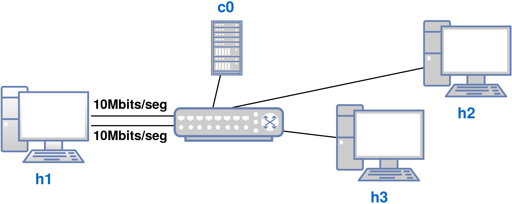

You will now need to open four terminals by starting _xterm_ from the Mininet-WiFi CLI. Note that two terminals are required for host **h1**. 

```
    mininet-wifi> xterm h1 h1 h2 h3 
```

On **h1**'s terminals, run _iperf_ as follows.

```
    h1-t2# iperf -s -i 1 -p 6700
    ------------------------------------------------------------
    Server listening on TCP port 6700
    TCP window size: 85.3 KByte (default)
    ------------------------------------------------------------
```

```
    h1-t1# iperf -s -i 1 -p 6701
    ------------------------------------------------------------
    Server listening on TCP port 6701
    TCP window size: 85.3 KByte (default)
    ------------------------------------------------------------
```

At this point, **h1** is waiting for connections that must be requested by clients, which will be the **h2** and **h3** nodes in this case. Commands must be run simultaneously, in the shortest possible time interval for better comprehension.

```
    h2# iperf -c 10.0.0.1 -i 1 -p 6700
```

```
    h3# iperf -c 10.0.0.1 -i 1 -p 6701
```

Should all occur as expected, you will be possible to note, on the terminals pertaining to **h1**, the connection requests sent by **h2** and **h3**, which result in a similar output, as shown next.

```
    h1-t1# 
    [ 17]  0.0- 1.0 sec  1.14 MBytes  9.60 Mbits/sec
    [ 17]  1.0- 2.0 sec  1.14 MBytes  9.57 Mbits/sec
    [ 17]  2.0- 3.0 sec  1.14 MBytes  9.56 Mbits/sec
    [ 17]  3.0- 4.0 sec  1.14 MBytes  9.57 Mbits/sec
    [ 17]  4.0- 5.0 sec  1.14 MBytes  9.57 Mbits/sec
    [ 17]  5.0- 6.0 sec  1.14 MBytes  9.56 Mbits/sec
    [ 17]  6.0- 7.0 sec  1.14 MBytes  9.57 Mbits/sec
    [ 17]  7.0- 8.0 sec  1.14 MBytes  9.57 Mbits/sec
    [ 17]  8.0- 9.0 sec  1.14 MBytes  9.56 Mbits/sec
    [ 17]  9.0-10.0 sec  1.14 MBytes  9.57 Mbits/sec
```

```
     h1-t2# 
    [ 17]  1.0- 2.0 sec  1.14 MBytes  9.57 Mbits/sec
    [ 17]  2.0- 3.0 sec  1.14 MBytes  9.56 Mbits/sec
    [ 17]  3.0- 4.0 sec  1.14 MBytes  9.57 Mbits/sec
    [ 17]  4.0- 5.0 sec  1.14 MBytes  9.57 Mbits/sec
    [ 17]  5.0- 6.0 sec  1.14 MBytes  9.56 Mbits/sec
    [ 17]  6.0- 7.0 sec  1.14 MBytes  9.57 Mbits/sec
    [ 17]  7.0- 8.0 sec  1.14 MBytes  9.57 Mbits/sec
    [ 17]  8.0- 9.0 sec  1.14 MBytes  9.56 Mbits/sec
    [ 17]  9.0-10.0 sec  1.14 MBytes  9.57 Mbits/sec
```

Since the bandwidth between **h1** and **s1** is limited to 10 Mbit/s, link aggregation enables **h1** to respond to the two simultaneous requests by **h2** and **h3**, preserving the full bandwidth of each connection to **s1**. Without link aggregation, **h1** would only be able to account for half the bandwidth, something around 4.5 Mbits/s for each node (**h2** and **h3**).


Finally, we will check the amount of packets sent and received by **h1**. _The loopback interface was omitted from the output_.

```
    mininet-wifi> h1 ifconfig
    bond0: flags=5187<UP,BROADCAST,RUNNING,MASTER,MULTICAST>  mtu 1500
        inet 10.0.0.1  netmask 255.0.0.0  broadcast 0.0.0.0
        inet6 fe80::200:ff:fe11:2233  prefixlen 64  scopeid 0x20<link>
        ether 00:00:00:11:22:33  txqueuelen 1000  (Ethernet)
        RX packets 9662  bytes 27669062 (26.3 MiB)
        RX errors 0  dropped 0  overruns 0  frame 0
        TX packets 9188  bytes 607324 (593.0 KiB)
        TX errors 0  dropped 0 overruns 0  carrier 0  collisions 0

    h1-eth0: flags=6211<UP,BROADCAST,RUNNING,SLAVE,MULTICAST>  mtu 1500
        ether 00:00:00:11:22:33  txqueuelen 1000  (Ethernet)
        RX packets 4833  bytes 13834677 (13.1 MiB)
        RX errors 0  dropped 0  overruns 0  frame 0
        TX packets 4600  bytes 304136 (297.0 KiB)
        TX errors 0  dropped 0 overruns 0  carrier 0  collisions 0

    h1-eth1: flags=6211<UP,BROADCAST,RUNNING,SLAVE,MULTICAST>  mtu 1500
        ether 00:00:00:11:22:33  txqueuelen 1000  (Ethernet)
        RX packets 4832  bytes 13834651 (13.1 MiB)
        RX errors 0  dropped 0  overruns 0  frame 0
        TX packets 4590  bytes 303368 (296.2 KiB)
        TX errors 0  dropped 0 overruns 0  carrier 0  collisions 0
```

 The `ifconfig` command was used to display a more organized output in comparison to `ip -s link`.

If we compare the amount of data sent to the amount of data received by **h1**, we can see that there is a certain balance between **h1-eth0** and **h1-eth1**. This would be the expected result, since both were able to respond to the same requests sent by **h2** and **h3**.

 The _simple\_switch\_lacp\_13_ module supported by _Ryu_ is fundamental for link aggregation to function as expected. However, it is not the only module available, and you will certainly find similar ones for the various SDN controllers.

 Try to run `sh ovs-ofctl dump-flows s1` on the Mininet-WiFi CLI to observe the flows created by the SDN controller.

Now, let us put into practice a scenario a little different from the one using link aggregation, which employs, instead, the broadcast mode. This mode provides fault tolerance in cases of interface failure. For example, when one interface becomes unavailable, another one can respond to requests and keep the service active.


Let us learn how to use it by practical means. First, you need to start the same code as before, but using the `-b` parameter this time, as shown below. Since _Ryu_ is not required for this new tutorial, its process should be killed.

```
    ~/mininet-wifi$ sudo python mn-wifi-book-en/codes/cap3/bonding.py -b
```

Then, let us try a _ping_ between **h2** and **h1**.

```
    mininet-wifi> h2 ping -c5 10.0.0.1
    PING 10.0.0.1 (10.0.0.1) 56(84) bytes of data.
    64 bytes from 10.0.0.1: icmp_seq=1 ttl=64 time=36.9 ms
    64 bytes from 10.0.0.1: icmp_seq=1 ttl=64 time=39.4 ms (DUP!)
    64 bytes from 10.0.0.1: icmp_seq=2 ttl=64 time=0.224 ms
    64 bytes from 10.0.0.1: icmp_seq=2 ttl=64 time=0.258 ms (DUP!)
```


 Why is every ICMP packet sent answered with another ending with the _DUP_! message? Because for each ICMP _request_, **h1** responds with two ICMP reply packets, one for each interface connected to the **s1** switch. Then, for each received packet (whether it be ICMP or any other type), **h1**'s interfaces will respond to duplicate packets in order to provide fault tolerance.

To understand a little more about how this fault tolerance works, let us disable the **h1-eth0** interface to simulate a fault while **h2** communicates with **h1**. To do so, we will open a terminal for **h1** from the Mininet-WiFi CLI to do a `ping` attempt from **h2** to **h1**.

```
    mininet-wifi> xterm h1
```

```
    mininet-wifi> h2 ping -c5 10.0.0.1
    PING 10.0.0.1 (10.0.0.1) 56(84) bytes of data.
    64 bytes from 10.0.0.1: icmp_seq=1 ttl=64 time=0.529 ms
    64 bytes from 10.0.0.1: icmp_seq=1 ttl=64 time=0.559 ms (DUP!)
    64 bytes from 10.0.0.1: icmp_seq=2 ttl=64 time=0.149 ms
    64 bytes from 10.0.0.1: icmp_seq=2 ttl=64 time=0.151 ms (DUP!)
    64 bytes from 10.0.0.1: icmp_seq=3 ttl=64 time=0.193 ms
    64 bytes from 10.0.0.1: icmp_seq=4 ttl=64 time=0.112 ms
    64 bytes from 10.0.0.1: icmp_seq=5 ttl=64 time=0.115 ms

    --- 10.0.0.1 ping statistics ---
    5 packets transmitted, 5 received, +2 duplicates, 0% packet loss, time 4085ms
    rtt min/avg/max/mdev = 0.112/0.258/0.559/0.182 ms
```

While the _ping_ command is in progress, disable the **h1-eth0** interface created by **h1**.

```
    h1# ip link set h1-eth0 down
```

As in the previous case, you can see that some ICMP packets were duplicated (as with the first two packets), since the **h1-eth0** interface was still active. However, after deactivating it, **h1** was able to respond to **h2** by using its unique active interface. In other words, the service remained uninterrupted even when one of the interfaces became unavailable.

## Traffic analysis
### Capturing packets
Requirements: _Wireshark_

Now let us learn how to capture packets and then how to capture beacons. If you are already familiar with computer networks, you have certainly used the _ping_ tool before and not just in the tutorials described in this book. Nonetheless, few have the curiosity to analyze in greater detail how the communication between two nodes occurs.


In this tutorial, we will generate traffic using the _ping_ tool and capture it with _Wireshark_, one of the most widely used programs in the world for network traffic analysis. The goal here is to learn how network traffic analysis can be performed and, more importantly, to understand how _ping_ works in practice. To do so, let us start Mininet-WiFi's simplest topology.

```
    ~/mininet-wifi$ sudo mn --wifi
```

Then we run _Wireshark_ from **sta1**:

```
    mininet-wifi> sta1 wireshark &
```

With _Wireshark_ open, look for the interface named **sta1-wlan0** and then begin capturing in this interface.


Now, in the Mininet-WiFi CLI, try carrying out a _ping_ to **sta2** from **sta1**. The output of the _ping_ command usually consists of the size of the packet (in bytes), the name of the target machine, the ICMP packet sequence number (icmp\_seq), TTL and latency (in milliseconds (ms)).

```
    mininet-wifi> sta1 ping -c1 sta2
    PING 10.0.0.2 (10.0.0.2) 56(84) bytes of data.
    64 bytes from 10.0.0.2: icmp_seq=1 ttl=64 time=0.100 ms

    --- 10.0.0.2 ping statistics ---
    1 packets transmitted, 1 received, 0% packet loss, time 0ms
    rtt min/avg/max/mdev = 0.100/0.100/0.100/0.000 ms
```

After running _ping_, you will be able to notice in _Wireshark_ the presence of the ARP and ICMP protocols, as shown in the figure below. The ARP protocol is a layer 2 protocol of the OSI reference model and is responsible for the resolution of MAC addresses. Once the MAC address portion has been resolved, the ICMP packets appear.\\

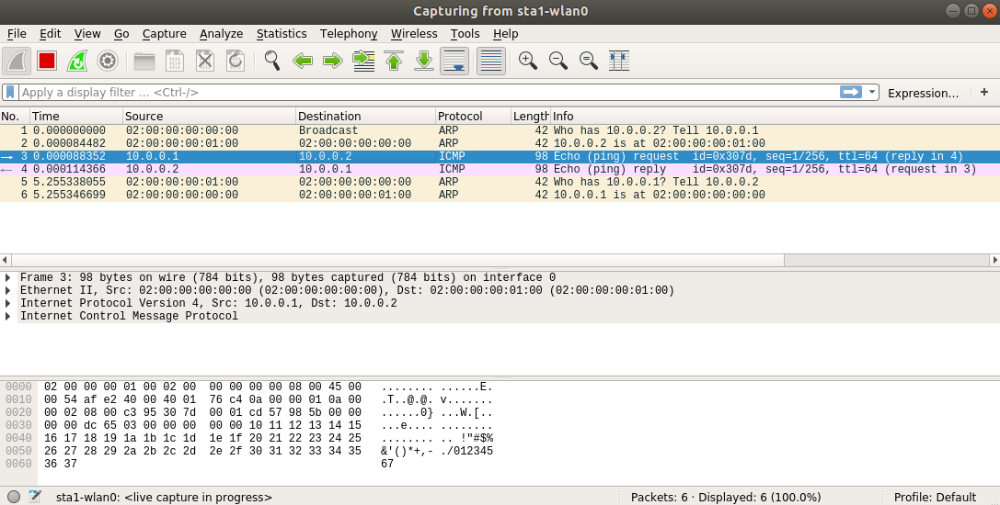


By doing this simple test you can see, via _Wireshark_, that there are only two messages belonging to the ICMP protocol: _request_ and _reply_. The first one refers to the _ping_ request, which originates from **sta1** (10.0.0.1), while the second one refers to the response, whose origin is **sta2** and destination is **sta1**.


Besides _Wireshark_, another widely used tool for analyzing network traffic is [tcpdump](tcpdump.org/). Working with `tcpdump` is relatively simple, but before using it you will need to close the previously opened instance of Mininet-WiFi, run it again, and then open a separate terminal for **sta1**, as follows.

```
    mininet-wifi> exit
    ~/mininet-wifi$ sudo mn --wifi
    mininet-wifi> xterm sta1
```

On the **sta1** terminal run _tcpdump_ as shown below. The `-i` parameter instructs _tcpdump_ as to which interface will be used for traffic capture.

```
    sta1# tcpdump -i sta1-wlan0    
```

Then, using the Mininet-WiFi CLI, _ping_ between **sta1** and **sta2**.

```
    mininet-wifi> sta1 ping -c1 sta2
    PING 10.0.0.2 (10.0.0.2) 56(84) bytes of data.
    64 bytes from 10.0.0.2: icmp_seq=1 ttl=64 time=0.121 ms

    --- 10.0.0.2 ping statistics ---
    1 packets transmitted, 1 received, 0% packet loss, time 0ms
    rtt min/avg/max/mdev = 0.121/0.121/0.121/0.000 ms
```

Now, look at the **sta1** terminal to observe the packets. Note that the output displayed there is quite similar to the information obtained by _Wireshark_.

``` 
    10:14:20.025022 ARP, Request who-has 10.0.0.2 tell alpha-Inspiron, length 28
    10:14:20.025100 ARP, Reply 10.0.0.2 is-at 02:00:00:00:01:00 (oui Unknown), length 28
    10:14:20.025104 IP alpha-Inspiron > 10.0.0.2: ICMP echo request, id 13535, seq 1, length 64
    10:14:20.025126 IP 10.0.0.2 > alpha-Inspiron: ICMP echo reply, id 13535, seq 1, length 64
```

 Why was it necessary to shut down Mininet-WiFi and run it again? Because an ARP table was created in **sta1** in the previous _ping_ attempt. Restarting the process from scratch forces the creation of a new ARP table. Try running the `sta1 arp -a` command from the Mininet-WiFi CLI to check the ARP table created in **sta1**.

_Tcpdump_ allows capture files to be saved in the pcap format for later analysis, or for porting to other systems for analysis as well. That is, you can also use _tcpdump_ to generate files that can be read by _Wireshark_.


For example, the command below will create a file called <_mycap-file.pcapng_>.

```
    sta1# tcpdump -i sta1-wlan0 -w mycap-file.pcapng
```

Further information about _tcpdump_ can found on its official website or by running the `tcpdump --help` command.

### Capturing beacons 
Requirements: _Wireshark_

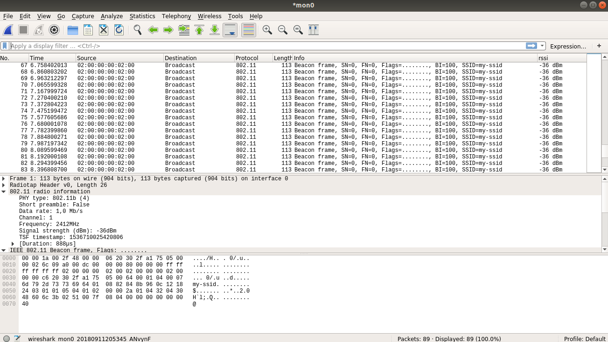

Beacons are wireless management frames (WLANs) based on WiFi (IEEE 802.11). They contain all the information about the wireless network, such as SSID, signal level, among other factors. When using Infrastructure mode (or Basic Infrastructure Services Set (BSS)), beacons serve to advertise the presence of a wireless LAN and to synchronize the members of the service set. In networks that do not have an access point (IBSS), the task of signal generation is distributed among stations.


In this tutorial, we will learn to capture beacons in a BSS network. To do so, let us run the simplest Mininet-WiFi topology.

```
    ~/mininet-wifi$ sudo mn --wifi
```

Since beacon capture cannot be done by interfaces operating in managed mode, you will need to create a monitor interface. Monitor interfaces allow the capture of beacons from all access points within reach of a client, even if the interfaces are not associated with the access point.


To create a _monitor_ interface, use the following command.

```
    mininet-wifi> sta1 iw dev sta1-wlan0 interface add mon0 type monitor
    mininet-wifi> sta1 ip link set mon0 up
```

Next, run _Wireshark_:

```
    mininet-wifi> sta1 wireshark &
```

In _Wireshark_, search for the _mon0_ monitor interface, and start the capturing processes from this interface. Then it should be possible to see the beacons captured by **sta1** on the _mon0_ interface, which are sent by access point **ap1**, as shown in the figure above. Remember that in a _BSS_ network beacons are sent by the access points that constitute the network.

 Try doing the same with mesh or _ad hoc_. Both <_mesh.py_> and <_adhoc.py_>, which are available in the <_/examples_> directory, may be useful in this task.

### Spectrum analysis
Requirements: _linssid_
Wireless communication signals tend to behave in unpredictable ways. You have probably seen how quickly the signal indicator on your smartphone or laptop oscillates between full and empty. A few steps in the wrong direction are enough to substantially weaken the signal, and if you are like many people who work with IT, you probably carry a mental map of your home WiFi network to avoid weak signals. Maybe you have even moved a piece of furniture in your room so you could enjoy higher and better download and upload rates. 


Signals from wireless devices such as WiFi routers are influenced by interference, obstructions and various other factors that may affect the performance of the router. Even if the router is configured to operate at a certain frequency, we cannot expect the signal range to be the same in all directions. Moreover, it may be operating at the same frequency as nearby routers, and this presents a problem: how would you be able to identify the most appropriate frequency for a particular situation, let alone the best location to install a wireless router, if the signal distribution is not the same? The answer is quite simple: by using wireless spectrum analysis tools such as _linssid_.


That is exactly what we are going to do now. Let us use the _linssid_ spectrum analyzer to identify the best or most suitable configuration for a particular topology. If _linssid_ is not installed, do so using the following command:

```
    ~/mininet-wifi$ sudo apt install linssid
```

Then, run <_wmediumd\_2aps.py_>.

```
    ~/mininet-wifi$ sudo python mn-wifi-book-en/codes/cap3/wmediumd_2aps.py
```

And open _linssid_ from **sta1**.

```
    mininet-wifi> sta1 linssid &
```

In _linssid_ search for the option to start captures and check the result while the analysis is performed. At the same time, change **sta1**'s position to the following coordinates.

```
    mininet-wifi> py sta1.setPosition('20,20,0')
```

At some point you will be able to notice a new wireless signal originating from access point **ap2**, as shown in the figure below.


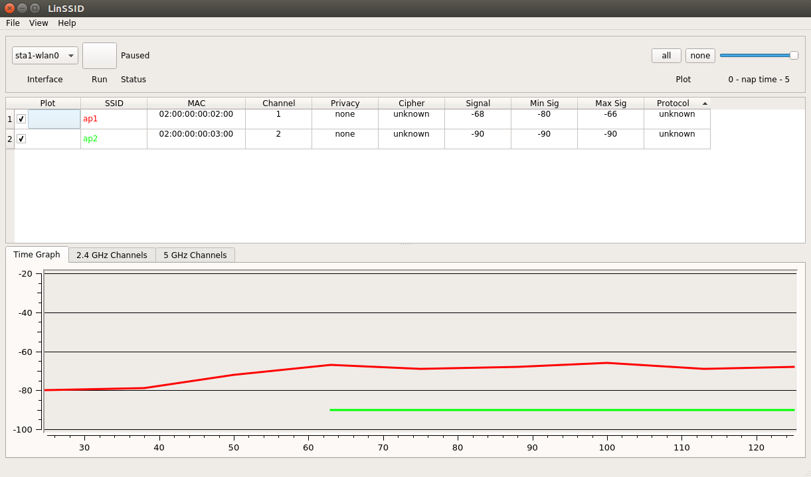


After this brief introduction to _linssid_, let us understand how a spectrum analyzer can help in the proper configuration of an access point.


If Mininet-WiFi is running, close it and then run <_wmediumd\_3aps.py_>. The topology of this script consists of three access points arranged according to the figure below. Note the channels on which each access point is operating.

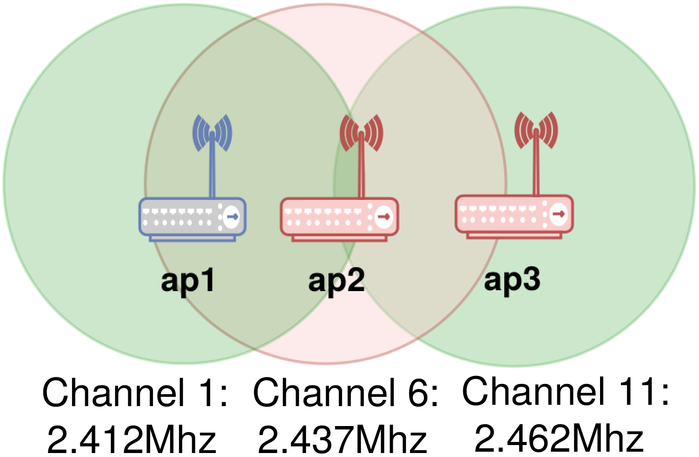

```
    mininet-wifi> exit
    ~/mininet-wifi$ sudo python mn-wifi-book-en/codes/cap3/wmediumd_3aps.py
```

And then, run _linssid_ from **sta1** again.

```
    mininet-wifi> sta1 linssid &
```

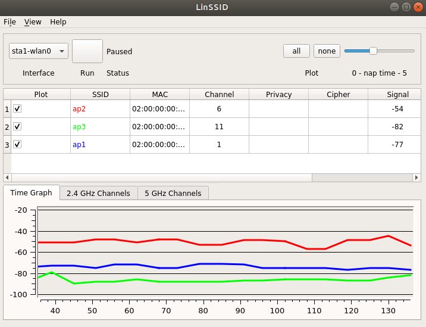


After initiating capture with _linssid_, you can see the signals captured by **sta1**. You can notice, on _linssid_, that access points **ap1**, **ap2** and **ap3** are operating on channels 1, 6 and 11, respectively, as shown in the figure above. This would be the most recommended configuration for such topology, since the most basic rule of a WiFi project says that you should not use the same channels, or those near each other with a distance of less than five units, with access points that are geographically close to each other.


Three access points - channels 1, 6 and 11 - are those that do not overlap at 2.4 GHz. What would happen if the topology had more than three access points? In this case, it would be necessary to reuse channels, and some level of interference could occur.

 Every channel operates at a certain frequency. For example: channel 1 operates at 2.412 MHz, channel 6 at 2.437 MHz and channel 11 at 2.462 MHz. The difference in MHz for each channel is 5 MHz, which means that channel 2 operates at 2.417 MHz and so on.

### Network telemetry 
Requirements: _script(s) only_

Continuous monitoring is an essential part of monitoring networks with a high level of detail in order to correctly identify and characterize situations related to equipment failure and performance, as well as to detect security issues and to perform traffic engineering. As networks constantly grow in size, complexity and traffic volume, the need for continuous and precise monitoring is greater than ever before. We can summarize network telemetry as an understanding of what is happening on a given network.


Network telemetry is emerging as a powerful way to support these needs. With the trend of Software-Defined Networking, network management solutions have become more automated than before. At its highest level, it is a push-based approach to monitoring: data plane devices such as switches and routers stream data about traffic and performance to the software that performs analytics.


In this simple tutorial, we will learn how to enable a simple telemetry implementation. It is important to stress, however, that the solution shown below was designed to make life easier for users who experience some difficulty in programming. Other telemetry tools can not only effortlessly support other types of data not compatible with Mininet-WiFi, but also be easily used with the latter. One example of this is _sFlow_, which will be introduced in https://github.com/ramonfontes/mn-wifi-ebook/blob/main/expert.md#traffic-monitoring-with-sflow-rt.

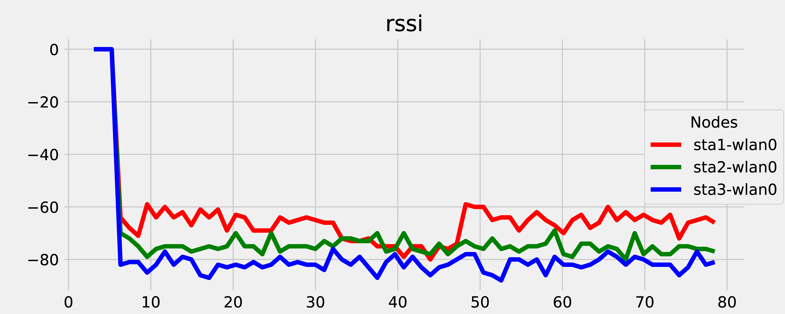


For this tutorial, consider running <_telemetry.py_>. The topology represented in this script consists of three stations exclusively associated with a single AP.

```
    ~/mininet-wifi$ sudo python mn-wifi-book-en/codes/cap3/telemetry.py
```

After running the script a figure similar to the figure above will appear, which shows the stations' RSSI while the code is running. Observing it, we can draw a conclusion: **sta1** is experiencing better signal strength compared to the other stations.


After while, you can change **sta1**'s position. The position shown below will move the station away from the AP, causing the signal to oscillate downward.

```
    mininet-wifi> py sta1.setPosition('10,10,0')
```

Then, after moving the station closer to the AP, the received signal improves significantly.

```
    mininet-wifi> py sta1.setPosition('10,40,0')
```

In addition to RSSIs, other data types are also automatically supported, such as those located in the statistics directory (`/sys/class/ieee80211/\{\}/device/net/\{\}/statistics/`), as well as position and other information. You only need to change the `data\_type` variable in the <_telemetry.py_> file to get the information you wish. It is worth mentioning that all traces are saved in a file that can be used later for more detailed analyses.  

 

[Telemetry](https://youtu.be/5cF9Ge_iozw)


## Scanning methods
There are basically two scanning methods that a client may use to determine to which access point a station should associate: passive and active scanning.

### Active scanning
In active scanning the client transmits a probe request and listens to the probe response from an access point. The probe request usually includes a specific SSID and only access points with a specific SSID will respond. 

### Passive scanning
In passive scanning the client listens to each channel for beacons periodically sent by access points. Compared to active scanning, passive scanning usually takes longer to achieve results, since the client must listen and wait for beacons and then manually find an access point. Another feature of this type of scanning is that if the client does not wait long enough on a channel, it may lose beacons sent by access points.

 By default, access points regularly broadcast beacons at every 100 ms. Therefore, due to the need to wait for these periodic beacons, clients typically prefer to use the active scanning.

During channel scanning the client is unable to transmit or even receive data. To minimize the consequences of downtime, one approach that can be used is background scanning. In this type of scanning, clients scan the wireless medium before moving to a new access point, which makes the transition between access points faster.

#### Background scanning
_Background scanning_ (bgscan) is a type of scan performed through _wpa\_supplicant_ that is done automatically, regardless of whether or not the station is associated with an access point. Once configured, _bgscan_ will search, at regular and pre-configured time intervals, for an access point with the best signal in relation to the access point with which the client is currently associated. If an access point with an optimal signal is found, _bgscan_ will initiate an association process between the client and the access point.


For _bgscan_ to work, all access points must have the same SSID. Both the signal level and the time interval can be customized to aid in its functioning: for example, if -60 dBm is set, _bgscan_ will only associate with an access point with a signal level higher than -60 dBm. As to the time, there are two types of timing: _short interval_ and _long interval_. The short interval is only used until an access point with a signal strength higher than -60 dBm, for instance, is encountered. After this, the long interval replaces the short interval.


For example, let us use <_bgscan.py_> as a reference point. In it, the signal strength was set to -60 dBm, the short interval to five seconds, and the long interval to ten seconds. Therefore, a scan will be performed every five seconds until an access point with a signal strength higher than -60 dBm is found. If it manages to find the desired access point, scanning will occur every ten seconds.

#### Bgscan
Given its relevance, let us then check how bgscan works. First, let us run the following script.

```
    ~/mininet-wifi$ sudo python mn-wifi-book-en/codes/cap3/bgscan.py
```

And then open a terminal for **sta1**.

```
    mininet-wifi> xterm sta1
```

On the **sta1** terminal, run _wpa\_cli_ on **sta1-wlan0**. _Wpa\_cli_ is a program used to interact with _wpa\_supplicant_. It is also worth mentioning that WPA\/WPA2 support is provided by _wpa\_supplicant_ as well.

```
    sta1-terminal# wpa_cli -i sta1-wlan0
```

Now, you can notice, on the **sta1** terminal, some scans being performed at regular five second intervals, as follows:

```
    <3>CTRL-EVENT-SCAN-STARTED 
    <3>CTRL-EVENT-SCAN-RESULTS    <3>CTRL-EVENT-SCAN-STARTED 
    <3>CTRL-EVENT-SCAN-RESULTS
```

Note that the scanning process was not able to find access points with better-received signal strength. If we look at **sta1**'s association data, we can see that it is associated with access point **ap1** and is broadcasting beacons at -52 dBm.

```
    mininet-wifi> sta1 iw dev sta1-wlan0 link
    Connected to 00:00:00:00:00:01 (on sta1-wlan0)
        SSID: handover
        freq: 2412
        RX: 2548 bytes (37 packets)
        TX: 742 bytes (7 packets)
        signal: -52 dBm
        tx bitrate: 6.0 MBit/s
        
        bss flags:	short-slot-time
        dtim period:	2
        beacon int:	100
```

Now, we will change **sta1**'s position using the Mininet-WiFi CLI.

```
    mininet-wifi> py sta1.setPosition('100,0,0')
```

Then, returning to the **sta1** terminal, you can observe that at some point **sta1** will find access point **ap2**, considering it the _best_ access point for a some time.

```
    <3>SME: Trying to authenticate with 00:00:00:00:00:02 (SSID='handover' freq=2437 MHz)
    <3>Trying to associate with 00:00:00:00:00:02 (SSID='handover' freq=2437 MHz)
    <3>Associated with 00:00:00:00:00:02
    <3>CTRL-EVENT-SUBNET-STATUS-UPDATE status=0
    <3>WPA: Key negotiation completed with 00:00:00:00:00:02 [PTK=CCMP GTK=CCMP]
    <3>CTRL-EVENT-CONNECTED - Connection to 00:00:00:00:00:02 completed [id=0 id_str=]
    <3>CTRL-EVENT-SIGNAL-CHANGE above=0 signal=-75 noise=-92 txrate=24000
```

Finally, after verifying **sta1**'s association status, you should be able to see that in fact there was a change in the association of one access point to another.

```
    mininet-wifi> sta1 iw dev sta1-wlan0 link
    Connected to 00:00:00:00:00:02 (on sta1-wlan0)
    	SSID: handover
    	freq: 2437
    	RX: 7576 bytes (134 packets)
    	TX: 860 bytes (15 packets)
    	signal: -75 dBm
    	tx bitrate: 18.0 MBit/s

    	bss flags:	short-slot-time
    	dtim period:	2
    	beacon int:	100
```

Returning to the **sta1** terminal, you can observe that the scanning process continues, but without the possibility of finding any other access point with a better signal strength than the one received from the **ap2** access point.


## Wireless mesh and _ad hoc_
Requirements: script(s) only

So far only infrastructure networks have been explored. In this type of network, data transfer always takes place between a station and an access point. As we have seen previously, access points are responsible for capturing and re-transmitting the messages sent by stations. In this case, data transfer never occurs directly between two stations.

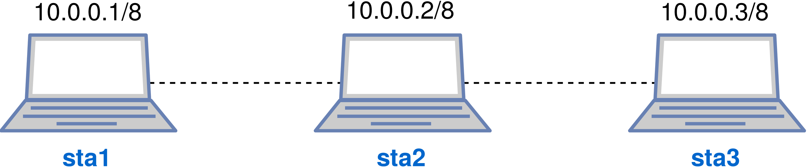


Now, in this tutorial we will explore two other types of wireless networks: the wireless _ad hoc_ network and wireless mesh network. In both cases we will use the topology shown in the figure above. In this topology there is signal overlap between **sta1** and **sta2**, and between **sta2** and **sta3**.


First, let us learn how wireless mesh networks work. To do so, run <_mesh.py_>.

```
    ~/mininet-wifi$ sudo python mn-wifi-book-en/codes/cap3/mesh.py
```

Then try to _ping_ between **sta1** and **sta2**, and then between **sta1** and **sta3**, as follows.

```
    mininet-wifi> sta1 ping -c1 sta2
    PING 10.0.0.2 (10.0.0.2) 56(84) bytes of data.
    64 bytes from 10.0.0.2: icmp_seq=1 ttl=64 time=4.90 ms

    --- 10.0.0.2 ping statistics ---
    1 packets transmitted, 1 received, 0% packet loss, time 0ms
    rtt min/avg/max/mdev = 4.905/4.905/4.905/0.000 ms
    mininet-wifi> sta1 ping -c1 sta3
    PING 10.0.0.3 (10.0.0.3) 56(84) bytes of data.
    64 bytes from 10.0.0.3: icmp_seq=1 ttl=64 time=6.16 ms

    --- 10.0.0.3 ping statistics ---
    1 packets transmitted, 1 received, 0% packet loss, time 0ms
    rtt min/avg/max/mdev = 6.160/6.160/6.160/0.000 ms
```

As you can see, **sta1** is able to communicate with **sta2** and **sta3**, since **sta2** is located between **sta1** and **sta3**, enabling **sta1** to also communicate with **sta3** by means of **sta2** (thanks to the IEEE 802.11s protocol).


Technically, we can see that the **sta2** node is actually located between **sta1** and **sta3** using the following command.

```
    mininet-wifi> sta1 iw dev sta1-mp0 mpath dump
    DEST ADDR         NEXT HOP          IFACE    SN METRIC QLEN EXPTIME  DTIM DRET FLAGS
    02:00:00:00:01:00 02:00:00:00:01:00 sta1-mp0 0  171    0    1504 0   0	  0x11
    02:00:00:00:02:00 02:00:00:00:01:00 sta1-mp0 1  4268   0    1504 0   0	  0x15
```

This command prints the mesh paths as if they were a routing table linked to **sta1**. By observing this table, you can notice that the next hop (_NEXT HOP_) for **sta2** (02:00:00:00:01:00) is **sta2** itself, whereas the next hop for **sta3** (02:00:00:00:02:00) is also **sta2**, since this node is located between **sta1** and **sta3**.


Now close the Mininet-WiFi CLI and run <_adhoc.py_>.

```
    mininet-wifi> exit
    ~/mininet-wifi$ sudo python mn-wifi-book-en/codes/cap3/adhoc.py
```

And then repeat the same communication process by connecting **sta1** to **sta2** and **sta3**, exactly as done previously. 

```
    mininet-wifi> sta1 ping -c1 sta2
    PING 10.0.0.2 (10.0.0.2) 56(84) bytes of data.
    64 bytes from 10.0.0.2: icmp_seq=1 ttl=64 time=2046 ms

    --- 10.0.0.2 ping statistics ---
    1 packets transmitted, 1 received, 0% packet loss, time 0ms
    rtt min/avg/max/mdev = 2046.137/2046.137/2046.137/0.000 ms
    mininet-wifi> sta1 ping -c1 sta3
    PING 10.0.0.3 (10.0.0.3) 56(84) bytes of data.
    From 10.0.0.1 icmp_seq=1 Destination Host Unreachable

    --- 10.0.0.3 ping statistics ---
    1 packets transmitted, 0 received, +1 errors, 100% packet loss, time 0ms
```

As we can see, **sta1** cannot communicate with **sta3**, since **sta2** was not instructed on how to forward data traffic to **sta3** in order to allow **sta1** and **sta3** to establish communication with each other.


In wireless _ad hoc_ networks, intermediate nodes do not automatically route traffic, as is done in wireless mesh networks. To do so, you first need to either setup a routing protocol or configure routing tables. So let us look at how this configuring can be done.


To do so, execute the following commands.

```
    mininet-wifi> sta1 ip route add 10.0.0.3 via 10.0.0.2
    mininet-wifi> sta3 ip route add 10.0.0.1 via 10.0.0.2
    mininet-wifi> sta2 echo 1 > /proc/sys/net/ipv4/ip_forward
```

The first command instructs **sta1** that, in case it needs to talk to **sta3**, the packet must first pass through **sta2**. The second, in turn, indicates that for the packet to arrive at **sta1**, from **sta3**, it must also pass through **sta2**. The third one instructs **sta2** to forward packets addressed to **sta1** and **sta3**.


Once all the necessary routing settings have been made, we can confirm them by viewing their routing tables, as follows.

```
    mininet-wifi> sta1 route -n
    Kernel IP routing table
    Destination Gateway  Genmask         Flags Metric Ref  Use Iface
    10.0.0.0    0.0.0.0  255.0.0.0       U     0      0    0 sta1-wlan0
    10.0.0.3    10.0.0.2 255.255.255.255 UGH   0      0    0 sta1-wlan0

    mininet-wifi> sta3 route -n
    Kernel IP routing table
    Destination Gateway  Genmask         Flags Metric Ref  Use Iface
    10.0.0.0    0.0.0.0  255.0.0.0       U     0      0    0 sta3-wlan0
    10.0.0.1    10.0.0.2 255.255.255.255 UGH   0      0    0 sta3-wlan0
```

Now, let us try again to _ping_ between **sta1** and **sta3**. 

```
    mininet-wifi> sta1 ping -c1 sta3
    PING 10.0.0.3 (10.0.0.3) 56(84) bytes of data.
    From 10.0.0.2: icmp_seq=1 Redirect Host(New nexthop: 10.0.0.3)
    64 bytes from 10.0.0.3: icmp_seq=1 ttl=63 time=20.1 ms

    --- 10.0.0.3 ping statistics ---
    1 packets transmitted, 1 received, 0% packet loss, time 0ms
    rtt min/avg/max/mdev = 20.167/20.167/20.167/0.000 ms
```

As you can see, communication can now be successfully established thanks to the static routing configured on the nodes.

 There are basically two types of routing: static and dynamic routing. Static routing is done similarly to the process performed above, using routes that are manually defined. Dynamic static, in turn, as the name itself indicates, is done dynamically, and in it the routing protocols are responsible for feeding the routing tables. Some of the main protocols that can be used for routing in wireless _ad hoc_ networks are: AODV (_Ad hoc On demand Distance Vector_), OLSR (_Optimized Link State Routing_) and BATMAN (_Better Approach to Mobile Ad hoc Networking_).

 

[Mininet-WiFi: Understanding the difference between _ad hoc_ and mesh wireless networks](https://youtu.be/-lI-TuvsQ5s) 


**Research that used Mininet-WiFi for experimentation on _ad hoc_/_mesh_**:

- Venkatraman Balasubramanian, Ahmed Karmouch. _Managing the Mobile Ad-hoc Cloud Ecosystem using Software Defined Networking Principles_. International Symposium on Networks, Computers and Communications (ISNCC), 2017.
- A. S. AbdelRahman and A. B. El-Sisi.  _Dynamic Load Balancing Technique for Software Defined WiFi Networks_.  International Conference on Computer Engineering and Systems (ICCES),  2017.
- Hisham Elzain, Wu Yang. _Decentralizing Software-Defined Wireless Mesh Networking (D-SDWMN) Control Plane_. Proceedings of the World Congress on Engineering (WCE), 2018.
- Sachin Sharma and Maziar Nekovee. _A demonstration of automatic configuration of OpenFlow in wireless ad hoc networks_. International Conference on Computer Communication and Networks (ICCCN), 2019.


## OpenFlow protocol 
OpenFlow is a protocol focused primarily on the administration of LANs and WANs, with an emphasis on commercial equipment such as switches, routers, access points, etc. The fact that this protocol is a flexible and open standard gives it a prominent role, since it allows its users to have more freedom to innovate, especially with regard to academia and industry. The OpenFlow protocol also allows the reduction of costs needed for the maintenance of equipment, and makes the adoption of new business models possible.


Studies using the OpenFlow protocol are constantly developed and many extensions for it are proposed. Many of these proposals are related to wireless networks, mainly because the OpenFlow protocol was not originally designed for wireless networks.


In the following tutorials, we will learn about practical aspects of the OpenFlow protocol by analyzing some messages defined in its specification. It is important to note that the first version, 0.2.0, was released in May 2008 and is currently obsolete. The 1.0 version, released in December 2009, was the most used one and served as a basis for other versions, such as 1.1, 1.2, 1.3, 1.4 and 1.5. In addition to providing a set of functional enhancements to the protocol, new specification versions bring more header fields.

- [Open Networking Foundation (ONF) Specifications](https://www.opennetworking.org/software-defined-standards/specifications/)
- [OpenFlow Protocol Decomposition](http://flowgrammable.org/sdn/openflow/)
- [Learn OpenFlow with Flowsim](https://flowsim.flowgrammable.org)
- Diego Kreutz, Fernando M. V. Ramos, Paulo Verissimo, Christian Esteve Rothenberg, Siamak Azodolmolky, Steve Uhlig. _Software-Defined Networking: A Comprehensive Survey_. In Proceedings of the IEEE, 2015.


### Capturing OpenFlow messages
Requirements: _Wireshark_

Until now, the OpenFlow protocol has been explored in this book only theoretically, through descriptions of its conceptual aspects. However, it will be used in the majority of the tutorials in the remainder of this book. Therefore, because of its importance, we will learn a bit more about the operations of the OpenFlow protocol.


Unlike previous tutorials, let us start Mininet-WiFi with the simplest Mininet topology, which consists of two hosts, a switch and a controller. Next, we will use _Wireshark_ to check a few messages related to this protocol.

```
    ~/mininet-wifi$ sudo mn
    mininet-wifi> sh wireshark &
```

 As we have seen before, the `sudo mn` command creates a wired topology rather than a wireless one. We chose to create a wired topology because the OpenFlow protocol was not originally designed for wireless networks. Wireless networks have some peculiarities that we will discuss in https://github.com/ramonfontes/mn-wifi-ebook/blob/main/intermediate.md#openflow-and-wireless-networks.

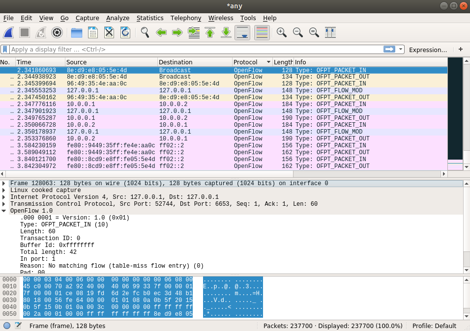

Once _Wireshark_ is open, look for the word _any_ on the interface list and initiate packet captures on this interface. Since OVS includes its own controller - _ovs-testcontroller_ -, selecting the _any_ option will allow you to capture any packet passing through your computer, including those targeting the OpenFlow controller.


Next, we will generate data traffic between **h1** and **h2**, to allow us to analyze a few messages from the OpenFlow protocol, as shown in the figure above.

```
    mininet-wifi> h1 ping -c2 h2
    PING 10.0.0.2 (10.0.0.2) 56(84) bytes of data.
    64 bytes from 10.0.0.2: icmp_seq=1 ttl=64 time=10.1 ms
    64 bytes from 10.0.0.2: icmp_seq=2 ttl=64 time=0.160 ms

    --- 10.0.0.2 ping statistics ---
    2 packets transmitted, 2 received, 0% packet loss, time 1001ms
    rtt min/avg/max/mdev = 0.160/5.155/10.150/4.995 ms
```

Note that the response time to the first ICMP packet was much higher compared to the second. This is because of the discovery process. The steps regarding the communication process between **h1** and **h2** are described below and illustrated in the figure below.


- **h1** sends an ARP/IMCP request in order to communicate with **h2**. This first packet enters the interface number one of switch **s1**.
- Switch **s1**, in turn, does not know where **h2** is located or even if it exists. Therefore, it must exchange a number of messages that result in a longer response time to the first ICMP packet. Since it does not know what to do with the packet, **s1** then forwards that packet to the controller (packet-in message) so that the controller can instruct the switch on what to do. Therefore, we can define the _packet-in_ message as a message created by the switch that targets the controller.
- The controller, in turn, responds to the switch with a _packet-out_ message looking for the MAC address corresponding to **h2**'s IP.
- The switch then sends this broadcast message to all of its ports, except the port from which it received the **h1** packet, since it already knows which node is connected to its number one port.
-  Host **h2** then receives the message sent by the switch and returns it, making itself (**h2**) known by stating its own presence in the message.
- The switch, which again does not know what to do with the message received by **h2**, since this message refers to the first packet received by the number two port of the switch. The switch then forwards the new packet-in message to the controller, which learns where **h2** is located (switch port number two).
- Thus, in response to this, the controller sends a _flow mod_ message to the switch, instructing the switch to forward the packet received by **h2** to **h1**.
- Finally, the ICMP message is sent back to **h1** in response format.

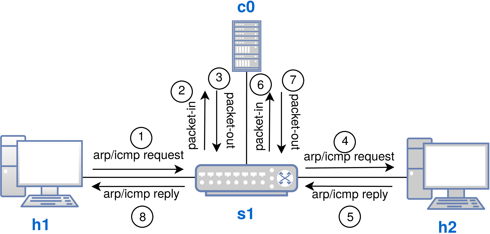

To use the the OpenFlow protocol, it is critical to understand how it works. Its main difference in relation to the traditional model is that now there is the role of the controller, which centralizes the whole network communication process.


Alternatively, it is also possible to input manual instructions directly into either the switch or controller, thus preventing some types of messages from being exchanged among them. This process is very similar to the insertion of static routes in traditional routers when routing protocols are in use. When static rules are defined, we say that the switch is running in proactive mode. On the other hand, when it learns the rules, we say that it is working in reactive mode, as there is traffic on the network.


Turning now our attention to the issue about wireless networks, the reason we do not use the simplest topology of Mininet-WiFi is that access points have only one interface, the wireless interface, which can be associated with n stations. I.e. the same interface is used as an input and output for data traffic. In this situation there is a special treatment that must be used, which is defined in the OpenFlow protocol specification that will be explored in https://github.com/ramonfontes/mn-wifi-ebook/blob/main/intermediate.md#openflow-and-wireless-networks.

 You can find more information about the OpenFlow protocol on the ONF (Open Network Foundation) website.


### Creating flows

As discussed earlier, flows can be created dynamically or statically. These forms of flow insertion are known as reactive and proactive modes, respectively.


In this new tutorial we will explore these concepts and understand a bit more about how static rules work. To do so, let us start Mininet with a single-type topology consisting of four hosts, where all hosts are connected to the **s1** switch, which in turn is connected to the **c0** controller.

```
    ~/mininet-wifi$ sudo mn --topo single,4
```

Next, we check the switch table of switch **s1** by running _ovs-ofctl_, a program that allows the managing of OpenFlow switches, especially those of the OVS type (_OpenVSwitch_). 

```
    mininet-wifi> sh ovs-ofctl dump-flows s1
    NXST_FLOW reply (xid=0x4):
```

As a result of the command used above, switch **s1** should not display any information about the flow table, since so far no packet has crossed switch **s1**.


So let us statically feed the flow table of switch **s1**. Since **s1** is connected to an SDN controller, the controller itself would be able to respond to requests originating from **s1**. It is no wonder we have used the `ping` command successfully on several previous attempts. But since the purpose of this tutorial is to demonstrate how flows can be statically defined, let us do so.


In general, the rule below instructs the system that all packets entering port number one of switch **s1** should exit through port number two. Moreover, all packets entering port number two must go out through port number one. I.e. the defined rule restricts, in this case, communication, allowing it to happen only between **h1** and **h2**, since all packets that are created by these nodes must go out through the port to which the opposite node is connected.

```
    mininet-wifi> sh ovs-ofctl add-flow s1 in_port=1,actions=output:2
    mininet-wifi> sh ovs-ofctl add-flow s1 in_port=2,actions=output:1
```

Note that now you can observe the tables installed on switch **s1** by issuing the `ovs-ofctl dump-flows` command. 

```
    mininet-wifi> sh ovs-ofctl dump-flows s1
     cookie=0x0, duration=7.553s, table=0, n_packets=1, n_bytes=70, in_port="s1-eth1" actions=output:"s1-eth2"
     cookie=0x0, duration=4.574s, table=0, n_packets=1, n_bytes=70, in_port="s1-eth2" actions=output:"s1-eth1"
```

In addition to this, you can also observe that there is communication between **h1** and **h2**, as shown below. It is also important to remember that, according to the information described in the previous paragraph, both **h3** and **h4** cannot communicate with **h1** and **h2**.

```
    mininet-wifi> h1 ping -c1 h2
    PING 10.0.0.2 (10.0.0.2) 56(84) bytes of data.
    64 bytes from 10.0.0.2: icmp_seq=1 ttl=64 time=0.482 ms

    --- 10.0.0.2 ping statistics ---
    1 packets transmitted, 1 received, 0% packet loss, time 0ms
    rtt min/avg/max/mdev = 0.482/0.482/0.482/0.000 ms
```

Now, let us disregard, for a moment, the previously established rules and create an action that causes the number three interface of switch **s1** to ignore all incoming packets.

```
    mininet-wifi> sh ovs-ofctl add-flow s1 in_port=3,actions=drop
```

And then we try a _ping_ between **h4** and **h3**.

```
    mininet-wifi> h4 ping -c1 h3
    PING 10.0.0.3 (10.0.0.3) 56(84) bytes of data.
    From 10.0.0.4 icmp_seq=1 Destination Host Unreachable

    --- 10.0.0.3 ping statistics ---
    1 packets transmitted, 0 received, +1 errors, 100% packet loss, time 0ms
```

As you can see, an _action_ called _drop_ causes the packet to be discarded, thus rejecting communication with **h3**. In this particular case, **h3** is completely isolated from the other nodes.


It is important to note that the rules are not limited to the port number. You can increment the rules with other information, such as the MAC address of sources and destinations, their IP address, protocol type, and many other options. A full list of possibilities can be found in the OpenFlow protocol specification on the ONF website.

 All of the rules described above were created using _ovs-ofctl_, a small program that lets you manage OpenVSwitch. Additionally, it is worth reading about _dpctl_, which can be used with both OpenVSwitch and [BOFUSS](https://github.com/CPqD/ofsoftswitch13/).

### OpenFlow and wireless networks

By default, access points are capable of forwarding packets that have the same incoming and outgoing port regardless of whether there are flows installed on it. However, the OpenFlow protocol specification says that packets entering and leaving the same port must be dropped. 


The only way for a packet to not be rejected would be to instruct the access point on what to do with those packets that have the same input and output port. Obviously, instructing the access point on how to act in this situation would consequently inhibit the sending of packet-in messages to the controller, right?


In order to implement the OpenFlow protocol specification, let us start Mininet-WiFi with a new parameter, `--no-bridge`, which will allow communication to happen between **sta1** and **sta2** only if the access point was given an instruction authorizing communication between these two nodes.


To do so, run the following command.

```
    ~/mininet-wifi$ sudo mn --wifi --no-bridge
```

Then, try to start communication between **sta1** and **sta2** via _ping_. 

```
    mininet-wifi> sta1 ping -c5 sta2
    PING 10.0.0.2 (10.0.0.2) 56(84) bytes of data.
    From 10.0.0.1 icmp_seq=1 Destination Host Unreachable
    From 10.0.0.1 icmp_seq=2 Destination Host Unreachable
    From 10.0.0.1 icmp_seq=3 Destination Host Unreachable
    From 10.0.0.1 icmp_seq=4 Destination Host Unreachable
    From 10.0.0.1 icmp_seq=5 Destination Host Unreachable

    --- 10.0.0.2 ping statistics ---
    5 packets transmitted, 0 received, +5 errors, 100% packet loss, time 4100ms
```

As you can see, although both **sta1** and **sta2** were connected to the same access point, the communication between them was not successful. 


As discussed earlier in this book, Mininet-WiFi uses the _hostapd_ software for the virtualization of access points. One of the features of _hostapd_ is to make communication possible only if the access points were instructed properly. The `-- no-bridge` command activates this function, and as at first there is no statement in **ap1** indicating how **sta1** can communicate with **sta2**, these nodes were unable to establish communication between themselves.


This information can be confirmed by running the _ovs-ofctl_ program, as follows.

```
    mininet-wifi> sh ovs-ofctl dump-flows ap1
    NXST_FLOW reply (xid=0x4):
```

Therefore, you must add flow tables to access point **ap1** in order to allow communication between **sta1** and **sta2** to occur. To do so, you will simply need to insert two rules, as can be seen below.

```
    mininet-wifi> sh ovs-ofctl add-flow ap1 "priority=0,arp,in_port=1, actions=output:in_port"
    mininet-wifi> sh ovs-ofctl add-flow ap1 "priority=0,icmp,in_port=1, actions=output:in_port"
```

What do the commands described above do? First, note that we are using _ovs-ofctl_ again. Hence, you can use it to both view and install flows. In particular, the above commands instruct access point **ap1** that every _arp_ and _icmp_ packets that enter through port number one must come out of **ap1** itself, i.e. the **ap1-wlan0** network interface, the same interface to which both **sta1** and **sta2** nodes are associated.


In case you did not understand, try imagining physical access points or wireless routers. Even though it has more than one antenna, the interface where all the mobile devices are associated with is unique, and all the packets come in and out through the same interface. This concept is the same used by Mininet-WiFi.

 The word _sh_ must always be used on the Mininet-WiFi CLI when you need to execute a command not recognized by Mininet-WiFi, but by the operating system. Because _ovs-ofctl_ is a software installed on the operating system, you must run it with `sh` on the Mininet-WiFi CLI. _The same command can be used outside the Mininet-WiFi CLI, without_ `sh`.

Now that we have instructed access point **ap1** to behave properly when it receives a packet in its number one port, it will certainly be possible to _ping_ successfully.


But first, let us see whether the rules were actually applied as expected.

```
    mininet-wifi> sh ovs-ofctl dump-flows ap1
    NXST_FLOW reply (xid=0x4):
    cookie=0x0, duration=7.654s, table=0, n_packets=0, n_bytes=0, idle_age=7, priority=0,arp,in_port=1 actions=IN_PORT
    cookie=0x0, duration=7.112s, table=0, n_packets=0, n_bytes=0, idle_age=7, priority=0,icmp,in_port=1 actions=IN_PORT
```

Once the appropriate application of the rules has been confirmed, a further _ping_ attempt between **sta1** and **sta2** can be performed.

```
    mininet-wifi> sta1 ping -c1 sta2
    PING 10.0.0.2 (10.0.0.2) 56(84) bytes of data.
    64 bytes from 10.0.0.2: icmp_seq=1 ttl=64 time=1.08 ms

    --- 10.0.0.2 ping statistics ---
    1 packets transmitted, 1 received, 0% packet loss, time 0ms
    rtt min/avg/max/mdev = 1.082/1.082/1.082/0.000 ms
```

As you can see, the attempt to communicate using _ping_ has finally been successful thanks to the rules defined for access point **ap1**.

 The `ovs-ofctl show ap1` command can be used to identify **ap1**'s port numbers and ensure the use of the correct port number.

### Remote controller
Requirements: _Ryu_

In the tutorials we completed so far, you ran the controller on your computer and in a somewhat abstract way. To be more precise, we started Mininet-WiFi and the controller was started along with it. However, in the real world the controller is installed and runs on a known computer or server.


So, let us run a test with a controller other than _ovs-testcontroller_: the Ryu controller. Although the official controller repository is located at https://github.com/osrg/ryu, we will use for the following tutorials in this book a fork of the official repository, which is available at https://github.com/ramonfontes/ryu. More specifically, we will consider the _book_ _branch_. \\


Therefore, you will need to make a copy of the _Ryu_ source code from this repository and _branch_. For standardization and organization purposes we recommend cloning the _Ryu_ code into the Mininet-WiFi directory as follows.

```
    ~/mininet-wifi$ git clone https://github.com/ramonfontes/ryu -b book
    ~/mininet-wifi$ cd ryu
```

Although the _Ryu_ controller is used as an external controller in this book, most of its tutorials should work normally with any other controller, such as OpenDayLight, Floodlight, and so on. The only exceptions are the tutorials that require Ryu's source code to be modified, as is the case with the tutorial for vehicular networks.

 What is the best OpenFlow controller? This is a very particular question, whose answer will depend substantially on the purpose for which you intend to use it. Issues such as the programming language the controller was developed in and availability of supported versions of the OpenFlow protocol should be factored into your decision process.

Let us then continue this tutorial by executing the following command. The `sudo mn` command has been described previously; however, now we will use it alongside the `--controller` parameter.

```
    ~/mininet-wifi$ sudo mn --controller=remote
```

What the `--controller` basically does is indicate that a remote controller should be used, otherwise the network will not work as expected. What does this mean? For example, if a _ping_ attempt is made between **h1** and **h2**, you can notice that these nodes are unable to communicate with each other, resulting in 100\% packet loss.

```
    mininet-wifi> h1 ping -c1 h2
    PING 10.0.0.2 (10.0.0.2) 56(84) bytes of data.
    From 10.0.0.1 icmp_seq=1 Destination Host Unreachable

    --- 10.0.0.2 ping statistics ---
    1 packets transmitted, 0 received, +1 errors, 100% packet loss, time 0ms
```

Therefore, you must start a remote controller so that the nodes can communicate with each other. To do so, try running _Ryu_ on a new terminal. As you have previously acquired the _Ryu_ source code, it can be started as follows.

```
    ~/mininet-wifi/ryu$ sudo PYTHONPATH=. ./bin/ryu-manager ryu/app/simple_switch_13.py
```

And then a new attempt to _ping_ can be made between **h1** and **h2**.

```
    mininet-wifi> h1 ping -c1 h2
    PING 10.0.0.2 (10.0.0.2) 56(84) bytes of data.
    64 bytes from 10.0.0.2: icmp_seq=1 ttl=64 time=1023 ms

    --- 10.0.0.2 ping statistics ---
    1 packets transmitted, 1 received, 0% packet loss, time 0ms
    rtt min/avg/max/mdev = 1023.761/1023.761/1023.761/0.000 ms
```

Now, as you can see, **h1** was able to communicate with **h2**, which shows how important the controller is for the full operation of the OpenFlow network.

### OpenFlow and handover
Requirements: script(s) only

_Handover_  or _handoff_ (as preferred in Europe) refers to the process used in wireless networks, Wi-Fi or not, to carry out the transition of a station from one cell to another in a way that is transparent to the user. 


Imagine that you are holding your smartphone, and while you are watching a video, regardless of the signal range of the access points available at the company you work in or on a university campus, they have been so well distributed that you remain connected at all times. And this happens mainly because of the process called handover.


In this tutorial, we will describe the handover process and observe an important issue regarding handover and the OpenFlow protocol, which many users end up facing and at first do not know the reason why. To do so, we will run <_handover.py_>, which includes a topology similar to the one shown in the figure below.


```
    ~/mininet-wifi$ sudo python mn-wifi-book-en/codes/cap3/handover.py
```

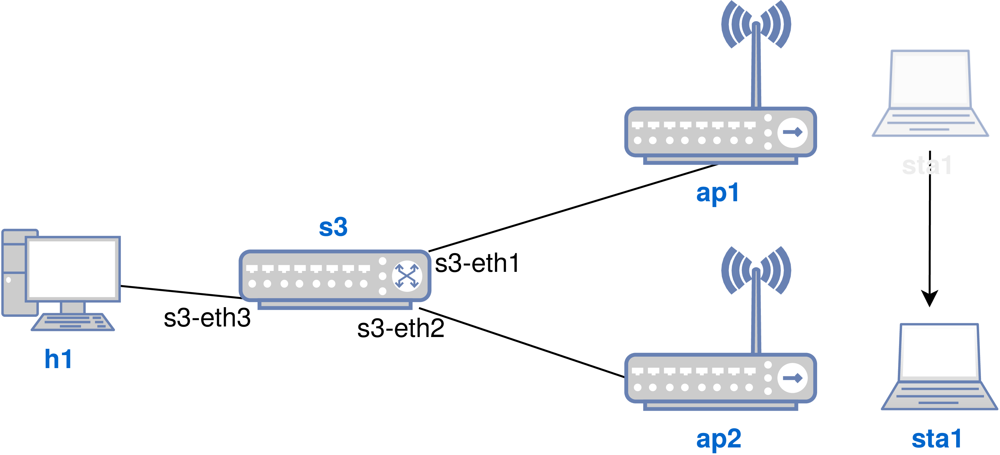


Then, on the Mininet-WiFi CLI try to _ping_ between **h1** and **sta1**.

```
    mininet-wifi> h1 ping -c5 sta1
    PING 10.0.0.1 (10.0.0.1) 56(84) bytes of data.
    64 bytes from 10.0.0.1: icmp_seq=1 ttl=64 time=46.5 ms
    64 bytes from 10.0.0.1: icmp_seq=2 ttl=64 time=1.48 ms
    64 bytes from 10.0.0.1: icmp_seq=3 ttl=64 time=1.17 ms
    64 bytes from 10.0.0.1: icmp_seq=4 ttl=64 time=1.17 ms
    64 bytes from 10.0.0.1: icmp_seq=5 ttl=64 time=1.18 ms

    --- 10.0.0.1 ping statistics ---
    5 packets transmitted, 5 received, 0% packet loss, time 4005ms
    rtt min/avg/max/mdev = 1.175/10.319/46.574/18.127 ms
```

As you can see, **sta1** can communicate with **h1** and vice versa. Note that **sta1** is initially associated with access point **ap1**.


Now, let us change the position of station **sta1**, so that it stays under the signal range of **ap2** and consequently associates with it.

```
    mininet-wifi> py sta1.setPosition('60,10,0')
```

Then try again to _ping_ between **h1** and **sta1**. 

```
    mininet-wifi> sta1 ping -c5 h1
    PING 10.0.0.2 (10.0.0.2) 56(84) bytes of data.

    --- 10.0.0.2 ping statistics ---
    5 packets transmitted, 0 received, 100% packet loss, time 4074ms
```

 Why is it that **sta1** can no longer communicate with **h1**? Because the way the controller acted made it impossible for communication between **sta1** and **h1** to take place. What does that mean? Before answering this question, let us check the connections between the access points and the switch.

```
    mininet-wifi> links
    sta1-wlan0<->wifi (OK wifi) 
    ap1-eth2<->s3-eth1 (OK OK) 
    ap2-eth2<->s3-eth2 (OK OK) 
    s3-eth3<->h1-eth0 (OK OK)
```

Now, let us look at the flow table of switch **s3**.

```
    mininet-wifi> sh ovs-ofctl dump-flows s3
     cookie=0x0, duration=49.302s, table=0, n_packets=4, n_bytes=392, idle_timeout=60, priority=65535, icmp, in_port="s3-eth1", vlan_tci=0x0000, dl_src=02:00:00:00:00:00, dl_dst=e2:8f:ac:bd:6c:79, nw_src=10.0.0.1, nw_dst=10.0.0.2, nw_tos=0, icmp_type=8, icmp_code=0 actions=output:"s3-eth3"
     cookie=0x0, duration=49.299s, table=0, n_packets=9, n_bytes=882, idle_timeout=60, priority=65535 ,icmp,in_port="s3-eth3", vlan_tci=0x0000, dl_src=e2:8f:ac:bd:6c:79, dl_dst=02:00:00:00:00:00,nw_src=10.0.0.2, nw_dst=10.0.0.1, nw_tos=0, icmp_type=0, icmp_code=0 actions=output:"s3-eth1"
     cookie=0x0, duration=24.518s, table=0, n_packets=4, n_bytes=392, idle_timeout=60, priority=65535, icmp, in_port="s3-eth2", vlan_tci=0x0000, dl_src=02:00:00:00:00:00, dl_dst=e2:8f:ac:bd:6c:79, nw_src=10.0.0.1, nw_dst=10.0.0.2, nw_tos=0, icmp_type=8, icmp_code=0 actions=output:"s3-eth3"
```

The first part of the output represents a flow installed on the switch **s3**. It says that any packet that goes to the **s3-eth1** interface should be forwarded to **s3-eth3**. The second part says that any packet that goes to interface **s3-eth3** must exit through **s3-eth1**. Until then, there is a perfect communication going on between **ap1** and **s3**, whose origin is **sta1** and destination is **h1**, correct?

 Part of the output from `dump-flows` has been omitted so that we can focus more specifically on what interests us: the communication between **sta1** and **sta2**.

Now let us look at the third and last flow. What does it say? It says that packets entering interface **s3-eth2** must go out through interface **s3-eth3**. It is very similar to the first packet, changing only the input interface. In this case, the packet arrives at the **s3** switch, which in turn routes the packet to host **h1** (_echo request_). 


What about the _echo reply_? What happens when the packet needs to be returned to **sta1**? The **s3** switch will continue trying to forward the packet to the station via **ap1**, since there is still a flow table with this statement, despite **sta1** no longer being associated with access point **ap1**, which makes it so that no communication is possible.


So, what could be done to make communication between **sta1** and **h1** possible? There are controllers that were developed to handle this specific situation. The [Odin controller](https://github.com/Wi5/odin-wi5-controller), for instance, promises mobility management. However, as a workaround, we could fix this issue by using a home-made solution.


What happens is that if the switch does not receive any packet for sixty seconds, it will erase the existing entries and **sta1** will be able to communicate with **h1** again. Simple, right? A sixty second duration is set in _idle\_timeout_ (see the flows shown above). Thus, if the switch does not receive packets that match the previously-installed flow - whose source is **h1** and destination **sta1** -, it will simply erase that input from its flow table.


Somewhat similar to _idle\_timeout_ is _hard\_timeout_. However, in _hard\_timeout_, entries are excluded regardless of the presence of new matching packets. But back to the case in question: would you prefer to wait a minute to make another attempt at communication? Certainly not.


Therefore, in order to not have to wait for sixty seconds, you can delete the previously installed table. For example, the command below will erase any flow that has as its reference point the **s3-eth3** input port, from the **s3** switch interface that is connected to host **h1**.

```
    mininet-wifi> sh ovs-ofctl del-flows s3 "in_port=s3-eth3"
```

After this, **sta1** will finally be able to reestablish communication with **h1**.

```
    mininet-wifi> sta1 ping -c1 h1
    PING 10.0.0.2 (10.0.0.2) 56(84) bytes of data.
    64 bytes from 10.0.0.2: icmp_seq=1 ttl=64 time=17.8 ms

    --- 10.0.0.2 ping statistics ---
    1 packets transmitted, 1 received, 0% packet loss, time 0ms
    rtt min/avg/max/mdev = 17.846/17.846/17.846/0.000 ms
```

Another alternative to solve this problem would be to identify the input packets on the **s3-eth3** interface and create an action called normal, which is available in the OpenFlow protocol and is used to make the switch operate as a traditional switch.

 What would happen if both _idle\_timeout_ and _hard\_timeout_ were set to the same value? _Hard\_timeout_ would occur and flows would be excluded regardless of the presence of new packets.

## Use case scenarios
From now on, we will perform some common scenario tutorials on computer networks that support Mininet-WiFi. These scenarios include web servers, DHCP, _firewall_, among other networks.

### WEB server
Requirements: _SimpleHTTPServer_

Web servers are some of the most widely used services and servers in the world and are essential for a website to be available on the internet. They basically consist of computers that host one or more internet sites or programs or even local area networks. The term web server, however, may refer to both the hardware and software.


In this tutorial, we will run a web server from one node in Mininet-WiFi and access the content of the tutorial through another one. To do so we will use _SimpleHTTPServer_. _SimpleHTTPServer_ is a module of the _Python_ programming language that functions as a simple and fast alternative to serve files from a directory on the local system via HTTP and without having to install other web servers such as Apache, Nginx, and so on.


Although it is a prerequisite, _SimpleHTTPServer_ should already be installed on your system, since _Python_ is also installed and this module is part of version 2.x of _Python_.

 If you have _Python_ 3.x installed and want to use a module for web servers, you should use _http.server_, since this new module replaces _SimpleHTTPServer_ in version 3.x.

To explore _SimpleHTTPServer_, let us first start Mininet-WiFi with its simplest topology.

```
    ~/mininet-wifi$ sudo mn --wifi
```

Then, we start _SimpleHTTPServer_ on **sta1** as below.

```
    mininet-wifi> sta1 python -m SimpleHTTPServer 80 &
```

Next, we use **sta2** to consume the content of _SimpleHTTPServer_ that is stored in **sta1**.

```
    mininet-wifi> sta2 wget -O - sta1
```

A result similar to the one given below should be seen.

```
    --2018-12-26 13:38:34--  http://10.0.0.1/
    Connecting to 10.0.0.1:80... connected.
    HTTP request sent, awaiting response... 200 OK
    Length: 4780 (4,7K) [text/html]
    Saving to: ‘STDOUT’
    ...
    ...
    -   100%[===================>]   4,67K  --.-KB/s    in 0,002s
```

Although this is only a simple test, it can be used as a support for more sophisticated tests, where, for instance, the transfer time of a given file could be measured in different circumstances, such as background traffic, mobility, etc.


Local files can also be accessed by replacing the destination with the IP address. For example, assuming that there is a text file called <_test.txt_>, it can be accessed as follows:

```
    mininet-wifi> sta2 wget -O - 10.0.0.1/test.txt
```


The <_test.txt_> file was not previously created for this tutorial, but you can do so. It is important to note that the file must be saved in the directory from which _SimpleHTTPServer_ is ran.

### DHCP server
Requirements: _isc-dhcp-server_

The DHCP protocol (_Dynamic Host Configuration Protocol_) is one of the most important services in the network infrastructure. It is responsible for assigning IP addresses dynamically, so that you do not need to alter the machine's settings to connect to the network.


In general, you can assign IP addresses in three different ways:


_Dynamic_ - the most common method, because, in it, the DHCP server provides the network settings. However, these are not permanent, and after a certain period, usually after the client machine is shut down or restarted, the addressing is updated;
_Automatic_ - similar to the dynamic configuration; its main difference is that it will make the DHCP server provide the same address used in the last request;
_Manual_ - the administrator binds the MAC address of the client device to a specific IP address.


In this tutorial, we will understand how a DHCP server works, from its configuration process to its execution, also analyzing the exchange of messages between server and client afterwards. To accomplish this, we will first execute the <_dhcp.py_> file, which generates a topology similar to the one shown in the figure below.

```
    ~/mininet-wifi$ sudo python mn-wifi-book-en/codes/cap3/dhcp.py
```

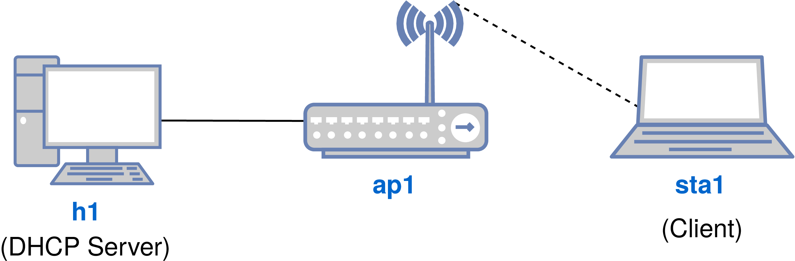


 <_dhcp.py_> includes three parameters that need to be explained. The _failMode='standalone'_ parameter makes the access point work as a traditional access point; `inNamespace=False`  causes the host **h1** to be executed in the root network namespace, instead of running in a namespace by itself; and the `echo 1 > /proc/sys/net/ipv4/ip\_forward` command enables the IP forwarding on **h1**.

After running the script you can see that **sta1** has no IP address. The reason for this is simple: the DHCP server has not been properly configured yet.

```
    mininet-wifi> sta1 ip add show
    1: lo: <LOOPBACK,UP,LOWER_UP> mtu 65536 qdisc noqueue state UNKNOWN group default qlen 1000
        link/loopback 00:00:00:00:00:00 brd 00:00:00:00:00:00
        inet 127.0.0.1/8 scope host lo
       valid_lft forever preferred_lft forever
        inet6 ::1/128 scope host 
       valid_lft forever preferred_lft forever
    354: sta1-wlan0: <NO-CARRIER,BROADCAST,MULTICAST,UP,LOWER_UP> mtu 1500 qdisc mq state DORMANT group default qlen 1000
        link/ether 00:00:00:00:00:12 brd ff:ff:ff:ff:ff:ff
```


Hence, to assign an IP address for **sta1** you will need to configure a DHCP server first. To do so, you will need to install a program that will act as a DHCP server, such as _isc-dhcp-server_. We will install it using the following command:

```
    ~/mininet-wifi$ sudo apt install isc-dhcp-server
```

Once _isc-dhcp-server_ is installed, you will need to configure the configuration file located at <_/etc/dhcp/dhcpd.conf_> (_the location of the file may vary depending on the version of the DHCP server being used_). To configure it, we suggest first accessing the dhcp directory and then copying the <_dhcpd.conf_> file, for security reasons.

```
    ~/mininet-wifi$ cd /etc/dhcp
    ~/etc/dhcp$ cp dhcpd.conf dhcpd.conf.bkp
```

You then need to edit <_dhcpd.conf_> and copy the content below and paste it into the file's text. <_dhcpd.conf_> can be edited using your preferred text editor. 

```
    option domain-name-servers 192.168.11.1;
    subnet 192.168.11.0 netmask 255.255.255.0 {
    range 192.168.11.2 192.168.11.254;
    option routers 192.168.11.1;
    default-lease-time 6000;
    max-lease-time 72000;
    INTERFACES="h1-eth0";
    }
```

Following all of the above steps, let us open a terminal for **h1** and another for **sta1**.

```
    mininet-wifi> xterm sta1 h1
```

Then locate the **h1** terminal and restart the DHCP server to apply the new settings by executing the following command.

```
    h1# service isc-dhcp-server restart
```

Now, let us perform two tasks on the **sta1** terminal: the first one is to start _Wireshark_ and check the exchange of messages between the DHCP server and the client; and the second one is to have **sta1** search for the IP address that will be assigned by **h1**, i.e. the DHCP server.

```
    sta1# wireshark &
```

When issued, the ``\&'' character runs _Wireshark_ and allows you to execute new commands on the same terminal. With _Wireshark_, find the **sta1-wlan0** interface and start capturing through it, as shown in the figure below.

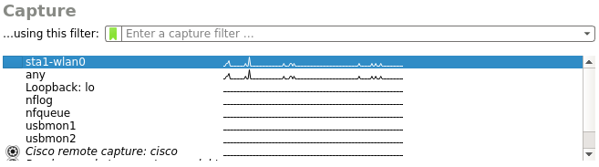


Then, returning to the **sta1** terminal, let us assign an IP address to it using the `dhclient` command.

```
    sta1# dhclient
```

Finally, check the IP address assigned to **sta1**. If everything happened as expected, you will be to see an IP address on the 192.168.11.0/24 subnet assigned to **sta1**.

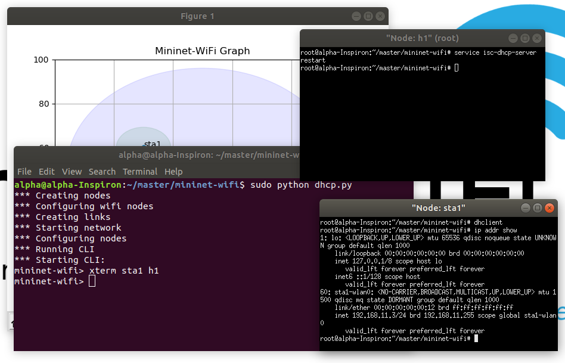

Now, using _Wireshark_ again, you can notice that the it shows four important messages, which are part of the IP address assignment process. These messages are: DHCP Discover, DHCP Offer, DHCP Request and DHCP ACK.


Generally speaking, the previously performed DHCP service functioned as follows:

- Initially, **sta1** sent a UDP packet called DHCP Discover to all network devices. If there were more nodes connected to access point **ap1**, the other nodes would also receive a copy of the packet;
- The computer responsible for the DHCP service - **h1** -, in turn, responded to DHCP Discover by providing the IP address to the **sta1** client. This step is carried out by DHCP Offer;
- Then, after receiving the DHCP Offer packet, **sta1** sent another packet to the server that requested a ``lease'' of the information previously provided by the DHCP server. This packet (or message) is called DHCP Request;
- Finally, after receiving the DHCP Request packet from the client, the DHCP server confirmed receipt of the ``lease'' request by sending the DHCP ACK message.


 If **sta1** has not received an IP address and/or could not view the messages on Wireshark, we recommend that you restart your system. Ensure that the 192.168.11.0/24 subnet has not been previously configured on your system, otherwise you may need to make changes in the <_dhcpd.conf_> file


### Dealing with loops
Requirements: script(s) only

A switching loop occurs when there is more than one layer 2 path between two endpoint devices. In other words, there are several connections between two switches or two ports that are linked together on the same switch. The problem is that when there is a switching loop in the network, the destination will be inaccessible until the switching loop disappears.


Switching loops also generate broadcast storms, since broadcast packets are routed to all ports on the switch. As a consequence, the switch will repeatedly re-transmit the broadcast messages, flooding the entire network and causing loss of communication between the devices that comprise it.


In this tutorial, we will see a practical example of the switching loop and how it can be avoided. To do this, we will run <_loop.py_>. The topology provided by this script retracts the previously used topology, shown in the figure below. Note that to reach **sta2**, a packet generated by **sta1** can be forwarded through two paths: either via **sta3** or directly to **sta2**.

```
    ~/mininet-wifi$ sudo python mn-wifi-book-en/codes/cap3/loop.py
```

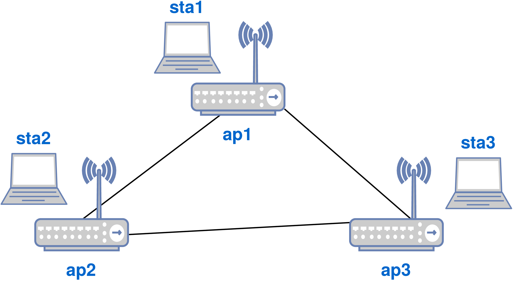


Then, try to _ping_ between **sta1** and **sta2**.

```
    mininet-wifi> sta1 ping -c1 sta2
    PING 10.0.0.2 (10.0.0.2) 56(84) bytes of data.
    From 10.0.0.1 icmp_seq=1 Destination Host Unreachable

    --- 10.0.0.2 ping statistics ---
    1 packets transmitted, 0 received, +1 errors, 100% packet loss, time 0ms
```

As you can see, _ping_ was not successful. One of the ways to avoid layer 2 loops is by using the Spanning-Tree Protocol (STP). Basically, the STP blocks redundant paths, thus avoiding the formation of loops. In fact, it is precisely because of this behavior (path blocking) that in some networks (data centers, for example) the STP is not very well accepted.


To check the STP in action, close Mininet-WiFi and run the same script as before, with `-s`.

```
    mininet-wifi> exit
    ~/mininet-wifi$ sudo python mn-wifi-book-en/codes/cap3/loop.py -s
```

Then, on the Mininet-WiFi CLI, do the operation indicated by the method below. This method will inform when the convergence of the STP has been completed. A message stating ``True'' should appear, indicating convergence.

```
    mininet-wifi> py net.waitConnected()
    *** Waiting for switches/aps to connect
    ap3 ap1 ap2 
    True
```

Finally, try a new _ping_ between **sta1** and **sta2**.

```
    mininet-wifi> sta1 ping -c1 sta2
    PING 10.0.0.2 (10.0.0.2) 56(84) bytes of data.
    64 bytes from 10.0.0.2: icmp_seq=1 ttl=64 time=2.48 ms

    --- 10.0.0.2 ping statistics ---
    1 packets transmitted, 1 received, 0% packet loss, time 0ms
    rtt min/avg/max/mdev = 2.489/2.489/2.489/0.000 ms
```

As you can notice, _ping_ has now been successful thanks to the STP protocol.


The following command confirms that the STP protocol is indeed active.

```
    mininet-wifi> sh ovs-ofctl show ap1
    OFPT_FEATURES_REPLY (xid=0x2): dpid:1000000000000001
    n_tables:254, n_buffers:0
    capabilities: FLOW_STATS TABLE_STATS PORT_STATS QUEUE_STATS ARP_MATCH_IP
    actions: output enqueue set_vlan_vid set_vlan_pcp strip_vlan mod_dl_src mod_dl_dst mod_nw_src mod_nw_dst mod_nw_tos mod_tp_src mod_tp_dst
     1(ap1-wlan1): addr:02:00:00:00:03:00
         config:     0
         state:      STP_FORWARD
         speed: 0 Mbps now, 0 Mbps max
     2(ap1-eth2): addr:ee:74:8c:50:a5:0d
         config:     0
         state:      STP_FORWARD
         current:    10GB-FD COPPER
         speed: 10000 Mbps now, 0 Mbps max
     3(ap1-eth3): addr:8a:b3:aa:0a:95:5f
         config:     0
         state:      STP_FORWARD
         current:    10GB-FD COPPER
         speed: 10000 Mbps now, 0 Mbps max
     LOCAL(ap1): addr:46:1a:2c:d4:84:4e
         config:     PORT_DOWN
         state:      LINK_DOWN
         speed: 0 Mbps now, 0 Mbps max
    OFPT_GET_CONFIG_REPLY (xid=0x4): frags=normal miss_send_len=0
```


### Virtual LAN (VLAN)
Requirements: _bridge-utils_, _vlan_

Virtual Local Area Networks (VLANs) are local networks that organize a set of computers in a logical way, where communication between the various computers is managed by the physical architecture. Thanks to the freedom brought by virtual networks (VLANs), it is possible to get rid of the physical architecture's limitations, such as geographic or even addressing restrictions. This allows the definition of a logical segmentation based on a grouping of machines, also due to criteria that permit the use of MAC addresses, port numbers, protocols, and so on. Even in the simplest VLAN configuration, the user can define different VLAN IDs for different groups of devices and reduce the size of the broadcast domain in order to improve network quality.


In this tutorial, we will segment the network using VLANs. The goal is to separate stations that are associated with different access points and still perform a number of configurations that will allow communication between the stations that belong to different VLANs.


Before starting this tutorial, you will need to install a few packages. The following command should install all necessary packages.

```
    ~/mininet-wifi$ sudo apt install bridge-utils vlan
```

Now, let us run <_vlan.py_>. The topology included in this script consists of four stations and two access points, arranged and configured according to the figure below.

```
    ~/mininet-wifi$ sudo python mn-wifi-book-en/codes/cap3/vlan.py
```


After running <_vlan.py_>, we will try to _ping_ between **sta1** and **sta2**.

```
    mininet-wifi> sta1 ping -c1 sta2
    PING 10.0.0.2 (10.0.0.2) 56(84) bytes of data.
    64 bytes from 10.0.0.2: icmp_seq=1 ttl=64 time=0.344 ms

    --- 10.0.0.2 ping statistics ---
    1 packets transmitted, 1 received, 0% packet loss, time 0ms
    rtt min/avg/max/mdev = 0.344/0.344/0.344/0.000 ms
```

Now, ping between **sta1** and **sta3**.

```
    mininet-wifi> sta1 ping -c1 sta3
    PING 10.0.0.3 (10.0.0.3) 56(84) bytes of data.
    From 10.0.0.1 icmp_seq=1 Destination Host Unreachable

    --- 10.0.0.3 ping statistics ---
    1 packets transmitted, 0 received, +1 errors, 100% packet loss, time 0ms
```

Both **sta1** and **sta3** are configured to operate on separate VLANs. For this reason and due to the lack of instructions given to access points **ap1** and **ap2** - which could allow communication between **sta1** and **sta3** to happen -, they cannot communicate with each other.


Now let us assume that it is necessary to allow communication between nodes belonging to different VLANs. Therefore, we will need to create instructions that will enable this communication. To do so, we will create the rules using the OpenFlow protocol. The four rules below modify the VLAN number (or VLAN ID), thus allowing communication to take place between all the nodes that comprise the topology, including those belonging to different VLANs.


```
    mininet-wifi> sh ovs-ofctl add-flow ap1 priority=100,in_port=1,dl_vlan=10,actions=mod_vlan_vid:20,output:2
    mininet-wifi> sh ovs-ofctl add-flow ap1 priority=100,in_port=2,dl_vlan=20,actions=mod_vlan_vid:10,output:1
    mininet-wifi> sh ovs-ofctl add-flow ap2 priority=100,in_port=1,dl_vlan=20,actions=mod_vlan_vid:10,output:2
    mininet-wifi> sh ovs-ofctl add-flow ap2 priority=100,in_port=2,dl_vlan=10,actions=mod_vlan_vid:20,output:1
```

Now, let us repeat the attempt to _ping_ **sta1** and **sta3**.

```
    mininet-wifi> sta1 ping -c1 sta3
    PING 10.0.0.3 (10.0.0.3) 56(84) bytes of data.
    64 bytes from 10.0.0.3: icmp_seq=1 ttl=64 time=1.75 ms

    --- 10.0.0.3 ping statistics ---
    1 packets transmitted, 1 received, 0% packet loss, time 0ms
    rtt min/avg/max/mdev = 1.751/1.751/1.751/0.000 ms
```

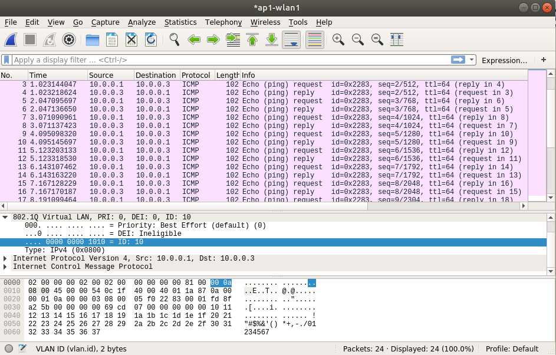

As you can notice, the communication between **sta1** and **sta3** was successfully established because of the four rules, which correctly applied to access points **ap1** and **ap2**. Consequently, _Wireshark_ can be used to verify information about the VLAN ID, as shown in the figure above.


#### VLAN striping
Requirements: _bridge-utils_, vlan

Now, let us carry out a slightly different procedure than the one we did before. Let us make it so that the number ten VLAN is untagged when it leaves **sta1**'s interface, and tagged when it enters the same interface.


First, let us remove any existing VLAN markup. In the example below we use `ip link`, but you can also use `vconfig`, a program for configuring VLANs.

```
    mininet-wifi> sta3 ip link delete sta3-wlan0.20
    mininet-wifi> sta4 ip link delete sta4-wlan0.20
    mininet-wifi> sta3 ip link set sta3-wlan0 down
    mininet-wifi> sta4 ip link set sta4-wlan0 down
    mininet-wifi> sta3 ip link set sta3-wlan0 up
    mininet-wifi> sta4 ip link set sta4-wlan0 up
    mininet-wifi> sta3 iw dev sta3-wlan0 connect ssid-ap2
    mininet-wifi> sta4 iw dev sta4-wlan0 connect ssid-ap2
```

Note that it was necessary to do a manual association with **ap2**, since the ip link command includes another that disables the wireless interface of both **sta3** and **sta4** via the `down` parameter.


Once the association is made, note that **sta1** is again unable to communicate with **sta3**, since there is no VLAN defined for **sta3**.

```
    mininet-wifi> sta1 ping -c1 sta3
    PING 10.0.0.3 (10.0.0.3) 56(84) bytes of data.
    From 10.0.0.1 icmp_seq=1 Destination Host Unreachable

    --- 10.0.0.3 ping statistics ---
    1 packets transmitted, 0 received, +1 errors, 100% packet loss, time 0ms
```

Now, let us enable VLAN untagging again using the OpenFlow protocol.

```
    mininet-wifi> sh ovs-ofctl add-flow ap1 priority=100,in_port=1,dl_vlan=10,actions=strip_vlan,output:2
    mininet-wifi> sh ovs-ofctl add-flow ap1 priority=100,in_port=2,actions=mod_vlan_vid:10,output:1
```

Finally, do a new _ping_ attempt in order to communicate. If all was set up properly, it should be successful again.

```
    mininet-wifi> sta1 ping -c1 sta3
    PING 10.0.0.3 (10.0.0.3) 56(84) bytes of data.
    64 bytes from 10.0.0.3: icmp_seq=1 ttl=64 time=0.456 ms

    --- 10.0.0.3 ping statistics ---
    1 packets transmitted, 1 received, 0% packet loss, time 0ms
    rtt min/avg/max/mdev = 0.456/0.456/0.456/0.000 ms
```

VLAN tagging and untagging is not limited to the OpenFlow protocol. Any other network command executable on Linux operating systems can also be used.

### Routing
Routing is the name given to the process of choosing among several possible ways to send a message. The node that makes this choice is called a router. There are basically two ways to perform MAC/IP routing: through static routing and/or dynamic routing. In the following tutorials, we will discuss a little more about these two types of routing.

#### Static routing
Requirements: script(s) only

In static routing, the network administrator is responsible for manually completing the route table (creation and change). This type of routing is typically used in networks with few connection elements and is relatively simple to configure in small networks. On the other hand, its maintenance is relatively difficult in medium and large networks.


In this tutorial, we will enable communication between two nodes that are separated by two wireless routers, exactly as illustrated in the figure below.

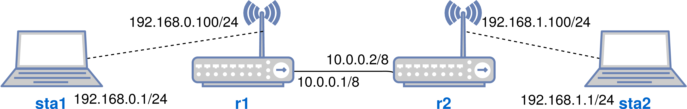


To do so, let us run <_static-routing.py_>.

```
    ~/mininet-wifi$ sudo python mn-wifi-book-en/codes/cap3/static-routing.py
```

Afterwards, let us try a _ping_ between **sta1** and **sta2**.

```
    mininet-wifi> sta1 ping -c1 sta2
    PING 192.168.1.1 (192.168.1.1) 56(84) bytes of data.
    From 192.168.0.100 icmp_seq=1 Destination Net Unreachable

    --- 192.168.1.1 ping statistics ---
    1 packets transmitted, 0 received, +1 errors, 100% packet loss, time 0ms
```

As you can see, **sta1** cannot communicate with **sta2**, even though the gateway address is set. You might wonder, then: what could be happening? What could be preventing communication between **sta1** and **sta2**?


By making a brief analysis, it is possible to observe that the **r1** router knows 192.168.0.0/24 and 10.0.0.0/8, while the **r2** router knows 192.168.1.0/24 and also 10.0.0.0/8, since these IPs are directly connected to these routers. I.e. router **r1** does not know the existence of 192.168.1.0/24 or how to get on its network, especially with regard to the **sta2** station, whose IP is 192.168.1.1. Router **r2**, on the other hand, does not know on how to acquire 192.168.0.0/24, especially regarding station **sta1**, whose IP is 192.168.0.1/24.


Therefore, you need to create a route table to solve this deadlock and allow communication to happen among the nodes. The commands below will cause **r1** and **r2** to know the networks previously unknown to them, or more specifically the hosts that are unreachable.

```
    mininet-wifi> r1 ip route add to 192.168.1.1 via 10.0.0.2
    mininet-wifi> r2 ip route add to 192.168.0.1 via 10.0.0.1
```

Then, let us finally try a new _ping_ between **sta1** and **sta2**.

```
    mininet-wifi> sta1 ping -c1 sta2
    PING 192.168.1.1 (192.168.1.1) 56(84) bytes of data.
    64 bytes from 192.168.1.1: icmp_seq=1 ttl=62 time=0.122 ms

    --- 192.168.1.1 ping statistics ---
    1 packets transmitted, 1 received, 0% packet loss, time 0ms
    rtt min/avg/max/mdev = 0.122/0.122/0.122/0.000 ms
```

As you can see, _ping_ was successful.


Now, picture the Internet, which has thousands of routers and paths often arranged in an unorganized way, where each company is responsible for its equipment. Creating static routes for each router would be very costly and difficult to maintain. Thus, it is often necessary to configure dynamic routes through routing protocols. Then, given its importance, let us understand how dynamic routing works.


#### Dynamic routing
Requirements: script(s) only

Usually, modern computer networks use dynamic routing algorithms instead of static routing. The routing algorithms are implemented by the protocols, commonly known as routing protocols. These protocols are divided into two main groups: distance vector and link state. The first group tracks the number of hops, or routers existing between source and destination, as a metric. The second group registers, also as a metric, the state of the network, which can include traffic load, bandwidth, the cost of the circuit, the service priority assigned to the packets that are created or forwarded to a specific point, among other variables.


For this tutorial, we will use a program that simulates the RIP routing protocol (_Routing Information Protocol_), a distance vector protocol. The scripts used in this tutorial were created by _Peter L Dordal_, author of the book _An Introduction to Computer Networks_. Although they are currently available [on the Internet](http://intronetworks.cs.luc.edu/current/html/mininet.html\#ip-routers-with-simple-distance-vector-implementation), you may need to read the book for more information should the public link be altered or made unavailable.


As the _book_ repository already includes all the scripts and codes needed, let us then run this tutorial's script.

```
    ~/mininet-wifi$ sudo python mn-wifi-book-en/codes/cap3/routerline.py
```

As illustrated in the figure below, the topology of this script consists of three routers and two hosts. You can notice that the three routers shown in the figure are arranged in a linear way. It is also worth noting that host **h1** is connected to router **r1**, while host **h2** is connected to the router **r3**.

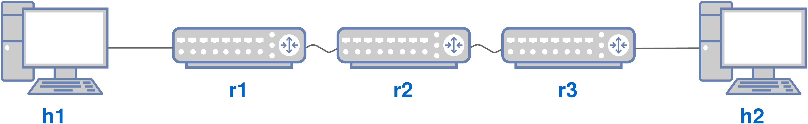


Now, if we ping between **h1** and **h2**, it will become evident that it is possible to establish communication between them.

```
    mininet> h1 ping -c1 h2
    PING 10.0.3.10 (10.0.3.10) 56(84) bytes of data.
    64 bytes from 10.0.3.10: icmp_seq=1 ttl=61 time=0.093 ms

    --- 10.0.3.10 ping statistics ---
    1 packets transmitted, 1 received, 0% packet loss, time 0ms
    rtt min/avg/max/mdev = 0.093/0.093/0.093/0.000 ms
```

 This communication was only possible due to the RIP routing protocol (see <_rip.py_>), which was started together with <_routerline.py_>.


Unlike static routing, in dynamic routing the routing protocol configures all routing tables and also interacts with their routers, which have the same active routing protocol. Note that we basically got the nodes to communicate with each other effortlessly.


### Firewall
Requirements: _iptables_

A firewall acts as a defense for a local computer or network against several threats, such as viruses, worms, trojans, and other malicious code. It can be software (a security program) or hardware (a physical router), but both have the same function: the analysis of incoming or outgoing network traffic to check for blacklisted data. Firewalls check each data packet (small pieces of a larger whole, reduced in size for easy transmission) to ensure that they do not contain anything malicious.


In this tutorial, we will use _iptables_ and create a rule that will block communication between two nodes. _Iptables_ is a firewall software that allows the administration of tables within the kernel of any Linux operating system. You do not need to have prior knowledge of the kernel, nor of the tables inside it, in order to modify the firewall and perform common system administration tasks. Usually, _iptables_ is already installed on Linux systems.

 The Linux community recently announced _bpfilter_, a firewall that will surely replace _iptables_. It promises to improve performance as well as to ensure a smooth transition from _iptables_ for Linux users.


Returning to the purpose of this tutorial, let us create our firewall rule by using Mininet-WiFi's simplest topology.

```
    ~/mininet-wifi$ sudo mn --wifi
```

Then, from the Mininet-WiFi CLI, let us create a single rule that does not allow **sta2** to receive _echo request_ messages.

```
    mininet-wifi> sta2 iptables -A INPUT -p icmp --icmp-type echo-request -j DROP
```

Next, we can ping to confirm that **sta2** does not actually respond to the _echo request_ sent by **sta1**.

```
    mininet-wifi> sta1 ping -c1 sta2
    PING 10.0.0.2 (10.0.0.2) 56(84) bytes of data.

    --- 10.0.0.2 ping statistics ---
    1 packets transmitted, 0 received, 100% packet loss, time 0ms
```

Now, let us try the inverse, that is, an attempt to _ping_ **sta1** from **sta2**.

```
    mininet-wifi> sta2 ping -c1 sta1
    PING 10.0.0.1 (10.0.0.1) 56(84) bytes of data.
    64 bytes from 10.0.0.1: icmp_seq=1 ttl=64 time=0.073 ms

    --- 10.0.0.1 ping statistics ---
    1 packets transmitted, 1 received, 0% packet loss, time 0ms
    rtt min/avg/max/mdev = 0.073/0.073/0.073/0.000 ms
```

As we can see, **sta2** is able to communicate with **sta1** because only the _echo request_ was blocked, which in the former case was done by **sta1**. In the latter case, the _echo request_ was sent by **sta2** as an OUTPUT packet and not INPUT, as defined in the rule.

 If you had to block _ping_ operations from **sta2** to **sta1**, what would you do? If you intend to use the _echo request_ as an OUTPUT of **sta2**, or even as an INPUT to **sta1**, you were right. For example: `iptables -A OUTPUT -p icmp --icmp-type echo-request -j DROP`
 

```
    mininet-wifi> sta2 
```

In this case, no ICMP packets could be generated by **sta2**, since they would all be blocked.


Now, let us do an operation similar to the one done earlier but changing the protocol and setting a port number.


To do so, we will run <_internet.py_>.

```
    ~/mininet-wifi$ sudo python mn-wifi-book-en/codes/cap3/internet.py
```

With Mininet-WiFi running, we will try to make sure that google.com's port 80 is open. This is a simple test, and its answer is yes, google.com's port 80 is open, since it is a web page available on the internet.


The port verification test will be done using _telnet_, a network protocol that makes it possible to check ports and tell whether they are open or not, in addition to other functions.

```
    mininet-wifi> sta1 telnet google.com 80
    Trying 216.58.202.78...
    Connected to google.com.
    Escape character is '^]'.
    ^]^]
    telnet> quit
    Connection closed.
    mininet-wifi>
```

 If _telnet_ does not work, and in turn a message appears stating that it was not possible to reach google.com, you will need to check whether a DNS server is properly configured on your system and if there are no active firewall rules preventing connection to port 80.


Hence, as a way of simulating an attempt to protect a fictitious internal network, we will block port 80 so that it cannot be reached.

 After starting a _telnet_ session, you can exit it by pressing Ctrl+], exactly as indicated by the `_Escape character is \^{}]}` message. The `\^{}` character means the Control key on the keyboard.


To do so, we will apply the following rule. It instructs the system that any outgoing packet corresponding to the TCP protocol that enters the **sta1-wlan0** interface with the destination port 80 must be dropped.

```
    mininet-wifi> sta1 iptables -A OUPUT -p tcp -i sta1-wlan0 --dport 80 -j DROP
```

Once the rule is applied, we can open a new telnet session on port 80 and confirm that it is possible to reach port 80.

```
    mininet-wifi> sta1 telnet google.com 80
    Trying 216.58.202.78...
```

After some time you will notice that you cannot communicate with google.com on port 80. Because port 80 is locked, **sta1** will try to communicate with it indefinitely. In these cases, you can cancel the communication attempt by pressing `Ctrl + c`.


You can also do blocking actions by checking IP addresses, and even block Internet pages with _iptables_, although the latter option is not so suitable to be carried out using firewalls, but rather through proxy servers.

### Quality of Service (QoS)
Requirements: _Ryu_

Quality of Service (QoS) allows you to define access priorities among flows - making video calls and online games, for example -, so that they have high priorities over any other type of traffic that can cross the network. QoS is especially useful in networks with many clients and, if well used, can significantly improve connection quality, reducing the need for a connection with greater transferability.


The purpose of this tutorial is to understand how OpenFlow rules can be defined in the context of QoS. Regarding the OpenFlow protocol, these rules are treated as _meter tables_. To start this tutorial, use <_qos.py_>, which is a relatively simple file, since it has only one station, one access point, and one host, as shown in the figure below. Rules added to the access point will instruct it to limit the bandwidth that passes through it to up to 5 Mbits/s.


Before issuing this tutorial's script, you need to open a terminal and run _Ryu_.

```
    ~/mininet-wifi/ryu$ sudo PYTHONPATH=. ./bin/ryu-manager ryu/app/simple_switch_13.py
```

Then, on a new terminal, execute <_qos.py_>, as follows:

```
    ~/mininet-wifi$ sudo python mn-wifi-book-en/codes/cap3/qos.py
```

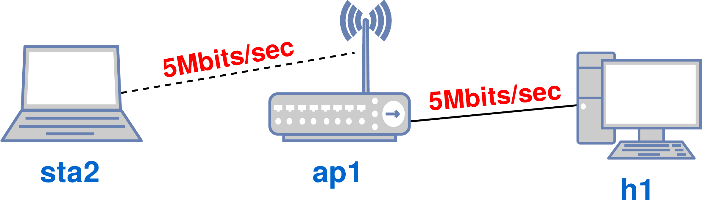


Then measure the bandwidth between **h1** and **sta1** with _iperf_. Do this on two terminals using _xterm_. Note that **h1** is the server and **sta1** the client. Unlike earlier tutorials, here we will use 10 Mb UDP packets (-u parameter).

```
    mininet-wifi> xterm h1 sta1
```

```
    h1# iperf -s -u
    ------------------------------------------------------------
    Server listening on UDP port 5001
    Receiving 1470 byte datagrams
    UDP buffer size:  208 KByte (default)
    ------------------------------------------------------------
    [ 15] local 10.0.0.2 port 5001 connected with 10.0.0.1 port 49733
    [ ID] Interval       Transfer     Bandwidth        Jitter   Lost/Total Datagrams
    [ 15]  0.0-10.8 sec  12.5 MBytes  9.68 Mbits/sec   0.095 ms    0/ 8918 (0%)
```

```
    sta1# iperf -c 10.0.0.2 -u -b 10M
    ------------------------------------------------------------
    Client connecting to 10.0.0.2, UDP port 5001
    Sending 1470 byte datagrams, IPG target: 1121.52 us (kalman adjust)
    UDP buffer size:  208 KByte (default)
    ------------------------------------------------------------
    [ 15] local 10.0.0.1 port 49733 connected with 10.0.0.2 port 5001
    [ ID] Interval       Transfer     Bandwidth
    [ 15]  0.0-10.0 sec  12.5 MBytes  10.5 Mbits/sec
```

Note that the client transferred data with a bandwidth close to 10 Mbits/s, and the server also received data at a rate of around 10 Mbits/s. In other words, here it can be seen that the server was able to receive approximately the same amount of data sent by **sta1**.


Now, we will close Mininet-WiFi, and run it again with the `-q` parameter, as demonstrated below.

```
    mininet-wifi> exit
    ~/mininet-wifi$ sudo python mn-wifi-book-en/codes/cap3/qos.py -q
```

Next, run _iperf_ again, exactly as was done earlier.

```
    h1# iperf -s -u
    -------------------------------------------------------------
    Server listening on UDP port 5001
    Receiving 1470 byte datagrams
    UDP buffer size:  208 KByte (default)
    ------------------------------------------------------------
    [ 15] local 10.0.0.2 port 5001 connected with 10.0.0.1 port 47218
    [ ID] Interval       Transfer     Bandwidth        Jitter   Lost/Total Datagrams
    [ 15]  0.0-10.8 sec  5.72 MBytes  4.43 Mbits/sec   0.293 ms 4835/ 8917 (54%)
```

```
    sta1# iperf -c 10.0.0.2 -u -b 10M
    -------------------------------------------------------------
    Client connecting to 10.0.0.2, UDP port 5001
    Sending 1470 byte datagrams, IPG target: 1121.52 us (kalman adjust)
    UDP buffer size:  208 KByte (default)
    ------------------------------------------------------------
    [ 15] local 10.0.0.1 port 47218 connected with 10.0.0.2 port 5001
    [ ID] Interval       Transfer     Bandwidth
    [ 15]  0.0-10.0 sec  12.5 MBytes  10.5 Mbits/sec
```

We can see that the client again transferred data at a rate of about 10 Mbit/s. However, this time, the server was limited to responding up to 5 Mbits/s. Or, more precisely, 4.43 Mbits/s. This was due to the OpenFlow rules that were defined for access point **ap1**, which are included in the script we just ran.

 It is important to note that this tutorial used OVSAP as the access point. However, OVS does not support _meter tables_ without _datapath_ being set as _user_ (see script). This is due to OVS's limitations.

Although in this tutorial we used a simple rule to limit bandwidth, rules can be customized in order to impose different bandwidth values for different types of traffic, as well as to impose different traffic profile priorities.

### MultiPath TCP (MP-TCP)

Requirements: _MP-TCP_

_MultiPath TCP_ (MP-TCP) is a set of extensions to the TCP protocol that enables reliable transmission over multiple end-to-end paths between client and server in computer networks, especially on the Internet. Two benefits are immediately obtained with the use of MP-TCP: the increase in end-to-end throughput via the aggregation of multiple TCP sub-flows; and greater tolerance to communication failure, since should a sub-flow become unavailable, one or more sub-flows will remain active.


The use of MP-TCP usually requires its installation, and afterwards it is necessary to use the kernel that will be created during the installation process. The installation process is simple and can be done by running _apt_.


```
    ~/mininet-wifi$ sudo apt install linux-mptcp
```

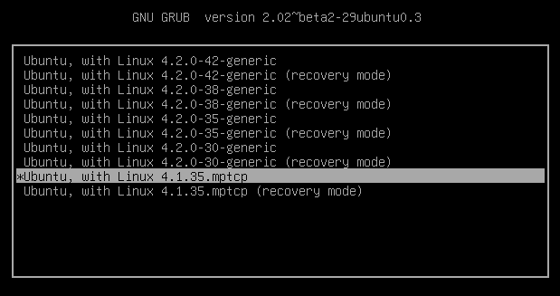


If you cannot install it using _apt_, you can find up-to-date information on how to install MP-TCP on its [official website](multipath-tcp.org/).


Since there is a kernel that is loaded by default when you start the operating system, you will need to choose the MP-TCP kernel before the operating system starts booting. A screen similar to the figure above should be displayed. You can easily identify the MP-TCP kernel, since there is a kernel with such name.


With MP-TCP installed and selected during the system boot, let us execute the tutorial script, <_mptcp.py_>. We recommend that you check its contents before doing so, however, as they contain the whole MP-TCP configuration code.

 You may need to issue the _uname -a_ command on the terminal to make sure that the kernel created for MP-TCP is being used.

After checking the contents of the script, run it:

```
    ~/mininet-wifi$ sudo python mn-wifi-book-en/codes/cap3/mptcp.py -m
```

Now open two terminals by running _xterm_ from the Mininet-WiFi CLI.

```
    mininet-wifi> xterm sta1 h1
```

Then, using _iperf_, make it so that **h1** and **sta1** operate as client and server, respectively. The throughput test will yield a similar result to the one shown below.

```
    sta1# iperf -s 
    ------------------------------------------------------------
    Server listening on TCP port 5001
    TCP window size: 85.3 KByte (default)
    ------------------------------------------------------------
    [ 20] local 10.0.0.2 port 5001 connected with 10.0.2.2 port 38248
    [ ID] Interval       Transfer     Bandwidth
    [ 20]  0.0-10.1 sec   227 MBytes   188 Mbits/sec
```

```
    h1# iperf -c 10.0.0.2 
    ------------------------------------------------------------
    Client connecting to 10.0.0.2, TCP port 5001
    TCP window size: 86.2 KByte (default)
    ------------------------------------------------------------
    [ 19] local 10.0.2.2 port 38268 connected with 10.0.0.2 port 5001
    [ ID] Interval       Transfer     Bandwidth
    [ 19]  0.0-10.0 sec   228 MBytes   191 Mbits/sec
```

Now, close Mininet-WiFi and try running the same script - <_mptcp.py_> - without adding _-m_, as follows.

```
    mininet-wifi> exit
    ~/mininet-wifi$ sudo python mn-wifi-book-en/codes/cap3/mptcp.py
```

This script without _-m_ is programmed to disassociate **sta1** from **ap2**. Thus, since **ap2** was operating on IEEE 802.11n and was therefore responsible for providing most of the throughput obtained in the previous test (about 190 Mbits/s), the resulting throughput in this new test will most likely be significantly lower than that of the previous one.


We can confirm this hypothesis, as demonstrated below.

```
    sta1# iperf -s 
    ------------------------------------------------------------
    Server listening on TCP port 5001
    TCP window size: 85.3 KByte (default)
    ------------------------------------------------------------
    [ 20] local 10.0.0.2 port 5001 connected with 10.0.2.2 port 38404
    [ ID] Interval       Transfer     Bandwidth
    [ 20]  0.0-10.5 sec  63.6 MBytes  50.9 Mbits/sec
```

```
    h1# iperf -c 10.0.0.2  
    ------------------------------------------------------------
    Client connecting to 10.0.0.2, TCP port 5001
    TCP window size: 86.2 KByte (default)
    ------------------------------------------------------------
    [ 19] local 10.0.2.2 port 38378 connected with 10.0.0.2 port 5001
    [ ID] Interval       Transfer     Bandwidth
    [ 19]  0.0-10.1 sec  63.1 MBytes  52.6 Mbits/sec
```

As you can see, the throughput has indeed dropped a lot - to around 50 Mbits/s.


**Research that used Mininet-WiFi for experimentation on MP-TCP**:

- Qi Zhao, Muhao Chen, Pengyuan Du, Tuan Le, Mario Gerla, _Towards Efficient Cellular Traffic Offloading via Dynamic MPTCP Path Configuration with SDN_. (ICNC'19), Honolulu, Hawaii, USA, February 2019.
- Singh, Pranav Kumar et al. _Multipath TCP for V2I communication in SDN controlled small cell deployment of smart city_. Vehicular communications.  2019.
- Zhao, Qi et al. _Software Defined Multi-Path TCP Solution for Mobile Wireless Tactical Networks_. In: MILCOM. IEEE. 2018.


## Extras

This section covers topics that are not originally present in the Mininet-WiFi book and may not necessarily have use cases related to wireless networks.

### GRE Tunnel

Requirements: _bridge-utils_

GRE tunnels are IP-over-IP tunnels which can encapsulate IPv4/IPv6 and unicast/multicast traffic. It is a tunneling protocol designed to initiate point-to-point connections capable of carrying any OSI Layer 3 protocol over an IP network. As it is a tunnel protocol, it can be deployed to connect different subnets or provide workarounds for networks with limited hops. Originally defined by Cisco, we can verify the operation of this protocol using Linux systems and consequently Mininet-WiFi.

We will run GRE Tunneling through <_extras/gre.py_> that will produce the network setup depicted just below:


```
               140.116.172.1                     140.116.172.2           
              h9 (h9-eth0) ----------------------- (h10-eth0) h10
              |   192.168.10.253--(tunnel)--192.168.20.253     |
          (h9-eth1)                                        (h10-eth1)   
        192.168.10.254                                   192.168.20.254 
              |                                                |
              |                                                |
            (eth3)                                          (eth3)    
              h1                                              h5
     (eth0) (eth1) (eth2)                            (eth0) (eth1) (eth2)
       |      |      |                                 |       |      | 
      h2      h3     h4                                h6      h7     h8 
```

 

- **h9** and **h10** are routers (gateways)
- **h1** and **h5** are switches
- the rest are simple hosts

You can run <_gre.py_> with:

```
    ~/mininet-wifi$ sudo python mn-wifi-book-en/codes/extras/gre.py
```

Then, you can try communicate **h1** and **h2** as follows:   

```
mininet-wifi> h2 ping -c2 h3
```

as well as **h2** and **h8**:  

```
mininet-wifi> h2 ping -c2 h8
```


- What is the routing table of **h2** and **h8**? Use the appropriated network commands and provide the outcome.
- Through the analysis of the packets that cross **h9** and **h10**, how many IP headers can you observe from each packet? Please explaing your answer based on how the GRE tunnel works.


### 6in4

Requirements: _script(s) only_

6in4 is a transparent mechanism that transmits IPv6 traffic on existing IPv4 networks. To do this, 6in4 does these functions:

- Encapsulates IPv6 packets in IPv4 packets for transmission on the IPv4 network.
- Routes traffic between 6in4 and "native" IPv6 networks.

We will run 6in4 through <_extras/6in4.py_> that will produce the network setup depicted just below:

details soon (contrituions are most than welcome!)
